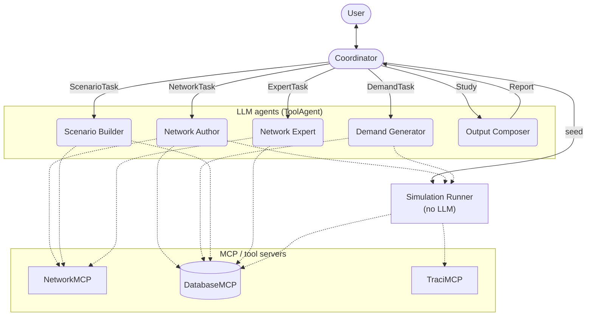

# RESTO — Agent communication

Who talks to whom: the Coordinator dispatches typed tasks to each specialist agent; every
specialist (and the plain-code Runner) uses the MCP servers as tools. Solid arrows = orchestration
(labeled with the task type sent). Dotted arrows = tool use / persistence (unlabeled — direction
and node name say enough).

