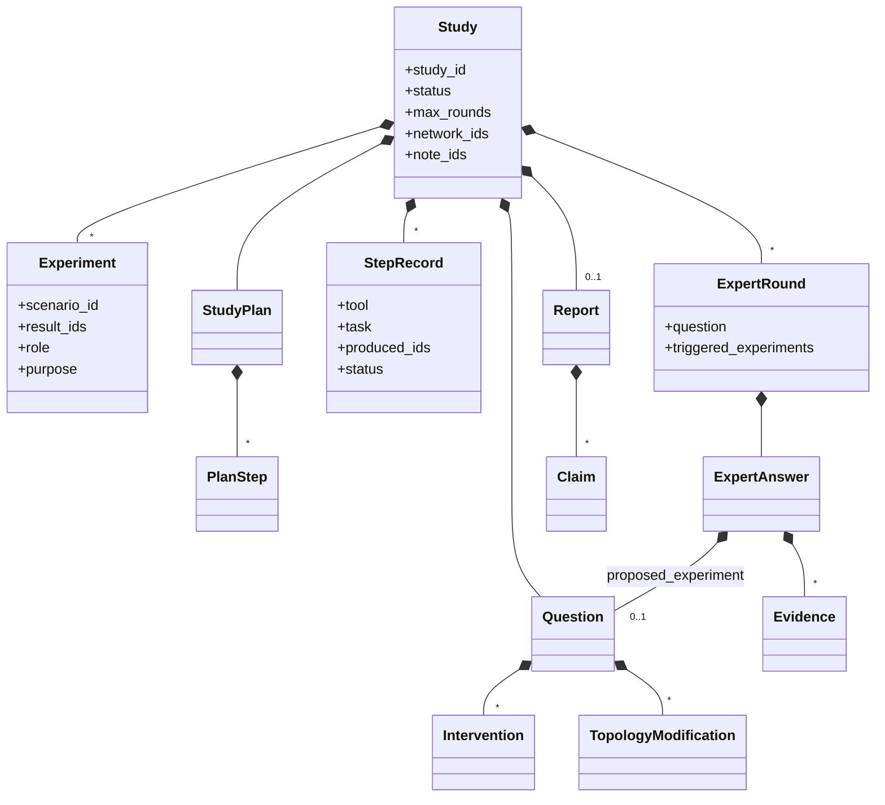
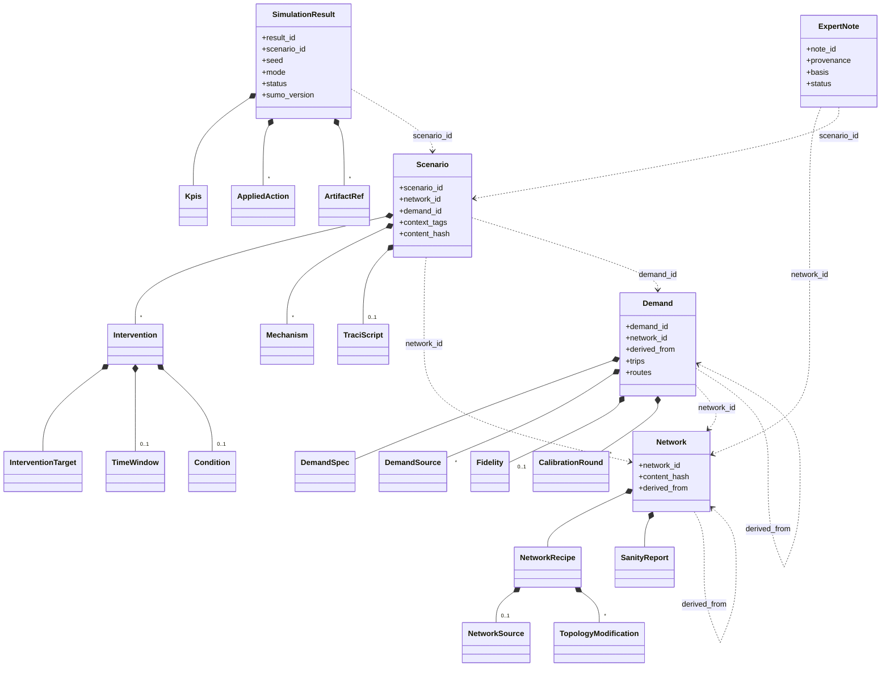

# Propuesta: modelo de dominio, capas y frontera agéntica — 2026-09-11 (v5)

Estado: **propuesta acordada en lo esencial** (§6). Si se acepta, lo que hay aquí
va a §7 (decisiones) y §2.2 (diagrama) de `tfm-architecture-and-dod.md`, y este fichero y
`domain-entities.md` se borran.

Historial: v1 proponía un solo agente (Expert) y el resto determinista. v2 hace agentes a los seis módulos.
v3 cambia `Hypothesis` por `Question`, añade la derivación de redes y modela la demanda como viajes + rutas.
v4 cierra las cuatro preguntas: herramientas tipadas de edición (sobre XML plano + `netconvert`, no sobre el
`.net.xml`), un solo mecanismo dinámico (script con primitivas declarativas dentro), calibración de demanda
con simulaciones en el bucle, y Coordinator que decide el *qué* y especialistas que deciden el *cómo*.
v5 renombra Network Generator → **Network Author**, fija los valores por defecto de rondas, añade el papel
del Builder y las responsabilidades del Expert (§2.8, §2.9), y asume que el catálogo de herramientas de red
crecerá con el error taxonomy de REAL-NET.

---

## 0. Resumen

1. **Frontera agéntica, un principio:** un agente trabaja libremente con herramientas y termina devolviendo un **borrador** (*Draft*): datos tipados + referencias a los artefactos que ha producido + su razonamiento. Un paso determinista de **promoción** valida el borrador, le asigna identidad y lo convierte en entidad. Ningún agente crea una entidad; ningún agente pone un id.
2. **Las decisiones de un agente quedan como datos.** El Network Author no edita XML compilado: llama a herramientas tipadas y la secuencia de llamadas es la *receta* que se guarda con la red. Reaplicar la receta sin LLM reproduce la red byte a byte. La mayoría de esas herramientas son opciones de `netconvert`; las pocas ediciones reales se hacen sobre el XML **plano** (`.nod.xml`, `.edg.xml`, `.con.xml`) y `netconvert` recompila (§2.3).
3. **Seis agentes con la misma forma** (bucle LLM + herramientas + tipo de salida): Coordinator (absorbe el Input Parser), Network Author, Demand Generator, Scenario Builder, Network Expert, Output Composer. Una sola interfaz (`ToolAgent`), una implementación, seis configuraciones (§2.1).
4. **El Coordinator decide el *qué*; cada especialista decide el *cómo*.** El Coordinator entiende la petición, consulta la base de datos y envía a cada agente una **tarea tipada** (`NetworkTask`, `DemandTask`, `ScenarioTask`, …) con objetivos y restricciones exactos. El especialista decide cómo cumplirla y devuelve un borrador que dice qué hizo; el Coordinator lo acepta o lo rechaza (§2.7).
5. **Dominio:** el usuario hace una **pregunta** (`Question`, con `intent` describe / diagnose / counterfactual / compare); responderla es un **`Study`**; a veces exige **experimentos**; cada `Experiment` es un `Scenario` (red + demanda + intervenciones) con sus `SimulationResult`. Agregados con identidad: `Study`, `Network`, `Demand`, `Scenario`, `SimulationResult`, `ExpertNote`.
6. **Reparto Network Author / Builder:** si responder exige un `.net.xml` distinto (añadir o quitar un edge, cambiar carriles), el Network Author **deriva** una red nueva; si la red es la misma y cambia lo que pasa durante la simulación, es el Builder (§2.5).
7. **`Demand` = viajes + rutas por red, calibrada con simulaciones.** Los viajes son la demanda; las rutas se calculan para una red concreta. Cuando solo hay conteos, el Demand Generator itera "muestrear rutas → simular → medir en los edges de control → ajustar" usando el Runner como herramienta, y la `fidelity` final lleva su evidencia (§2.6).
8. **Un solo mecanismo dinámico:** script Python contra `resto.traci_api`, que incluye primitivas declarativas `at_time(...)` y `when(...)`. Un script que solo usa esas primitivas *es* el plan declarativo de v0.2; no hace falta un intérprete aparte (§2.4).
9. **Ids:** hash de la petición para `Scenario`, hash de escenario + seed para `SimulationResult`; hash de contenido para `Network` y `Demand`; UUID para `Study` y `ExpertNote`. `seed` vive en `SimulationResult`.
10. **MCP es transporte:** servidores en `interface/mcp/`; SUMO, Postgres y cliente LLM en `adapters/`. Un único modelo: dataclasses en `domain/`, `TypeAdapter` en las fronteras (§7). Hexagonal ligera.

---

## 1. Capas vs. módulos: la tabla que faltaba

| Módulo funcional | Tipo | Caso de uso (`application/use_cases/`) | Ports que usa | Adapter principal |
|---|---|---|---|---|
| Coordinator (+ Input Parser) | agente | `run_study` | `ToolAgent`, `StudyRepository`, y **los demás casos de uso como herramientas** | `llm/agents/coordinator.py` |
| Network Author (crear y derivar) | agente | `generate_network`, `derive_network` | `ToolAgent`, `OsmSource`, `NetconvertRunner`, `PlainNetEditor`, `NetworkQuery`, `NetworkRepository` | `llm/agents/network_author.py` + `sumo/netconvert.py`, `sumo/plain_edit.py` |
| Demand Generator | agente | `generate_demand`, `reroute_demand` | `ToolAgent`, `WebSearch`, `HistoricalDemandSource`, `DemandTools` (randomTrips, duarouter, routeSampler), **`run_simulation`** (calibración), `DemandRepository` | `llm/agents/demand_generator.py` + `sumo/demand.py` |
| Scenario Builder | agente | `build_scenario` | `ToolAgent`, `NetworkQuery`, `AdditionalFileWriter` (uno por mecanismo, como herramientas), `ScriptSandbox`, `ScenarioRepository` | `llm/agents/scenario_builder.py` + `sumo/writers/` |
| Simulation Runner | **código** | `run_simulation` | `SumoRunner`, `ScriptSandbox`, `ResultRepository` | `sumo/runner.py`, `sumo/traci_api.py` |
| Network Expert | agente | `ask_expert` | `ToolAgent`, `NetworkQuery`, `ResultQuery`, `NoteRepository` | `llm/agents/expert.py` |
| Output Composer | agente | `compose_report` | `ToolAgent`, `StudyRepository`, `ResultQuery` | `llm/agents/composer.py` |
| NetworkMCP / DatabaseMCP / TraciMCP | transporte | — | exponen `NetworkQuery`, repositorios, `TraciControl` | `interface/mcp/*_server.py` |

Solo el Runner no es agente: principio 3 del documento ("authoring is agentic, execution is not").

---

## 2. La frontera agéntica

### 2.1 Qué es un port, y por qué uno solo sirve a los seis agentes

Un **port** es una interfaz que la aplicación declara y de la que depende, sin saber quién la implementa (un
`Protocol`). Un **adapter** la implementa (el cliente de Anthropic, un mock). Así `application/` no importa
`anthropic` nunca y los tests de cualquier agente corren sin red.

Los seis agentes tienen la misma forma vistos desde fuera: *dame una tarea, una lista de herramientas, el
tipo de salida que espero y un presupuesto; corre el bucle LLM ↔ herramientas hasta la salida final;
devuélvemela validada, con la traza y el consumo.*

```python
class ToolAgent(Protocol):
    def run(self, task: AgentTask, tools: Sequence[Tool], output: type[T], budget: Budget) -> AgentRun[T]: ...

# AgentRun[T]: output: T · tool_calls: tuple[ToolCall, ...] · usage: Usage · stop_reason
```

Lo que distingue a cada agente está en su configuración, no en el port:

| Agente | `task` | `tools` | `output` |
|---|---|---|---|
| Network Author | `NetworkTask` (source o red base, objetivos, restricciones) | `fetch_osm`, `netconvert`, `inspect_network`, `sanity_check`, `probe_run`, `keep_largest_component`, `remove_isolated`, `join_junctions`, `keep_vclass`, `remove_edge`, `add_edge`, `set_lanes`, `set_speed` (catálogo v1; crece con §2.3) | `NetworkDraft` |
| Demand Generator | `DemandTask` (red, perfil, conteos o fuentes, edges de control, tolerancia) | `web_search`, `fetch_url`, `get_historical_demand`, `random_trips`, `duarouter`, `route_sampler`, `calibration_run` | `DemandDraft` |
| Scenario Builder | `ScenarioTask` (red, demanda, intervenciones, tags) | `edge_exists`, `lane_exists`, `tls_exists`, `write_rerouter`, `write_vss`, `write_tls_program`, `write_taz`, `write_sumocfg`, `write_traci_script`, `lint_script`, `dry_run` | `ScenarioDraft` |
| Expert | `ExpertTask` (pregunta, modo, red, resultados disponibles) | `get_edge`, `neighbours`, `shortest_path`, `capacity_estimate`, `query_edgedata`, `get_result`, `search_notes` | `ExpertAnswer` |
| Composer | `Study` cerrado | `get_study`, `get_result`, `query_edgedata` | `Report` |
| Coordinator | texto del usuario + estado de la BD | **los casos de uso de arriba**, `find_*`, `ask_user` | `StudyPlan` primero, `StudyOutcome` al final |

Una `Tool` es una función Python tipada de `application/tools/`. El adapter puede ofrecérsela al LLM en
proceso o vía MCP; para los tests, en proceso. MCP hace falta de verdad en DatabaseMCP (contrato pluggable) y
en lo que quieras exponer a clientes externos. El resto es despliegue, no diseño.

El bucle del Network Author es exactamente "mirar la red → aplicar una función → volver a mirar → …
hasta que lo considere suficiente". El agente decide cuándo parar; `Budget` le pone tope; la promoción vuelve
a pasar el sanity check por su cuenta, así que "suficiente" según el agente no basta si los umbrales de §4.3
no se cumplen.

### 2.2 Qué devuelve cada agente y quién lo promueve

| Agente | Devuelve (*Draft*) | Promoción (código) → entidad |
|---|---|---|
| **Coordinator** | `Question` + `StudyPlan` antes de actuar; cada llamada a herramienta es un paso; `StudyOutcome` al final | `run_study` mantiene el `Study`: registra pasos, aplica guardas (no re-simular un `result_id` existente, `max_rounds`, presupuesto, `ambiguities` ⇒ parar y preguntar) |
| **Network Author** | `NetworkDraft`: `source` **o** `base_network_id`, `netconvert_options`, `plain_edits[]`, `net_artifact`, `sanity_report`, `rationale` | `generate_network` / `derive_network`: recarga en SUMO, recalcula `sanity_report`, replay(receta) → mismo hash, `network_id = content_hash` → `Network` |
| **Demand Generator** | `DemandDraft`: `spec`, `sources[]`, `trips_artifact`, `routes_artifact`, `fidelity` (con evidencia), `calibration_rounds[]`, `rationale` | `generate_demand`: `duarouter` carga contra la red, teleports ≤ umbral, `fidelity` dentro de tolerancia, `demand_id = content_hash(trips)` → `Demand` |
| **Scenario Builder** | `ScenarioDraft`: `interventions[]`, `mechanism` por intervención, `additional_files`, `sumocfg`, `script?`, `rejected[]`, `rationale` | `build_scenario`: SUMO carga el cfg, ids existen, script pasa lint y `dry_run`, `scenario_id = hash(network_id, demand_id, interventions, context_tags)` → `Scenario` |
| **Network Expert** | `ExpertAnswer` (+ `proposed_experiment: Question?`); tras un experimento, `ExpertNoteDraft` | `ask_expert` lo adjunta a la `ExpertRound`; `write_note` pone `provenance` y `status` → `ExpertNote` |
| **Output Composer** | `Report` (JSON): `summary`, `sections[]`, `claims[]` (texto, valor, `evidence_refs[]`), tabla de experimentos, `mode`, `basis`, `limitations` | `compose_report`: comprobador de trazabilidad (E5.7); Markdown en `interface/` |

Regla común: **el agente nunca escribe un id, un hash, un `status` ni un `provenance`**.

### 2.3 "Decisiones como datos", y cómo editar la red sin sufrir

**Por qué.** Si el agente edita ficheros como quiera, al final hay un fichero y no se sabe qué cambió salvo
por su prosa; no se puede reproducir sin volver a pagar al LLM; no se puede probar la edición sin LLM; y la
tesis no puede decir "el generador aplicó X, Y, Z" con evidencia. Si solo puede cambiar la red llamando a
herramientas tipadas, la lista de llamadas es la **receta** (`NetworkRecipe`), que se reaplica sin LLM y da el
mismo fichero. "Idempotente" pasa a ser comprobable; las herramientas se prueban sin LLM; el agente se evalúa
aparte, estadísticamente; la receta es la evidencia.

**Cuánto cuesta.** Menos de lo que parece, por dos hechos verificados hoy contra SUMO 1.27.1:

1. **La mayoría de limpiezas son opciones de `netconvert`, no ediciones de XML.** Quedarse con el componente conexo mayor (`--keep-edges.components 1`), quitar edges aislados (`--remove-edges.isolated`), unir junctions cercanas (`--junctions.join`, `--junctions.join-dist`), quitar vías peatonales o de bici (`--keep-edges.by-vclass passenger`, `--remove-edges.by-type`), simplificar geometría (`--geometry.remove`). Cada una es una herramienta de una línea que añade una opción a la receta.
2. **Las ediciones reales no se hacen sobre el `.net.xml`.** El `.net.xml` es un fichero *compilado* (geometría calculada, carriles internos, conexiones resueltas) y editarlo a mano es exactamente tan complejo como temes. SUMO tiene el formato **plano** para esto: `netconvert --plain-output-prefix` exporta `.nod.xml` (nodos: id, x, y, tipo), `.edg.xml` (edges: id, from, to, numLanes, speed, priority) y `.con.xml` (conexiones), tres esquemas pequeños y documentados; se editan, y `netconvert -n -e -x` recompila todo. `add_edge(from_junction, to_junction, lanes, speed)` es añadir un elemento a `.edg.xml`; `netconvert` traza la geometría entre los dos nodos y deduce las conexiones. `remove_edge`, `set_lanes`, `set_speed` son igual de triviales.

Con eso, la receta de una red es: **snapshot del OSM + opciones de `netconvert` + lista de ediciones
planas**, y `replay` es "exportar a plano, aplicar ediciones, recompilar". Determinista con la versión fijada.

Estimación honesta: las ocho herramientas de la tabla de §2.1 con tests, dos o tres días; `inspect_network`
y `sanity_check` con `sumolib` + `networkx`, otro día o dos, pero eso el DoD §4.3 ya lo exige con o sin
agente. Lo que sí cuesta y no está en el plan como tal es afinar el bucle del agente (prompt, cuándo parar,
evaluación en GEN-LOCATIONS): es E6.4 (18 h) y probablemente se queda corto.

**Las opciones de `netconvert` no van a bastar, y el diseño lo asume.** Un ingeniero de tráfico pasa una
parte considerable de su tiempo arreglando la red a mano, y ese trabajo (giros prohibidos que OSM no tiene,
carriles de giro que faltan, semáforos mal agrupados, prioridades erróneas, vías de servicio que absorben
tráfico) no lo cubre ninguna opción global. Tres consecuencias:

1. **El catálogo v1 es el punto de partida, no el final.** Cinco opciones de `netconvert` + `remove_edge` / `add_edge` / `set_lanes` / `set_speed` sobre XML plano. Cubre la limpieza gruesa de OSM (componentes, aislados, peatones, geometría) y las modificaciones que el DoD §4.3 exige.
2. **El catálogo crece con E6.3.** Al limpiar REAL-NET a mano hay que anotar cada arreglo como (tipo, fichero plano tocado, atributo). Esa lista es a la vez el error taxonomy que el plan ya pide y el backlog de herramientas del Network Author: cada tipo de arreglo que aparezca dos veces se convierte en una herramienta (`set_connection`, `disallow_turn`, `set_priority`, `set_junction_type`, `join_tls`, …). Todas son ediciones de `.edg.xml`, `.con.xml` o `.tll.xml`, así que cuestan horas, no días.
3. **"Mirar si la red está bien" tiene dos niveles.** El estático es el `sanity_report` (componentes, aislados, longitud cero, alcanzabilidad desde la periferia). El que de verdad usa un ingeniero es dinámico: **meter tráfico y ver dónde se atasca**. Por eso el Network Author tiene `probe_run`: una simulación corta con demanda aleatoria ligera (`randomTrips`, seed fija) que devuelve teleports, colisiones, vehículos que no llegan y los edges donde ocurren. Es la misma idea que el Stretch de §4.3 ("teleport reduction on fixed demand"), pero como herramienta del bucle, no como métrica final. Reutiliza el caso de uso `run_simulation`, igual que `calibration_run` en §2.6, y sus ejecuciones tampoco entran en el almacén de resultados.

El bucle del Network Author queda así: `netconvert` con opciones iniciales → `sanity_check` → `probe_run`
→ mirar dónde falla → aplicar herramienta → repetir hasta que sanity pasa y `probe_run` está por debajo del
umbral de teleports, o hasta agotar `NetworkTask.max_rounds` (por defecto 5). Cuando el agente necesita un
arreglo para el que no hay herramienta, lo dice en `NetworkDraft.unresolved[]` con la descripción del
problema y el edge o junction afectado: eso es evidencia para el error taxonomy y no un fallo silencioso.

Nota de entorno (resuelta el 2026-09-11): SUMO 1.27.1 está ahora instalado en el entorno `resto` desde
PyPI (`eclipse-sumo`, `sumolib`, `traci`, `libsumo`), igual que en el entorno `tfm`; `pyproject.toml` y
`README.md` lo reflejan.

### 2.4 Un solo mecanismo dinámico: script con primitivas declarativas

Aclaración de la disyuntiva, porque no estaba bien explicada: un *plan declarativo* es una lista de reglas
"cuando pase X, haz Y" escrita como datos (JSON) que un intérprete pequeño ejecuta; un *script* es código
Python que el agente escribe y el Runner ejecuta. El plan es más fácil de validar y probar, pero solo cubre
lo que el intérprete conoce; el script cubre cualquier cosa, pero es más difícil de validar.

La disyuntiva desaparece si el script se escribe contra una API que **incluye** las primitivas del plan:

```python
from resto.traci_api import at_time, when, occupancy, close_lane, set_speed, run

when(occupancy("E12") > 0.8, close_lane("E12_1"))
at_time(3600, set_speed("E07", 8.3))
run()
```

- Un script que solo usa `at_time`/`when` **es** el `TraciPlan` de v0.2: se puede inspeccionar antes de arrancar (las reglas quedan registradas en la API), comparar estructuralmente entre ejecuciones, y verificar como en §4.5.
- Un script que necesita lógica que las primitivas no cubren (TLS adaptativo con memoria, reversión con histéresis) escribe Python normal contra las mismas primitivas de bajo nivel (`step`, `get_edge_occupancy`, `set_tls_program`, …).
- La API registra cada acción en `applied_actions`, con `origin = rule | code`. `lint_script` comprueba con AST que solo importa `resto.traci_api`; `dry_run` ejecuta unos pocos pasos en un SUMO real y falla si el script rompe.

DoD: el mecanismo único (script + API) es *Minimal* y *Done* de §4.5/§4.6. El intérprete de `TraciPlan`
aparte (E2.5, 24 h) desaparece del plan; sus tests por trigger/acción se trasladan a la API. Nada queda como
Stretch porque no hay segundo mecanismo que aplazar.

### 2.5 Qué va al Network Author y qué al Builder: el caso "añade un edge entre A y B"

Regla, para §7 del documento de arquitectura:

> Si la petición exige que SUMO cargue una red distinta (añadir o quitar un edge de forma permanente,
> cambiar carriles, geometría, velocidad de diseño), el Network Author **deriva** una `Network` nueva de la
> existente. Si la red es la misma y cambia lo que ocurre durante la simulación (cierre con ventana o
> condición, límite temporal de velocidad, programa semafórico, escala de demanda), es el Builder.

El mismo agente tiene dos operaciones: **crear** (`source` → red) y **derivar** (`base_network_id` +
modificaciones → red, con `derived_from`). Si "Generator" molesta, `Network Author`.

"¿Qué pasaría si añadiéramos un edge entre A y B?" con este modelo:

1. Coordinator: `Question(intent=counterfactual, topology_changes=[AddEdge(A, B)])`.
2. `derive_network(NetworkTask(base=N_A, modifications=[AddEdge(A, B, lanes, speed)]))` → `N_B`.
3. **Demanda.** Si `Demand` guardara solo rutas, las rutas viejas seguirían valiendo en `N_B` pero nunca usarían el edge nuevo y el experimento diría "no cambia nada". Por eso `Demand` = **viajes** (origen, destino, hora; artefacto `trips`) + **rutas** para una red concreta (artefacto `routes`, de `duarouter`). `reroute_demand(D_A, N_B)` → `D_B`: mismos viajes, rutas nuevas, `derived_from = D_A`. Determinista, sin agente.
4. `baseline = Scenario(N_A, D_A, [])` y `treatment = Scenario(N_B, D_B, [])`. Comparables porque los viajes son los mismos.
5. Expert compara; Composer redacta.

`edge_closure` permanente deja de ser una intervención y pasa a `TopologyModification.RemoveEdge`; con
ventana o condición se queda como está. `demand_scale` sigue siendo intervención de escenario y produce una
`Demand` derivada con `scale`.

### 2.6 Demanda con conteos pero sin rutas: calibración con el Runner en el bucle

Sí tiene sentido, y es el caso normal con datos reales: se tienen conteos en unos pocos puntos (espiras,
aforos) y no se sabe de dónde a dónde va nadie. El procedimiento estándar en SUMO es:

1. Generar **rutas candidatas** abundantes con `randomTrips` + `duarouter` (seed).
2. `routeSampler.py --edgedata-files conteos.xml` muestrea de las candidatas un subconjunto cuyo paso por los edges de control **se acerca a los conteos** (verificado: existe en 1.27.1 y acepta ese formato). Salida: `trips` + `routes`.
3. **Simular** un escenario de calibración (red + demanda candidata, sin intervenciones, corto) y **medir** en los edges de control con edgedata. La congestión hace que lo que pasa en simulación no coincida con lo que `routeSampler` calculó en estático; por eso hace falta la simulación.
4. Comparar con los objetivos → `fidelity`. Si no entra en tolerancia, ajustar (más candidatas, `--optimize`, escala, ventana) y volver a 2.

Este es el bucle agéntico del Demand Generator, y por eso **`calibration_run` es una herramienta suya que
llama al caso de uso `run_simulation`**. Consecuencias para el modelo y las capas:

- La dependencia va a través del caso de uso, no de SUMO directamente: el hexágono se mantiene y el Runner sigue siendo el único que toca SUMO en ejecución.
- Las simulaciones de calibración **no** son `SimulationResult` del almacén de conocimiento (no son experimentos del usuario; ensuciarían `list_results` y el efecto de aprendizaje). Son ejecuciones efímeras; el `DemandDraft` guarda `calibration_rounds[]` (parámetros, fidelity obtenida) para la traza, y **la última** deja su edgedata como artefacto referenciado desde `Fidelity.evidence`. Así el principio 6 se cumple: "fidelity ±12 % en E12, E31, E44" apunta a un fichero.
- Los conteos vienen de `DemandSource`: `HistoricalDb(query)` o `ExternalDataset(url, snapshot, transformation)`; `DemandTask.control_edges` y `tolerance` los fija el Coordinator (o el DoD: ±15 % DEV-NET, ±25 % REAL-NET).
- Orden en el plan: el Demand Generator *Done* (E6.5) necesita el Runner batch (E2.1). Ya está así en el calendario.
- Presupuesto: cada ronda de calibración es una simulación. `DemandTask.max_calibration_rounds = 5` por defecto: la primera ronda es `routeSampler` sin ajuste, y con tres o cuatro correcciones (escala, `--optimize`, más candidatas) o se converge o el problema es de datos, no de iteraciones. Simulaciones cortas (la ventana de los conteos, no el día entero).

Lo que sigue **fuera** de v1: estimación OD completa (`cadyts`, `dfrouter` con matrices), que el documento ya
tenía como Stretch de §4.4. `routeSampler` es la versión sencilla y suficiente para la tesis.

### 2.7 El Coordinator decide el *qué*; los especialistas deciden el *cómo*

De acuerdo con que el Coordinator es quien entiende la petición y quien envía a cada agente exactamente lo
que tiene que hacer. La matización es en qué nivel toma las decisiones, porque hay dos:

- **Qué** (estratégico): qué red, si reutilizar o generar, qué demanda y con qué conteos, qué intervenciones y en qué escenarios, baseline contra qué tratamiento, modo free/forced, cuándo preguntar al usuario, cuándo parar el bucle. **Todo esto lo decide el Coordinator**, y lo materializa en la tarea tipada que envía a cada agente.
- **Cómo** (táctico): qué 40 edges quitar de OSM, qué opciones de `routeSampler`, si un cierre va como rerouter o como script. Esto lo decide el **especialista**, porque es el único que está mirando el estado de la red o de la calibración en ese momento. Si el Coordinator lo decidiera, tendría que tener todas las herramientas de todos y ser un agente gigante, y perderíamos la posibilidad de evaluar cada agente por separado.

Para que "enviar exactamente lo que tiene que hacer" no sea prosa, las entradas de cada caso de uso son
**tareas tipadas** que el Coordinator rellena:

| Tarea | Campos (esencia) |
|---|---|
| `NetworkTask` | `source` **o** `base_network_id`; `goals[]` (p. ej. "vehículos privados", "sin peatones"); `modifications[]` obligatorias (p. ej. `AddEdge(A, B)`); `sanity_thresholds`; `probe_teleport_threshold`; `max_rounds` (5) |
| `DemandTask` | `network_id`; `profile`; `sources[]` (conteos, histórico, parámetros); `control_edges[]`; `tolerance`; `max_calibration_rounds`; `seed` |
| `ScenarioTask` | `network_id`; `demand_id`; `interventions[]`; `context_tags[]`; `allow_script: bool` |
| `ExpertTask` | `question`; `mode`; `network_id`; `result_ids[]` disponibles; `notes_allowed: bool` |

El especialista devuelve su `Draft`, que además de artefactos dice **qué decidió y por qué** (`rationale`,
receta, `rejected[]`). El Coordinator lo lee y decide: aceptar, pedir otra vez con la tarea corregida, o
fallar el paso. Esa relación "tarea tipada → borrador tipado" es la misma para los cinco especialistas.

Guardas en código, no en el prompt del Coordinator: no re-simular un `result_id` existente;
`Study.max_rounds = 3` por defecto (la ronda 1 responde o pide un experimento; la 2 responde con él; la 3
absorbe un segundo `needs_simulation`; más rondas es señal de que la pregunta era ambigua, y eso se
resuelve preguntando al usuario, no simulando); presupuesto total; `ambiguities` no vacío ⇒ estado
`awaiting_user`; `StudyPlan` obligatorio antes del primer paso (contra él se mide §4.2).

### 2.8 El Builder sigue existiendo, y por qué

Sí sigue, y no se puede fundir con nadie. Su papel: recibe **red + demanda + intervenciones** y produce
**un escenario que SUMO puede ejecutar**. Concretamente:

- Escribe el `sumocfg` (qué red, qué rutas, qué salidas, qué ventana).
- Para cada intervención elige el **mecanismo** SUMO y lo escribe: rerouter con `closingLaneReroute` para un cierre con ventana, `variableSpeedSign` para un límite temporal, programa TLS con `WAUT` para un cambio semafórico, TAZ para cambios de zonas, demanda derivada para `demand_scale`. Es la tabla §2.4 del documento de arquitectura.
- Para lo que no cabe en un fichero estático, escribe el **script** contra `traci_api` (§2.4 de este doc).
- Valida antes de entregar: ids existen, SUMO carga el cfg, el script pasa lint y `dry_run`.
- Rechaza con motivo lo que no puede implementar (`rejected[]`).

Por qué no lo hace otro: el Network Author cambia **la red** (otro `.net.xml`); el Builder cambia **lo que
pasa durante la simulación** en la misma red. El Coordinator sabe *qué* intervenciones quiere el usuario,
pero no *cómo* se expresan en SUMO. El Runner no decide nada. El Builder es donde vive la pericia SUMO
sobre mecanismos, y es el único módulo que sabe que "cerrar el carril 1 de E12 de 8 a 9" es un
`<rerouter>` con un `<closingLaneReroute>` dentro de un `<interval>`.

Lo que sí ha cambiado respecto a v0.2 es su **tamaño**: al desaparecer el intérprete de `TraciPlan`, el
Builder solo tiene dos salidas posibles por intervención (fichero estático o script) y una regla de
preferencia (estático si hay ventana fija; script si hay condición o es `custom`).

### 2.9 El Network Expert: quién es y qué hace

Es el de la derecha del diagrama de §2.1 del documento de arquitectura ("Reasoning (agentic)"), y es el
**foco de investigación de la tesis** (§4.7). Es "experto en la red" en este sentido: responde preguntas
sobre **una red concreta** apoyándose en lo que se ha simulado en ella y en lo que él mismo ha aprendido de
experimentos anteriores. Responsabilidades, en orden:

1. **Responder** preguntas descriptivas ("qué edges superan el 80 % de ocupación entre las 8 y las 9"), diagnósticas ("cuáles son los tres cuellos de botella y por qué") y contrafactuales ("si cierro el carril 1 de E12, ¿sube o baja el retraso en E20?"), siempre sobre una `Network` y unos `SimulationResult` concretos.
2. **Llegar a los hechos por herramientas**, nunca de memoria: edgedata y KPIs por `query_edgedata` / `get_result`, la topología por NetworkMCP (`get_edge`, `neighbours`, `shortest_path`, `capacity_estimate`). Cada afirmación lleva `evidence[]` que apunta a un artefacto o a una consulta.
3. **Declarar la base de cada respuesta**: `basis = observed` (lo dice un resultado), `inferred` (lo deduce de resultados y topología) o `extrapolated` (opinión sin simulación que lo respalde), y `confidence` en [0, 1]. Con esto se mide la calibración (Brier, §4.7).
4. **Abstenerse y proponer un experimento** en modo *free*: si no puede responder con base observada, devuelve `needs_simulation = True` y un `proposed_experiment: Question` que el Coordinator convierte en escenario y ejecución. En modo *forced* responde igualmente, marcando `basis = extrapolated`.
5. **Aprender**: tras cada experimento escribe una `ExpertNote` (prosa corta, con `provenance`, `basis`, `context_tags`), y esas notas se le devuelven por búsqueda (`search_notes`) en preguntas posteriores. Cuando una simulación posterior confirma o refuta una nota, el código actualiza su `status`. La tesis mide si con más notas acierta más en contrafactuales nuevos (efecto de aprendizaje, §4.7).

Lo que **no** hace: no ejecuta SUMO (pide experimentos, no los corre); no decide el plan del estudio (eso es
el Coordinator); no redacta el informe final (eso es el Composer, que toma el `ExpertAnswer` y lo convierte
en un `Report` con cada número enlazado a su evidencia). La diferencia Expert / Composer es razonar contra
redactar: el Expert produce la respuesta y sus pruebas; el Composer la presenta sin añadir nada.

---

## 3. Modelo de dominio

### 3.1 Agregados

| Agregado | Id | Cómo se obtiene | Repositorio | Referencia por id a |
|---|---|---|---|---|
| `Study` (raíz) | `study_id` | UUID | `StudyRepository` (port del framework, **fuera** del contrato DatabaseMCP) | `network_ids[]`, `experiments[].scenario_id`, `experiments[].result_ids`, `note_ids` |
| `Network` | `network_id` | `content_hash` del `.net.xml` | `networks` (DatabaseMCP) | `derived_from?` |
| `Demand` | `demand_id` | `content_hash` de `trips` | `demands` (DatabaseMCP, **capacidad nueva**) | `network_id`, `derived_from?` |
| `Scenario` | `scenario_id` | `hash(network_id, demand_id, interventions, context_tags)` | `scenarios` (DatabaseMCP) | `network_id`, `demand_id` |
| `SimulationResult` | `result_id` | `hash(scenario_id, seed, mode, sumo_version)` | `results` (DatabaseMCP) | `scenario_id` |
| `ExpertNote` | `note_id` | UUID | `notes` (DatabaseMCP) | `network_id`, `scenario_id?`, `study_id` |

Dos políticas de id: red y demanda son salidas de agente sin input canónico, así que el id es el hash del
contenido y la búsqueda es por `source`/`name`/`derived_from`; escenario y resultado sí tienen input canónico
y su id es el hash de la **petición**, lo que hace que la reutilización y "cero simulaciones redundantes"
salgan por construcción.

`Study` es la raíz y no `Experiment` porque el usuario pregunta, y a veces la respuesta no necesita ningún
experimento. `Demand` es entidad (pregunta 1 de `domain-entities.md`, opción a) porque la matriz la comparte
entre escenarios, `fidelity` y `sources[]` necesitan dónde vivir, y la derivación necesita `derived_from`.

### 3.2 Value objects

| VO | Dentro de | Campos | Nota |
|---|---|---|---|
| `Question` | `Study`, `ExpertAnswer` | `text`, `intent`, `network_ref`, `demand_ref`, `interventions[]`, `topology_changes[]`, `metrics_of_interest[]`, `time_window`, `mode`, `context_tags[]`, `ambiguities[]` | el `ExperimentRequest` de §2.2 del documento; una duda sin hipótesis es `describe` o `diagnose` |
| `StudyPlan`, `PlanStep` | `Study` | `steps[]`, `rationale`, `reuse_decisions[]` | antes de actuar; contra él se mide §4.2 |
| `StepRecord` | `Study` | `tool`, `task`, `produced_ids[]`, `status`, `error`, `usage` | uno por llamada del Coordinator; `task` es la tarea tipada enviada |
| `Experiment` | `Study` | `scenario_id`, `result_ids[]`, `role` (baseline / treatment / comparison), `purpose` | |
| `ExpertRound` | `Study` | `question`, `answer`, `triggered_experiments[]` | |
| `ExpertAnswer`, `Evidence` | `ExpertRound` | §2.2 del documento; `Evidence = (kind, ref, excerpt)` | |
| `Report`, `Claim` | `Study` | ver §2.2 | |
| `NetworkTask`, `DemandTask`, `ScenarioTask`, `ExpertTask` | `StepRecord` | §2.7 | entradas tipadas de los especialistas |
| `NetworkRecipe` | `Network` | `source?` \| `base_network_id?`, `osm_snapshot: ArtifactRef?`, `netconvert_options[]`, `plain_edits: TopologyModification[]` | exactamente uno de `source` / `base_network_id` |
| `ProbeReport` | `Network` | `teleports`, `collisions`, `not_arrived`, `hot_edges[]`, `evidence: ArtifactRef` | resultado del último `probe_run` (§2.3) |
| `UnresolvedIssue` | `NetworkDraft` (no persiste en `Network`) | `description`, `target`, `wanted_tool?` | entrada del error taxonomy de E6.3 |
| `NetworkSource` | `NetworkRecipe` | `kind` (place / bbox / file), `value` | existe |
| `TopologyModification` | `NetworkRecipe`, `Question` | unión discriminada: `RemoveEdge`, `AddEdge(from_junction, to_junction, lanes, speed)`, `SetLanes`, `SetSpeed`; las opciones de `netconvert` van en `netconvert_options`, no aquí | una variante por edición plana |
| `SanityReport` | `Network` | existe | umbrales como parámetros |
| `DemandSpec` | `Demand` | `profile`, `vehicles_per_hour?`, `window`, `seed`, `scale`, `sampler_options?` | |
| `DemandSource` | `Demand` | unión: `Parameters`, `HistoricalDb(query)`, `ExternalDataset(url, snapshot, transformation)` | |
| `Fidelity` | `Demand` | `per_edge: {edge_id: (target, achieved)}`, `evidence: ArtifactRef` (edgedata de la última calibración), `within_tolerance: bool` | |
| `CalibrationRound` | `Demand` | `round`, `params`, `fidelity_summary` | traza del bucle de §2.6 |
| `Intervention` | `Scenario`, `Question` | `type` (5 conocidos + `custom`), `target`, `params`, `window \| condition`, `description?`, `expected_effect?` | `edge_closure` permanente pasa a `TopologyModification` |
| `InterventionTarget` | `Intervention` | unión discriminada con `kind: Literal[...]` | |
| `TimeWindow`, `Condition` | `Intervention` | `(start, end)`; `(metric, target, op, value)` | hoy tupla y string |
| `Mechanism` | `Scenario` | por intervención: `StaticFile(kind, path)` \| `Script` \| `Regenerate(demand_id)` | |
| `TraciScript` | `Scenario` | `artifact: ArtifactRef`, `api_version`, `declared_rules[]` (lo que `at_time`/`when` registraron), `lint_ok`, `dry_run_ok` | |
| `AppliedAction` | `SimulationResult` | `step`, `action`, `origin` (rule / code) | |
| `Kpis`, `ArtifactRef` | varios | | `ArtifactRef = (path, content_hash, kind)` |

### 3.3 Diagramas

Sintaxis compatible con Mermaid ≥ 9 (sin `direction`, sin cuerpos de clase en una línea); verificados con
`mermaid-cli`.

**Estudio (estado de ejecución del framework):**



**Conocimiento (agregados en DatabaseMCP):**



`*--` composición (mismo ciclo de vida, sin id propio). `..>` referencia por id, resuelta por un repositorio.
Entre los dos diagramas: `Experiment.scenario_id → Scenario`, `Experiment.result_ids → SimulationResult`,
`Study.network_ids → Network`, `Study.note_ids → ExpertNote`, `ExpertNote.study_id → Study`.

### 3.4 Invariantes que hace cumplir el dominio (no el agente)

- `Intervention`: exactamente una de `window` / `condition`; `demand_scale` sin target; `custom` exige `description`; los demás exigen target. `edge_closure` sin ventana ni condición se rechaza con el mensaje "es una `TopologyModification`".
- `NetworkRecipe`: exactamente uno de `source` / `base_network_id`; `base_network_id` ⇒ `Network.derived_from` igual; `source.kind == place | bbox` ⇒ `osm_snapshot` presente.
- `Demand`: `routes` calculadas para `network_id`; `derived_from` ⇒ mismos `trips` o `scale ≠ 1`; `fidelity` presente ⇒ `evidence` presente.
- `Scenario`: toda intervención tiene un `Mechanism`; alguno es `Script` ⇒ `TraciScript` con `lint_ok` y `dry_run_ok`; `demand_scale` ⇒ `Demand.derived_from` no nulo.
- `SimulationResult`: `sumo_version` igual al fijado; `failed` ⇒ `error`; `mode == online` ⇔ `Scenario` tiene script.
- `Study`: `StudyPlan` antes del primer `StepRecord`; `len(rounds) ≤ max_rounds`; `mode == forced` ⇒ ninguna ronda dispara experimentos; `ambiguities` no vacío ⇒ `awaiting_user`, sin pasos.
- `ExpertNote.status` solo cambia por un `SimulationResult` posterior.
- `Network`: replay(`recipe`) produce `content_hash` (test del almacén).

### 3.5 El bucle, con este modelo

1. Coordinator produce `Question` y `StudyPlan`; `run_study` crea el `Study`.
2. Cada herramienta que llama el Coordinator es un `StepRecord` con su tarea tipada; las que producen escenario + resultado añaden un `Experiment`.
3. `ask_expert` añade una `ExpertRound`. Si `needs_simulation`, `mode == free` y quedan rondas, el Coordinator recibe `proposed_experiment` y vuelve a 2.
4. `compose_report` cierra el `Study` con un `Report` verificado.

Con `intent=describe` sobre resultados existentes: 1 → `ask_expert` → 4. Cero experimentos.

---

## 4. Estructura de repo

```
src/resto/
  domain/
    entities/         study.py  network.py  demand.py  scenario.py  simulation_result.py  expert_note.py
    value_objects/    (§3.2, incluidas las tareas tipadas)
    services/         content_hash.py  ids.py
  application/
    ports/            llm.py (ToolAgent, Tool, Budget)  sumo.py  repositories.py  network_query.py
                      writers.py  sandbox.py  web.py  tracing.py
    use_cases/        run_study.py  generate_network.py  derive_network.py  generate_demand.py
                      reroute_demand.py  build_scenario.py  run_simulation.py  ask_expert.py
                      write_note.py  compose_report.py
    tools/            un módulo por agente con sus herramientas como funciones tipadas
    schemas.py        TypeAdapters de los tipos de dominio + export JSON-schema (esto es E0.3)
  adapters/
    llm/              anthropic_client.py (ToolAgent)  agents/ (prompt + tools + output por agente)
    sumo/             netconvert.py  plain_edit.py  demand.py (randomTrips, duarouter, routeSampler)
                      runner.py  traci_api.py  netxml.py (NetworkQuery vía sumolib)  writers/
    sandbox/          subprocess_sandbox.py
    web/              search.py  fetch.py (snapshot a ArtifactStore)
    persistence/      postgres/  filesystem.py (ArtifactStore)  memory.py (tests)  mcp_client.py
    tracing/          jsonl.py
  interface/
    mcp/              network_server.py  database_server.py  traci_server.py
    cli/              main.py
eval/                 bancos, métricas, harness
```

Tres cambios respecto al layout actual: (1) `adapters/*_mcp` desaparecen, implementación a `adapters/sumo`
y `adapters/persistence`, servidores a `interface/mcp` (un servidor MCP es un *driving adapter*, como la
CLI); (2) la pluggabilidad de DatabaseMCP queda honesta con dos adapters de repositorio (`postgres/` en
proceso, `mcp_client.py` contra un servidor ajeno) y la conformance suite corriendo el cliente contra
cualquier servidor; (3) no hay `application/contracts/`, `schemas.py` hace ese papel con `TypeAdapter`s.

---

## 5. Consecuencias sobre el DoD y el plan

| Criterio | Hoy | Propuesta |
|---|---|---|
| §4.3 idempotencia del Network Author | "mismas entradas → hash idéntico" | "replay(recipe) sin LLM → hash idéntico" + "3 ejecuciones del agente sobre la misma localización → mismas opciones de `netconvert`, misma clase de ediciones, `sanity_report` equivalente" |
| §4.3 modificaciones topológicas | remove / lanes / speed | + `AddEdge`; sobre XML plano; operación **derivar** con `derived_from` |
| §4.4 determinismo del Demand Generator | "mismas entradas + seed → hash idéntico" | replay de `spec + sources` congelados → hash idéntico; `fidelity` con `evidence`; `calibration_rounds ≤ max`; `reroute_demand` determinista con test |
| §4.5 / §4.6 mecanismo dinámico | `TraciPlan` + intérprete (E2.5, 24 h); scripts Stretch | **un** mecanismo: script + `traci_api` con `at_time`/`when`; tests por primitiva en la API; `lint` + `dry_run`; `applied_actions` con `origin` |
| §4.5 determinismo de autoría del Builder | "estructuralmente equivalente en 3 ejecuciones" | se mantiene, comparando `declared_rules[]` y ficheros estáticos |
| §4.2 routing accuracy | plan vs. gold plan | `StudyPlan` antes de actuar vs. gold plan, **y** secuencia de `StepRecord` (con tareas tipadas) vs. traza esperada |
| §4.1 Input Parser | módulo aparte | absorbido por el Coordinator; su DoD sobre la `Question` producida |
| §2.3 Expert "facts via tools" | ninguna tool devuelve edgedata | `query_edgedata(result_id, edge_ids, window)` en la capacidad `results` |
| §2.2 `Intervention` | 5 tipos | + `custom`; `edge_closure` permanente → `TopologyModification` |
| DatabaseMCP | 5 capacidades | + `demands` (requerida) |
| E0.2 entorno | "conda-forge" | **hecho**: SUMO 1.27.1 desde PyPI como dependencia de `pyproject.toml`; README corregido |
| §4.3 Stretch "teleport reduction" | Stretch | entra en v1 como herramienta `probe_run` del bucle del Network Author (no como métrica final) |
| E0.3 | 11 modelos Pydantic + mappers | `schemas.py` con `TypeAdapter`s + round-trip por tipo |
| E2.5 | intérprete `TraciPlan` | se sustituye por `traci_api` (mismas horas, otro entregable) |
| E6.4 / E6.5 | 18 h / 22 h | probablemente cortas con bucles agénticos; ver recorte abajo |

Sobre el plan: seis agentes con herramientas propias son más prompts y más bancos de evaluación que un
agente y cinco módulos deterministas, en un plan un 4 % por encima de capacidad y sin holgura. Para la
orden de recortes de §5 del plan de trabajo, propongo como primer candidato: "Network Author y Demand
Generator con catálogo mínimo (cinco opciones de `netconvert`, `remove_edge`/`add_edge`; `randomTrips` +
`routeSampler` sin búsqueda web) y sin afinado del bucle más allá de un prompt".

---

## 6. Decisiones tomadas (2026-09-11) y lo que sigue abierto

| # | Pregunta | Decisión |
|---|---|---|
| 1 | Edición de red por herramientas tipadas o edición libre del XML | **Herramientas tipadas**, sobre XML plano + opciones de `netconvert`, nunca sobre el `.net.xml` (§2.3). |
| 2 | `TraciPlan` declarativo + script, o solo script | **Un solo mecanismo**: script contra `traci_api` que incluye `at_time`/`when` (§2.4). No queda nada como Stretch. |
| 3 | Forma de los datos externos de demanda | Conteos por edge/hora (→ `routeSampler` + calibración con simulación) y perfiles horarios (→ escalar). OD completo fuera de v1 (§2.6). |
| 4 | Coordinator con agentes como herramientas, o plan + motor aparte | **Agentes como herramientas**; el Coordinator decide el *qué* con tareas tipadas, los especialistas el *cómo* (§2.7). |

| 5 | Nombre del agente de red | **Network Author** (crea y deriva). |
| 6 | Valores por defecto de rondas | `DemandTask.max_calibration_rounds = 5`, `NetworkTask.max_rounds = 5`, `Study.max_rounds = 3`. Todos configurables; se revisan tras las primeras mediciones (E7.4). |
| 7 | Catálogo de herramientas de red | v1 = opciones de `netconvert` + ediciones planas básicas + `probe_run`; crece con el error taxonomy de E6.3 (§2.3). |

Nada queda abierto que bloquee E0.3.

---

## 7. Evidencia de los spikes (2026-09-11)

- **`TypeAdapter`** (pydantic 2.13.5, entorno `resto`): sobre las dataclasses actuales de `domain/`, sin tocarlas, `validate_python` ejecuta los invariantes de `__post_init__`; construye `LaneTarget` desde un dict y `Path` desde un string; `validate_json(dump_json(s)) == s`; `json_schema()` genera `$defs` para las ocho clases anidadas. Para la unión `InterventionTarget`: `kind: Literal[...]` en cada variante y `Field(discriminator="kind")`.
- **`netconvert` 1.27.1**: existen `--plain-output-prefix`, `-n/-e/-x` (node/edge/connection files), `--keep-edges.components`, `--remove-edges.isolated`, `--junctions.join`, `--junctions.join-dist`, `--keep-edges.by-vclass`, `--remove-edges.by-type`, `--geometry.remove`.
- **`routeSampler.py`** presente en `$SUMO_HOME/tools`, acepta `--edgedata-files`, `--turn-files`, `--optimize`, `--min-count`.
- **Entorno** (resuelto): `resto` tiene ahora `eclipse-sumo`, `sumolib`, `traci` y `libsumo` 1.27.1 desde PyPI, como `tfm`; `sumo --version` y `netconvert --version` responden 1.27.1 dentro del entorno; `sumolib`/`traci` importables sin `SUMO_HOME`; `randomTrips.py` y `routeSampler.py` en `site-packages/sumo/tools`.

---

## 8. Qué haría a continuación

1. E0.3 con este modelo: `Study`, `Demand`, `SimulationResult`, `ExpertNote`, `Question`, `ExpertAnswer`, `Report` como dataclasses; `NetworkRecipe`, `TopologyModification` (con `AddEdge`), `DemandSource`, `Fidelity` con `evidence`, `CalibrationRound`, `Mechanism`, `TraciScript`, las cuatro tareas tipadas; tipar `Condition`; mover `seed`; `schemas.py` + round-trip por tipo.
2. E0.4 con `demands` y `query_edgedata`.
3. Reorganizar carpetas (§4).
4. Volcar §0, §2.3–§2.7 y §5 a §7 del documento de arquitectura y los diagramas a §2.2; sustituir E2.5 por `traci_api` en el plan; borrar `domain-entities.md` y este fichero.
