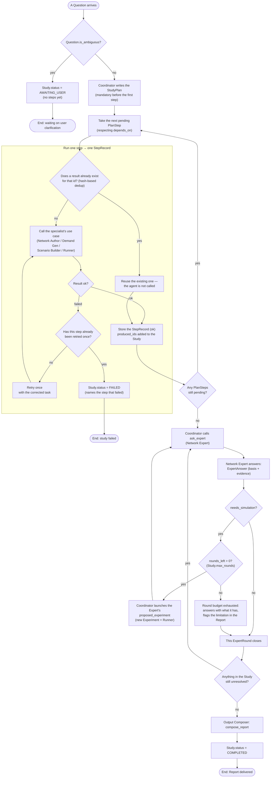

# RESTO — Study flow

Flow diagram (Mermaid) of how the Coordinator takes a `Question` from arrival to a closed
`Report`, including the branches for: an ambiguous question, dedup before calling an agent, a
failed step (with the single retry that `docs/tfm-architecture-and-dod.md` §8 lists as an open
question), and the Expert↔Simulation loop when the Network Expert asks for a simulation that
does not exist yet.

**Deliberate level of abstraction:** it does not try to enumerate every specialist or task type —
"call the specialist's use case" covers Network Author, Demand Generator, Scenario Builder and
Runner alike, because from the Coordinator's point of view they are the same shape of step (a
tool call that produces a `StepRecord`). See `docs/class_diagram.md` for the exact shape of every
type mentioned here (`Study`, `StepRecord`, `ExpertRound`, `Experiment`...).

## Reading notes

- **The dedup diamond (`F`)** is the same logic seen in `build_scenario`/`run_simulation`: before
  spending an agent call or a simulation, the framework checks whether something with that
  request's id already exists (content hash or request hash, depending on the aggregate). This is
  what makes "zero redundant simulations" a fact of construction rather than a separate
  optimisation.
- **The retry diamond (`J`)** encodes a decision the architecture document itself leaves open
  (§8: *"whether the Coordinator should be allowed to re-ask a specialist with a corrected task
  more than once before failing the step (currently: once)"*) — the diagram fixes the **current**
  behaviour (a single retry), not a final design guarantee.
- **The loop `O → P → Q → T → U → O`** is the `ExpertRound` drawn as flow: every full pass through
  that loop is one new entry in `Study.rounds`, and `T` is exactly `Study.rounds_left` evaluated
  in code, not a decision the agent makes itself.
- The terminal branches (`Z1`, `Z2`, `Z3`) correspond to the three real terminal states of
  `StudyStatus`: `AWAITING_USER`, `FAILED`, `COMPLETED`.
