# RESTO — Diagrama de clases del dominio

Diagrama de clases (Mermaid) de las seis entidades/agregados del dominio (`docs/tfm-architecture-and-dod.md`
§2.3) y todos los value objects que los componen — generado a partir de `src/resto/domain/entities/` y
`src/resto/domain/value_objects/` en su estado actual.

**Fuera de alcance deliberadamente** (para que el diagrama siga siendo legible): los *drafts* de agente
(`NetworkDraft`, `DemandDraft`, `ScenarioDraft`, `ExpertNoteDraft` — la forma que devuelve un agente antes
de la promoción) y los *tasks* del Coordinator (`NetworkTask`, `DemandTask`, `ScenarioTask`, `ExpertTask` —
lo que el Coordinator le manda a cada especialista). Ambos son familias de tipos paralelas a esta, no parte
del modelo de dominio persistido; si hacen falta, son un segundo diagrama con la misma técnica.

**Leyenda de flechas:**
- `*--` composición (el campo es una tupla/valor propio, vive y muere con el contenedor)
- `-->` asociación simple (el campo referencia un objeto de esa clase)
- `<|--` "es una variante de" (unión discriminada de Python — `A = B | C | D` — dibujada como herencia)
- `..>` referencia **por id** (`str`), no por objeto — así es como los agregados se referencian entre sí

```mermaid
classDiagram

%% ==================================================================================
%% STUDY — raíz de una petición de usuario (framework-only, fuera del contrato DatabaseMCP)
%% ==================================================================================

class Study {
  +str study_id
  +StudyStatus status
  +int max_rounds
  +List~str~ network_ids
  +List~str~ note_ids
}
class Phase {
  +Question question
}
class StudyStatus {
  <<enumeration>>
  PLANNING
  RUNNING
  AWAITING_USER
  COMPLETED
  FAILED
}

class Question {
  +str text
  +Intent intent
  +Mode mode
  +str? network_ref
  +str? demand_ref
  +List~str~ metrics_of_interest
  +frozenset~str~ context_tags
  +List~str~ ambiguities
}
class Intent {
  <<enumeration>>
  DESCRIBE
  DIAGNOSE
  COUNTERFACTUAL
  COMPARE
  RUN
}
class Mode {
  <<enumeration>>
  FREE
  FORCED
}

class StudyPlan {
  +str | FromStep network_id
  +str rationale
}
class ReusedExperiment {
  +str scenario_id
  +ExperimentRole role
  +str purpose
}
class ClarificationRequest {
  +str reason
  +List~str~ candidates
}
class PlanStep {
  <<union>>
  kind
  +List~int~ depends_on
}
class FromStep {
  +int step
}
class GenerateNetworkStep {
  +NetworkSource source
  +List~str~ goals
  +List~TopologyModification~ modifications
}
class DeriveNetworkStep {
  +str | FromStep base_network_id
  +List~TopologyModification~ modifications
  +List~str~ goals
}
class GenerateDemandStep {
  +str | FromStep network_id
  +DemandProfile profile
  +int seed
  +List~DemandSource~ sources
}
class RerouteDemandStep {
  +str | FromStep demand_id
  +str | FromStep network_id
}
class BuildScenarioStep {
  +str | FromStep network_id
  +str | FromStep demand_id
  +ExperimentRole role
  +str purpose
  +List~Intervention~ interventions
}
class RunSimulationStep {
  +str | FromStep scenario_id
  +List~int~? seeds
}

class StepRecord {
  +str tool
  +StepStatus status
  +Dict~str, Any~ task
  +List~str~ produced_ids
}
class StepError {
  +StepErrorKind kind
  +str message
  +List~str~ details
}
class StepErrorKind {
  <<enumeration>>
  USER_INPUT
  BUDGET
  AGENT
  INFRASTRUCTURE
}
class StepStatus {
  <<enumeration>>
  OK
  FAILED
  SKIPPED
}
class Usage {
  +int input_tokens
  +int output_tokens
  +int simulations
}

class Experiment {
  +str scenario_id
  +ExperimentRole role
  +str purpose
  +List~str~ result_ids
  +bool reused
}
class ExperimentRole {
  <<enumeration>>
  BASELINE
  TREATMENT
  COMPARISON
}

class ExpertRound {
  +str question
  +bool forced_by_limit
}

class ExpertAnswer {
  +str answer
  +Basis basis
  +float confidence
  +bool needs_simulation
}
class AnswerValue {
  <<union>>
}
class Edges {
  +List~str~ edge_ids
  +bool ranked
}
class Quantity {
  +Measure measure
  +float value
  +str? edge_id
}
class Change {
  +Measure measure
  +ChangeDirection direction
  +float? relative_change_pct
  +str? edge_id
}
class Measure {
  <<enumeration>>
  TRAVEL_TIME
  TIME_LOSS
  WAITING_TIME
  OCCUPANCY
  SPEED
  DENSITY
  ENTERED
  LEFT
  MEAN_DELAY
  MEAN_TRAVEL_TIME
  TELEPORTS
  DEPARTED
  ARRIVED
}
class NoValue {
  +Measure measure
  +str edge_id
  +NoValueReason reason
}
class ChangeDirection {
  <<enumeration>>
  INCREASE
  DECREASE
  UNCHANGED
}
class Basis {
  <<enumeration>>
  OBSERVED
  INFERRED
  EXTRAPOLATED
}
class Evidence {
  +EvidenceKind kind
  +str ref
  +str excerpt
}
class EvidenceKind {
  <<enumeration>>
  ARTIFACT
  QUERY
}

class Report {
  +str summary
  +Mode mode
  +Basis basis
  +List~str~ limitations
}
class ReportSection {
  +str title
  +str body
}
class Claim {
  +str text
  +List~str~ evidence_refs
  +str? value
}

Study "1" *-- "1..max_rounds" Phase : phases
Study "1" o-- "0..1" Report : report
Phase *-- "1" Question : question
Phase "1" o-- "0..1" StudyPlan : plan
Phase "1" o-- "0..1" ClarificationRequest : clarification
Phase "1" *-- "0..*" StepRecord : steps
Phase "1" *-- "0..*" Experiment : experiments
Phase "1" o-- "0..1" ExpertRound : round
Study --> StudyStatus
Question --> Intent
Question --> Mode
StepRecord --> StepStatus
StepRecord *-- Usage : usage
StepRecord "1" o-- "0..1" StepError : error
StepError --> StepErrorKind
Experiment --> ExperimentRole
StudyPlan "1" *-- "0..*" PlanStep : steps
StudyPlan "1" *-- "0..*" ReusedExperiment : reused
StudyPlan ..> FromStep : network_id
ReusedExperiment --> ExperimentRole
PlanStep <|-- GenerateNetworkStep
PlanStep <|-- DeriveNetworkStep
PlanStep <|-- GenerateDemandStep
PlanStep <|-- RerouteDemandStep
PlanStep <|-- BuildScenarioStep
PlanStep <|-- RunSimulationStep
PlanStep ..> FromStep : ids producidos por pasos anteriores
ExpertRound *-- "1" ExpertAnswer : answer
ExpertAnswer --> Basis
ExpertAnswer "1" *-- "0..*" Evidence : evidence
ExpertAnswer "1" *-- "0..*" AnswerValue : values
AnswerValue <|-- Edges
AnswerValue <|-- Quantity
AnswerValue <|-- Change
AnswerValue <|-- NoValue
NoValue --> Measure
Quantity --> Measure
Change --> Measure
Change --> ChangeDirection
ExpertAnswer "1" o-- "0..1" Question : proposed_experiment
Evidence --> EvidenceKind
Report --> Mode
Report --> Basis
Report "1" *-- "0..*" ReportSection : sections
Report "1" *-- "0..*" Claim : claims

%% ==================================================================================
%% NETWORK — id = content hash del .net.xml compilado
%% ==================================================================================

class Network {
  +str network_id
  +str sumo_version
  +str? derived_from
  +str? label
}

class NetworkRecipe {
  +List~str~ netconvert_options
}
class NetworkSource {
  +str kind
  +str value
}
class SanityReport {
  +float largest_scc_ratio
  +int zero_length_edges
  +bool all_reachable_from_fringe
}
class ProbeReport {
  +int teleports
  +int collisions
  +int not_arrived
  +List~str~ hot_edges
}

class TopologyModification {
  <<union>>
}
class RemoveEdge {
  +str edge_id
}
class AddEdge {
  +str from_junction
  +str to_junction
  +int lanes
  +float speed
}
class SetLanes {
  +str edge_id
  +int lanes
}
class SetSpeed {
  +str edge_id
  +float speed
}

Network "1" *-- "1" ArtifactRef : net_xml
Network "1" *-- "1" NetworkRecipe : recipe
Network "1" *-- "1" SanityReport : sanity_report
Network "1" o-- "0..1" ProbeReport : probe_report
NetworkRecipe "1" o-- "0..1" NetworkSource : source
NetworkRecipe "1" o-- "0..1" ArtifactRef : osm_snapshot
NetworkRecipe "1" *-- "0..*" TopologyModification : plain_edits
ProbeReport "1" *-- "1" ArtifactRef : evidence
TopologyModification <|-- RemoveEdge
TopologyModification <|-- AddEdge
TopologyModification <|-- SetLanes
TopologyModification <|-- SetSpeed

%% ==================================================================================
%% DEMAND — id = content hash de los trips
%% ==================================================================================

class Demand {
  +str demand_id
  +str network_id
  +str? derived_from
}

class DemandSpec {
  +DemandProfile profile
  +int seed
  +float scale
  +float? vehicles_per_hour
  +List~str~ sampler_options
}
class DemandProfile {
  <<enumeration>>
  LOW
  PEAK
  INCIDENT
  CUSTOM
}

class DemandSource {
  <<union>>
}
class ParametersSource {
  +str kind = "parameters"
}
class HistoricalDbSource {
  +Dict~str, Any~ query
}
class ExternalDatasetSource {
  +str url
  +str transformation
}

class Fidelity {
  +float tolerance
}
class EdgeFidelity {
  +str edge_id
  +float target
  +float achieved
}
class CalibrationRound {
  +int round
  +float max_relative_error
  +Dict~str, Any~ params
}

Demand "1" *-- "1" DemandSpec : spec
Demand "1" *-- "1" ArtifactRef : trips
Demand "1" *-- "1" ArtifactRef : routes
Demand "1" *-- "0..*" DemandSource : sources
Demand "1" o-- "0..1" Fidelity : fidelity
Demand "1" *-- "0..*" CalibrationRound : calibration_rounds
DemandSpec "1" *-- "1" TimeWindow : window
DemandSpec --> DemandProfile
DemandSource <|-- ParametersSource
DemandSource <|-- HistoricalDbSource
DemandSource <|-- ExternalDatasetSource
ExternalDatasetSource "1" *-- "1" ArtifactRef : snapshot
Fidelity "1" *-- "1..*" EdgeFidelity : per_edge
Fidelity "1" *-- "1" ArtifactRef : evidence

%% ==================================================================================
%% SCENARIO — id = hash de la petición (network + demand + interventions + context_tags)
%% ==================================================================================

class Scenario {
  +str scenario_id
  +str network_id
  +str demand_id
  +str content_hash
  +frozenset~str~ context_tags
}

class Intervention {
  +InterventionType type
  +Dict~str, Any~ params
  +str? description
  +str? expected_effect
}
class InterventionType {
  <<enumeration>>
  LANE_CLOSURE
  EDGE_CLOSURE
  SPEED_LIMIT
  DEMAND_SCALE
  SIGNAL_PROGRAM
  CUSTOM
}
class Strategy {
  <<enumeration>>
  STATIC
  DYNAMIC
}

class InterventionTarget {
  <<union>>
}
class EdgeTarget {
  +str edge_id
}
class LaneTarget {
  +str edge_id
  +int lane_index
}
class TlsTarget {
  +str tls_id
}
class TazTarget {
  +str taz_id
}

class Condition {
  +Metric metric
  +str target
  +Operator op
  +float value
}
class Metric {
  <<enumeration>>
  OCCUPANCY
  SPEED
  VEHICLE_COUNT
}
class Operator {
  <<enumeration>>
  GT
  GE
  LT
  LE
}

class Mechanism {
  <<union>>
}
class StaticFileMechanism {
  +str file_kind
  +Path path
}
class ScriptMechanism {
  +str kind = "script"
}
class RegenerateDemandMechanism {
  +str demand_id
}

class TraciScript {
  +str api_version
  +bool lint_ok
  +bool dry_run_ok
}
class DeclaredRule {
  +str trigger
  +str action
}

Scenario "1" *-- "0..*" Intervention : interventions
Scenario "1" *-- "0..*" Mechanism : mechanisms
Scenario "1" *-- "1" ArtifactRef : sumocfg
Scenario "1" *-- "0..*" ArtifactRef : additional_files
Scenario "1" o-- "0..1" TraciScript : traci_script
Intervention --> InterventionType
Intervention "1" o-- "0..1" InterventionTarget : target
Intervention "1" o-- "0..1" TimeWindow : window
Intervention "1" o-- "0..1" Condition : condition
Intervention ..> Strategy : strategy (property)
Condition --> Metric
Condition --> Operator
InterventionTarget <|-- EdgeTarget
InterventionTarget <|-- LaneTarget
InterventionTarget <|-- TlsTarget
InterventionTarget <|-- TazTarget
Mechanism <|-- StaticFileMechanism
Mechanism <|-- ScriptMechanism
Mechanism <|-- RegenerateDemandMechanism
TraciScript "1" *-- "1" ArtifactRef : artifact
TraciScript "1" *-- "0..*" DeclaredRule : declared_rules

%% ==================================================================================
%% SIMULATIONRESULT — id = hash(scenario_id, seed, mode, sumo_version)
%% ==================================================================================

class SimulationResult {
  +str result_id
  +str scenario_id
  +int seed
  +RunMode mode
  +RunStatus status
  +str content_hash
  +str? error
  +float? wall_clock_s
  +str sumo_version
}
class RunMode {
  <<enumeration>>
  BATCH
  ONLINE
}
class RunStatus {
  <<enumeration>>
  OK
  FAILED
}

class Kpis {
  +float mean_delay
  +float mean_travel_time
  +int teleports
  +int departed
  +int arrived
}
class AppliedAction {
  +int step
  +str action
  +ActionOrigin origin
  +Dict~str, Any~ params
}
class ActionOrigin {
  <<enumeration>>
  RULE
  CODE
}

SimulationResult --> RunMode
SimulationResult --> RunStatus
SimulationResult "1" *-- "0..*" ArtifactRef : artifacts
SimulationResult "1" o-- "0..1" Kpis : kpis
SimulationResult "1" *-- "0..*" AppliedAction : applied_actions
AppliedAction --> ActionOrigin

%% ==================================================================================
%% EXPERTNOTE — id = UUID
%% ==================================================================================

class ExpertNote {
  +str note_id
  +str network_id
  +str study_id
  +str text
  +Provenance provenance
  +NoteStatus status
  +str? scenario_id
  +frozenset~str~ context_tags
}
class Provenance {
  <<enumeration>>
  SIMULATION
  OPINION
}
class NoteStatus {
  <<enumeration>>
  UNVERIFIED
  CONFIRMED
  REFUTED
}

ExpertNote --> Provenance
ExpertNote --> NoteStatus
ExpertNote "1" *-- "1" Basis : basis

%% ==================================================================================
%% VALUE OBJECTS COMPARTIDOS (usados por varios agregados)
%% ==================================================================================

class ArtifactRef {
  +Path path
  +str content_hash
  +str kind
}
class TimeWindow {
  +float start
  +float end
}

%% ==================================================================================
%% REFERENCIAS ENTRE AGREGADOS — por id (str), nunca por objeto
%% ==================================================================================

Demand ..> Network : network_id
Scenario ..> Network : network_id
Scenario ..> Demand : demand_id
SimulationResult ..> Scenario : scenario_id
ExpertNote ..> Network : network_id
ExpertNote ..> Study : study_id
ExpertNote ..> Scenario : scenario_id
Experiment ..> Scenario : scenario_id
Study ..> Network : network_ids
Study ..> ExpertNote : note_ids
```

- `<<enumeration>>` / `<<union>>` son estereotipos; `?` tras un tipo marca un campo opcional

