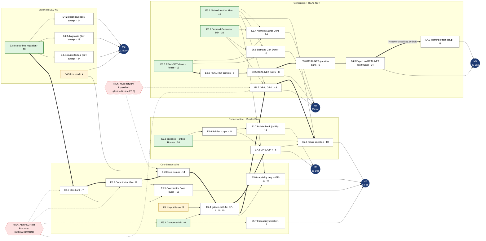
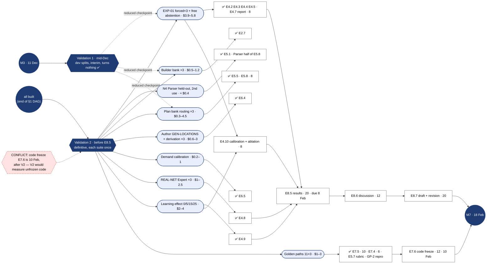

# PROTOTYPE — DAG of pending tasks with the critical path

> Throwaway asset for wayfinder ticket [Prototype: DAG of pending tasks with the critical path](https://github.com/ferranUPC/resto/issues/5)
> (map: [Re-baseline the TFM work plan (v0.3)](https://github.com/ferranUPC/resto/issues/1)). Lives on branch
> `prototype/dag-pending-tasks`, never on `master`. The validated DAG goes into `tfm-work-plan.md` v0.3.
> State as of 2026-09-24. Numbers on nodes are plan hours, read as **story points** (ticket "ADR-0028
> clock-time migration"), not wall-clock time.

Sources: work plan §1/§4, tracker notes, ADR-0023/0025/0026/0027/0028, the resolutions of "Inventory of
pending paid runs", "What does ✅ mean…" and "ADR-0028 clock-time migration". ✅ tasks are left out (all
their edges are satisfied); ⏳ tasks (built, only a measurement missing) appear because they still feed
milestones.

## 1. Build DAG (everything that must be built before Validation 2)

Thick arrows (`==>`) are the critical chains; dotted arrows come from risk nodes.

Not drawn, no prerequisite and off every chain: **E8.1** outline + SoA (16), **EVB** evaluation-budget
document (~5, dated ~24 Oct, before the funding request), **DLT** trim of `evaluating-resto.md`'s
Decisions log (~2), E8.2/E8.3/E8.4 (rolling chapters).

## 2. Measurement DAG (what turns ⏳ into ✅)

Per "What does ✅ mean…": measurement suites run only inside a validation pass. Costs from "Inventory of
pending paid runs"; $30 cap for both passes.

## 3. Critical paths (longest chain of pending build points to each milestone)

| Target | Points | Chain |
|---|---|---|
| M2 (build) | 34 | E3.8 → E4.4 |
| M3 (build) | 59 | E3.8 → E3.7 → E5.2 → E5.3 → E7.1 → E7.2 |
| M4 (build) | 61 | E3.8 → E3.7 → E5.2 → E5.3 → E7.1 → E6.7 |
| M5 (build) | 78 | E6.3 → E6.6 → E3.5 → E3.6 → E4.8 → E4.9 |
| M6 (build) | 71 | E3.8 → E3.7 → E5.2 → E5.3 → E7.1 → E6.7 → E7.3 |
| Validation 2 (all built) | 78 | = M5 chain |
| *Total pending build points* | *383* | |

After V2: E4.10 (8) → E8.5 (20) → E8.6 (12) → E8.7 (20) → E8.8 (8) = 68 points of tail, plus the V2
runs themselves.

## 4. What the DAG says (for the maintainer to react to)

1. **The plan is capacity-bound, not dependency-bound.** The longest chain is 78 of 383 pending build
   points (≈ 20 %). Order is mostly free; dates are set by how much fits per week, not by who waits for
   whom.
2. **One spine carries three milestones.** E3.8 → E3.7 → E5.2 → E5.3 → E7.1 is on the critical path of
   M3, M4 *and* M6: GP-8 and GP-11 (E6.7) need the Coordinator and the golden-path framework, so M4 is
   not only an E6 milestone.
3. **ADR-0027 (Proposed) sits at the root of that spine** (E3.7, E5.2, E5.4, E6.7 build on arms). It
   should be Accepted — or changed — before E3.7 starts, i.e. right after E3.8.
4. **E6.3 has no prerequisite.** The whole M5 chain (REAL-NET) can start any week; it is on the
   Christmas break only by calendar. Pulling E6.3 forward decouples M5 from the break.
5. **E4.9's network is not fixed by the DoD** (§4.7 says "held-out interventions at store sizes
   0/5/15/25", no network). On DEV-NET it leaves the REAL-NET chain: the M5 chain drops to 60 points and
   the learning-effect experiment can be set up as soon as E4.2–E4.4 are tuned.
6. **Frontier (no pending prerequisite):** E3.8, E2.5, E5.4, E6.1, E6.2, E6.3, E8.1, EVB, DLT.
7. **GP-9 (ambiguous request → `awaiting_user`) has no owning task.** Natural home: E7.1 (it starts at
   the Input Parser).
8. **Code freeze vs Validation 2.** V2 must finish before E8.5 (8 Feb) but E7.6 freezes code on 10 Feb,
   so the definitive measurements would run on code that can still change. Either a feature freeze
   before V2 or V2 counts as the freeze.
9. **Measurement-only tasks** (E4.7 report, E4.10, E5.8, E7.4, E7.5, E5.7's rubric half ≈ 50 points)
   all sit after V2 and before E8.5: that window is the real crunch of the calendar.
