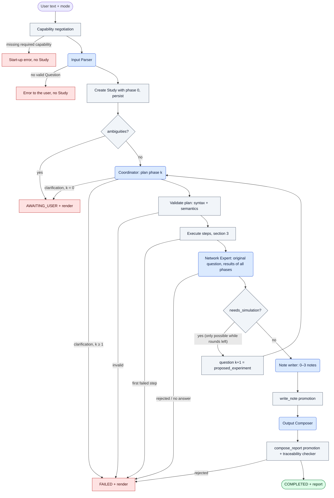
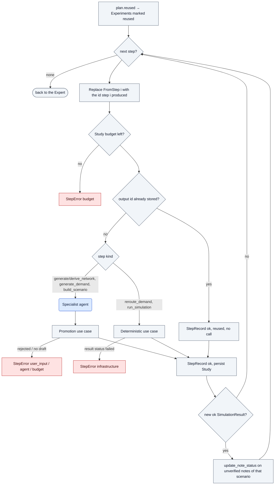
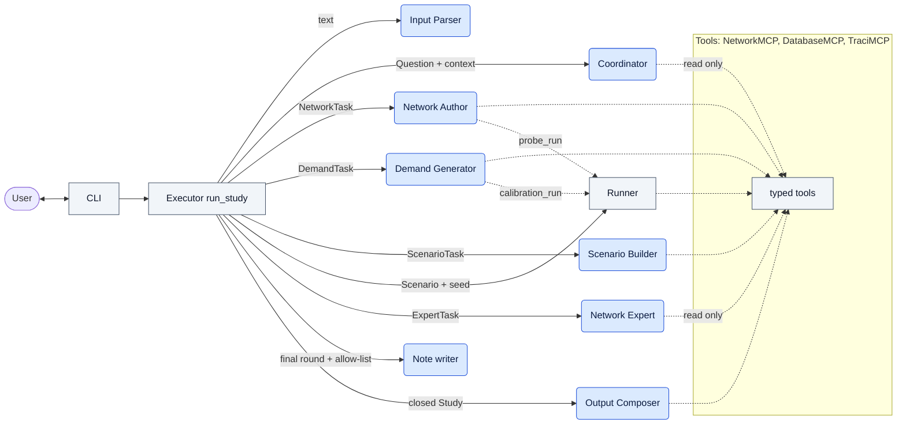

# RESTO — Study flows: who plans, who executes, what happens on failure

How a user request becomes a closed `Study`, after the Coordinator split. Sources:
[ADR-0023](adr/0023-coordinator-split-deterministic-executor.md) (Parser / Coordinator / Executor, `Study`
in phases), [ADR-0025](adr/0025-executor-plan-shape-intent-rules-and-failures.md) (plan shape, planning
rules by intent, typed failures, forced last round, agent ports) and
[ADR-0026](adr/0026-expert-notes-per-study-and-prediction-verification.md) (notes). Where this document
and the frozen v1.0 body disagree, the ADRs win. Replaces `study_flow_diagram.md` and
`agent_communication_diagram.md` (now in `docs/_old/`), which described the pre-ADR-0023 Coordinator.

In every diagram: **rounded blue = LLM agent**, **square grey = deterministic code**.

**Agents decide, the Executor chains, use cases certify.** No agent calls another agent; every agent
returns a draft to the Executor.

## 1. Responsibilities

| Piece | Kind | Decides | Never does | Lives in |
|---|---|---|---|---|
| Input Parser | agent, no tools | what the user asked (`Question`); textual ambiguity (`ambiguities[]`) | touch the database | `adapters/llm/agents/input_parser.py` |
| Coordinator | agent, one run per `Question`, read-only DB tools | reuse vs create, which experiments with `role`/`purpose`, order (`StudyPlan`); DB-level ambiguity (clarification) | execute anything | `adapters/llm/agents/coordinator.py` |
| Executor (`run_study`) | code | nothing about the domain: order, `FromStep`, dedup, budget, rounds and forced last round, status, persistence, which results the Expert gets, when notes are written and verified | call an LLM for a decision | `application/use_cases/run_study.py` |
| Network Author, Demand Generator, Scenario Builder | agents | *how* to satisfy their typed task | pick ids, status, provenance | `adapters/llm/agents/*.py` |
| Runner, `reroute_demand`, `scale_demand`, `update_note_status` | code | — | — | `application/use_cases/` |
| Promotion use cases | code | whether a draft is valid; ids; persistence | — | `application/use_cases/` |
| Network Expert | agent, read-only tools | answer, or `needs_simulation` + `proposed_experiment` | run SUMO, plan, write the report | `adapters/llm/agents/expert.py` |
| Note writer | agent, no tools | 0–3 notes about the network, each tied to at most one scenario from an allow-list | invent a scenario id | `adapters/llm/agents/expert.py` |
| Output Composer + traceability checker | agent + code | report prose; the checker verifies numbers | add reasoning of its own | `adapters/llm/agents/composer.py` |
| Failure / clarification render | code | three blocks: what happened, what was done, what the user can do | — | `interface/render.py` |

The Executor reaches agents through one narrow port per agent (`application/ports/agents.py`, task in,
`AgentRun[Draft]` out); the `run_<agent>` functions implement them with infrastructure bound in the
composition root (`interface/cli`).

## 2. Main flow

- The Expert is always asked the **user's original question**, with the results of every phase and the
  reused ones. Round `max_rounds` (3) is sent in forced mode, so a free study always ends with an answer;
  `ExpertRound.forced_by_limit` makes the report state it as a limitation (added by code).
- Forced studies have one phase and one round: the Expert must answer (`basis = extrapolated` if it has no
  data).
- A failure of the note writer goes to the trace and does not fail the study (notes are knowledge for
  later questions, not part of this answer).

## 3. Executing one plan

- Dedup runs before any call where the id can be computed in advance: `result_id` always;
  `scenario_id` from the task's interventions (the Builder may still change it by rejecting one — then
  `build_scenario`'s own dedup after the run applies). Networks and demands are content-hashed, so their
  reuse is the Coordinator's job at planning time (`find_network`, `find_demand`).
- `run_simulation` uses `DEFAULT_SEEDS = (1, 2, 3)` (the scenario matrix's), unless the step overrides
  them; every `build_scenario` + its runs becomes one `Experiment` with the step's `role` and `purpose`.
- No re-ask: a rejected draft is a failed step. The only retry in the system is inside `ToolAgent`, which
  feeds an output that fails validation back to the model within `Budget.max_steps`.

## 4. Planning rules and golden paths

What the Coordinator plans in phase 0 depends on `intent`; later phases are always planned as `run`
(the Expert asked for that experiment). Mode does not change the plan, only what the Expert may answer.

| `intent` | Phase 0 plan |
|---|---|
| `describe`, `diagnose` | ensure baseline results (reuse, or build + run the baseline) |
| `counterfactual` | ensure the baseline only; the treatment only if the Expert asks |
| `run` | the requested experiments (baseline and treatment) |
| `compare` | ensure results for every scenario being compared |

Traces as phases (P = Input Parser, C = Coordinator, E = Expert, N = note writer, Comp = Composer):

| GP | Request | Phase 0 | Later phases | End |
|---|---|---|---|---|
| GP-1 | describe, results exist | P → C (0 steps, reused baseline) → E | — | N → Comp |
| GP-2 | describe, no results | P → C → Builder → Runner → E | — | N → Comp |
| GP-3 | counterfactual, free, no match | P → C (baseline) → E `needs_simulation` | C → Builder (treatment) → Runner → E | N → Comp |
| GP-4 | same, forced | P → C (baseline) → E `extrapolated` | — | N (prediction note) → Comp |
| GP-5 | same, experiment exists | P → C (0 steps, reused baseline + treatment) → E `observed` | — | N → Comp |
| GP-6 | closure when occupancy > 0.8 (`run`) | P → C → Builder (script) → Runner (online) → E | — | N → Comp |
| GP-7 | compare A and B | P → C (0 steps, reused A + B as comparison) → E | — | N → Comp |
| GP-8 | new place, nothing exists | P → C → Network Author → Demand Generator → Builder → Runner → E | — | N → Comp |
| GP-9 | ambiguous | P (or C) → `awaiting_user`, render | — | — |
| GP-10 | no `historical_demand` | P → C (parameter-driven demand, fallback in `rationale`) → Demand Generator → … | — | N → Comp |
| GP-11 | add an edge J7–J9 (`run`) | P → C → Network Author (derive) → `reroute_demand` → Builder ×2 → Runner ×2 → E (compare) | — | N → Comp |

A free *counterfactual* topology question ("what if we added an edge…") is GP-3-shaped: phase 1 is
`derive_network` → `reroute_demand` → Builder → Runner. Open until E5.3: how `ExpertTask` covers a base
and a derived network (ADR-0023).

## 5. Failure flows

On the first failure the Executor stops, leaves pending steps unrun, persists, and the study is rendered
by code (no Composer call). A rerun of the same request reuses everything already promoted.

| Where | Detected by | Status | `StepError.kind` | What the user sees / can do |
|---|---|---|---|---|
| Required DatabaseMCP capability missing | capability negotiation | no Study | — | start-up error naming the capability |
| Parser cannot produce a valid `Question` | `ToolAgent` (validation retries exhausted) | no Study | — | error; rephrase |
| Ambiguous text | Parser | `awaiting_user` | — | the list of ambiguities; ask again, more precisely |
| Ambiguous against the DB (two "Gran Via" networks) | Coordinator, phase 0 | `awaiting_user` | — | the candidates with their labels |
| Proposed experiment cannot be planned | Coordinator, phase ≥ 1 | `failed` | `agent` | which round and why |
| No plan / invalid plan (`FromStep` not in `depends_on`, unknown id, `HistoricalDb` without the capability) | `ToolAgent` / plan validation | `failed` | `agent` | the planning phase named |
| Unknown edge, intervention rejected by the Builder | promotion | `failed` | `user_input` | the wrong item and the reason; rephrase |
| Specialist or Study budget exhausted | `ToolAgent` stop reason / Executor | `failed` | `budget` | narrow the question or rerun with a raised budget |
| Specialist returns no valid draft (sanity never passes, SUMO rejects its cfg) | promotion | `failed` | `agent` | retry or change approach; `unresolved[]` shown |
| SUMO crash, `netconvert` failure, OSM / repository down | Runner result / adapters | `failed` | `infrastructure` | nothing on their side; logs path |
| Expert returns no answer / answer rejected | `ask_expert` | `failed` | `agent` (`budget` if it ran out) | the round named |
| Report rejected by the traceability checker | `compose_report` | `failed` | `agent` | results and Expert answer are stored; rerun composes again |
| Note writer fails | `write_note` | unchanged | none — logged in the trace, not a `StepRecord` | — |

## 6. Notes

Notes are about the **network**, not the study (the study's conclusion is the `Report`); they are
retrieved by `search_notes` in later questions on the same network.

- **Written** once per completed study, after the final round: 0–3 notes, each about one scenario or the
  network in general.
- **Scenario**: chosen by the agent from an allow-list — the study's scenarios plus, for an answer about an
  intervention that was not simulated, its predicted `scenario_id` (`scenario_id_for` with the baseline's
  network and demand).
- **Provenance**: `simulation` only if that scenario has ok results in the study; otherwise `opinion`
  (a prediction keeps its `scenario_id`).
- **Verified** by `update_note_status` after every *new* ok result of the note's scenario — never on reused
  results, which would confirm a note with its own data. A forced prediction is settled the first time
  its scenario is simulated.

## 7. Who calls whom

Solid arrows: the Executor sends a typed task and receives a draft (or a result, for the Runner). Dotted:
tool use inside an agent's own run. The Coordinator no longer sends tasks to anyone.
