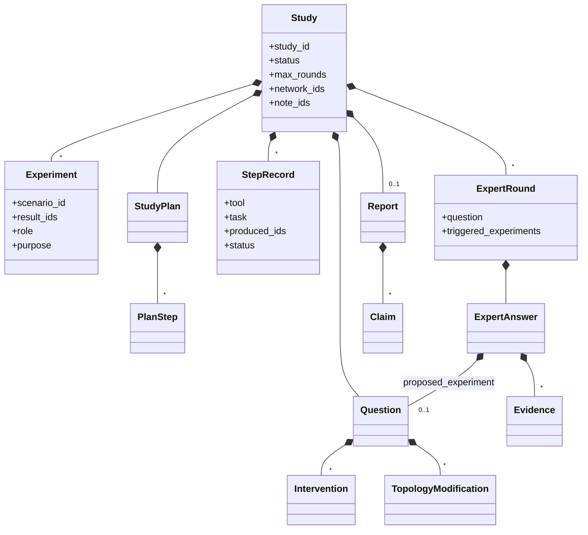
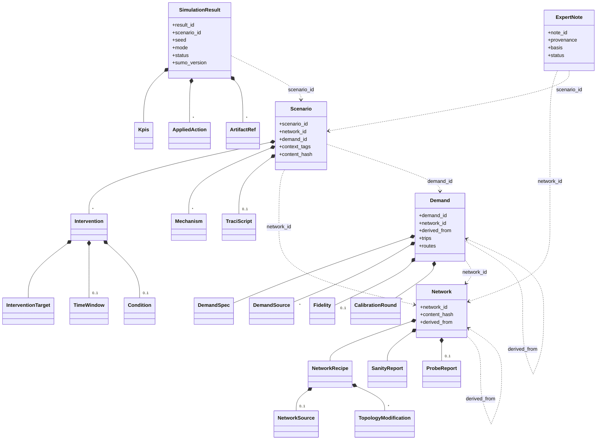

# Agentic Traffic Simulation Framework — Architecture & Definition of Done (v0.3)

Status: third iteration. Supersedes v0.2 (kept in [`_old/tfm-architecture-and-dod-v0.2.md`](_old/tfm-architecture-and-dod-v0.2.md)). The reasoning behind every change is recorded in [`_old/domain-model-proposal-2026-09-11.md`](_old/domain-model-proposal-2026-09-11.md).

Changes vs v0.2:

- **All authoring modules are agents.** Network Author (renamed from Network Generator), Demand Generator, Scenario Builder, Coordinator (which absorbs the Input Parser), Network Expert and Output Composer are tool-using LLM agents sharing one interface (`ToolAgent`). Only the Simulation Runner is plain code.
- **Agents return drafts; code promotes them.** Every agent ends by returning a typed *draft* (data + references to the artifacts it produced + rationale). Deterministic code validates the draft, assigns identity and turns it into a domain entity. No agent ever assigns an id, a hash, a `status` or a `provenance`.
- **Agent decisions are recorded as data.** Network edits are typed tool calls on SUMO's plain XML (never on the compiled `.net.xml`) plus `netconvert` options; the call sequence is a *recipe* stored with the network and replayable without an LLM. Demand keeps its sources frozen as artifacts. This is what keeps principles 5 and 6 valid with agentic authoring.
- **Domain model made explicit.** Six aggregates (`Study`, `Network`, `Demand`, `Scenario`, `SimulationResult`, `ExpertNote`) and their value objects, with an identity policy and invariants (§2.3). `Study` is new: the user asks a `Question`; answering it is a `Study`; a `Study` may run zero or more `Experiment`s.
- **`Demand` is an aggregate**, modelled as *trips* plus *routes computed for one network*, calibrated against counts by running short simulations in the loop. DatabaseMCP gains a required `demands` capability.
- **Network derivation.** Anything that needs a different `.net.xml` (add/remove an edge, change lanes) is a `TopologyModification` applied by the Network Author to derive a new `Network`; it is not a scenario intervention.
- **One dynamic mechanism.** The declarative `TraciPlan` and its interpreter are gone. Dynamic interventions are Python scripts against a small `resto.traci_api` that itself offers the declarative primitives `at_time(...)` and `when(...)`; a script that only uses them *is* the old plan. `Intervention` gains a `custom` type as the escape hatch.
- **`seed` moves from `Scenario` to `SimulationResult`** (one scenario, several seeded runs, as the scenario matrix always assumed).
- **MCP is transport, not a layer.** MCP servers live in `interface/mcp/` and wrap application ports; SUMO, Postgres and the LLM client live in `adapters/`.
- **One data model.** Domain types are stdlib dataclasses validated and serialised with `pydantic.TypeAdapter` at the boundaries. No parallel `contracts/` package, no mappers.
- **Environment.** SUMO 1.27.1 is installed from PyPI as a regular dependency (`eclipse-sumo`, `sumolib`, `traci`); no `SUMO_HOME` needed.

All *(threshold)* values remain placeholders until first measurements.

---

## 1. Design principles

1. **Evaluation first.** Every module has a *Minimal* version (the framework runs end-to-end), a *Done* criterion (metric + threshold + test asset) and a *Stretch* level. The thesis can stop at any point where every module is at least *Minimal* and the research focus (Network Expert) is *Done*.
2. **Typed contracts between modules.** Modules communicate through validated schemas, never free text. Every LLM output is validated against a dataclass schema; one retry with the validation error in the prompt, then explicit failure.
3. **Authoring is agentic, execution is not.** Agents write networks, demands, scenarios, scripts, answers and reports. Anything that touches SUMO at run time is deterministic code executing what the agents wrote.
4. **Agents return drafts; code promotes them.** An agent's output is data plus artifact references. Promotion (validation, identity, persistence) is code. Ids, hashes, `status` and `provenance` are never written by an agent.
5. **Decisions as data.** Whatever an agent decides is recorded in a form that code can re-apply without the agent: a network recipe, a demand spec with frozen sources, a script. Determinism is then a property of the replay, and the agent's step is evaluated statistically (repeated runs).
6. **Simulation is the ground truth.** SUMO decides what is true. Agents are evaluated against simulation, never against other agents.
7. **Every answer carries evidence.** No module produces a claim that cannot be traced to an artifact or a query.
8. **Ports and adapters, lightly.** Three ports matter — the LLM, SUMO, storage — because they are what lets tests run without an API key, without SUMO and without Postgres, and what makes DatabaseMCP pluggable. No further ceremony (no interactors, presenters or per-layer DTOs).

---

## 2. Architecture

### 2.1 Software layers vs. functional modules

Two taxonomies that must not be confused: the **functional modules** below (what the framework does) and the **software layers** of the repository (`domain / application / adapters / interface`). A module cuts across layers.

```
┌────────────────────────────── Interface ────────────────────────────────┐
│   CLI · MCP servers (NetworkMCP, DatabaseMCP, TraciMCP) · report render  │
└──────────────────────────────┬──────────────────────────────────────────┘
                               ▼
┌────────────────────────── Coordinator (agent) ──────────────────────────┐
│  understands the request → Question + StudyPlan; calls specialists as   │
│  tools; keeps the Study; closes the Expert ↔ Simulation loop            │
└──────┬──────────────┬──────────────┬──────────────┬─────────────┬───────┘
       ▼              ▼              ▼              ▼             ▼
┌ Network Author ┐┌ Demand Gen. ┐┌ Scenario Builder ┐┌ Network Expert ┐┌ Output Composer ┐
│ create/derive  ││ trips+routes││ static files or  ││ facts via tools││ Report with     │
│ network (agent)││ calibrated  ││ traci_api script ││ opinions via   ││ evidence-linked │
│                ││ (agent)     ││ (agent)          ││ notes (agent)  ││ claims (agent)  │
└───────┬────────┘└──────┬──────┘└────────┬─────────┘└───────┬────────┘└────────────────┘
        │                │               │                  │
        ▼                ▼               ▼                  │
┌──────────────── Simulation Runner (deterministic code) ───┴─────────────┐
│  batch: sumo + sumocfg · online: sumo under TraCI running the script    │
│  also used as a tool by Network Author (probe_run) and Demand Generator │
│  (calibration_run)                                                      │
└─────────────────────────────────────────────────────────────────────────┘
┌──────────────────────────── Ports & adapters ───────────────────────────┐
│  LLM (Anthropic) · SUMO (netconvert, duarouter, routeSampler, sumo,     │
│  traci) · storage (Postgres + pgvector, filesystem artifact store)      │
└─────────────────────────────────────────────────────────────────────────┘
```

| Functional module | Kind | Use case(s) (`application/use_cases/`) | Ports used | Main adapter |
|---|---|---|---|---|
| Coordinator (incl. Input Parser) | agent | `run_study` | `ToolAgent`, `StudyRepository`, **the other use cases as tools** | `llm/agents/coordinator.py` |
| Network Author (create and derive) | agent | `generate_network`, `derive_network` | `ToolAgent`, `OsmSource`, `NetconvertRunner`, `PlainNetEditor`, `NetworkQuery`, `NetworkRepository`, `run_simulation` (probe) | `llm/agents/network_author.py`, `sumo/netconvert.py`, `sumo/plain_edit.py` |
| Demand Generator | agent | `generate_demand`, `reroute_demand` | `ToolAgent`, `WebSearch`, `HistoricalDemandSource`, `DemandTools`, `run_simulation` (calibration), `DemandRepository` | `llm/agents/demand_generator.py`, `sumo/demand.py` |
| Scenario Builder | agent | `build_scenario` | `ToolAgent`, `NetworkQuery`, `AdditionalFileWriter` (one per mechanism, exposed as tools), `ScriptSandbox`, `ScenarioRepository` | `llm/agents/scenario_builder.py`, `sumo/writers/` |
| Simulation Runner | **code** | `run_simulation` | `SumoRunner`, `ScriptSandbox`, `ResultRepository` | `sumo/runner.py`, `sumo/traci_api.py` |
| Network Expert | agent | `ask_expert`, `write_note` | `ToolAgent`, `NetworkQuery`, `ResultQuery`, `NoteRepository` | `llm/agents/expert.py` |
| Output Composer | agent | `compose_report` | `ToolAgent`, `StudyRepository`, `ResultQuery` | `llm/agents/composer.py` |
| NetworkMCP / DatabaseMCP / TraciMCP | transport | — | expose `NetworkQuery`, the repositories, `TraciControl` | `interface/mcp/*_server.py` |

**MCP is transport.** Every tool exists first as a typed Python function in `application/tools/`. An MCP server is a *driving* adapter (an external client comes in through it), like the CLI, and lives in `interface/`. The framework itself calls tools in-process; MCP is required where an external party must plug in (DatabaseMCP's pluggable contract) and optional everywhere else.

### 2.2 Agents: one port, six configurations

All six agents have the same shape from the outside: *given a task, a list of tools, an expected output type and a budget, run the LLM ↔ tools loop until a final output is produced; return it validated against the type, together with the tool trace and the usage.*

```python
class ToolAgent(Protocol):
    def run(self, task: AgentTask, tools: Sequence[Tool], output: type[T], budget: Budget) -> AgentRun[T]: ...

# AgentRun[T] = output: T · tool_calls: tuple[ToolCall, ...] · usage: Usage · stop_reason
```

One implementation (the Anthropic client) and one fake for tests. What differs per agent is configuration:

| Agent | `task` (typed, filled by the Coordinator) | `tools` | `output` (draft) |
|---|---|---|---|
| Network Author | `NetworkTask`: `source` **or** `base_network_id`, `goals[]`, mandatory `modifications[]`, `sanity_thresholds`, `probe_teleport_threshold`, `max_rounds` (5) | `fetch_osm`, `netconvert`, `inspect_network`, `sanity_check`, `probe_run`, `keep_largest_component`, `remove_isolated`, `join_junctions`, `keep_vclass`, `remove_edge`, `add_edge`, `set_lanes`, `set_speed` (v1 catalogue; grows, see §2.4) | `NetworkDraft` |
| Demand Generator | `DemandTask`: `network_id`, `profile`, `sources[]`, `control_edges[]`, `tolerance`, `max_calibration_rounds` (5), `seed` | `web_search`, `fetch_url`, `get_historical_demand`, `random_trips`, `duarouter`, `route_sampler`, `calibration_run` | `DemandDraft` |
| Scenario Builder | `ScenarioTask`: `network_id`, `demand_id`, `interventions[]`, `context_tags[]`, `allow_script` | `edge_exists`, `lane_exists`, `tls_exists`, `write_rerouter`, `write_vss`, `write_tls_program`, `write_taz`, `write_sumocfg`, `write_traci_script`, `lint_script`, `dry_run` | `ScenarioDraft` |
| Network Expert | `ExpertTask`: `question`, `mode`, `network_id`, available `result_ids[]`, `notes_allowed` | `get_edge`, `get_lanes`, `get_neighbours`, `shortest_path`, `capacity_estimate`, `get_tls`, `query_edgedata`, `get_result`, `list_results`, `search_notes` | `ExpertAnswer`; after an experiment `ExpertNoteDraft` |
| Output Composer | the closed `Study` | `get_study`, `get_result`, `query_edgedata` | `Report` |
| Coordinator | user text + database state | `find_network`, `find_demand`, `find_scenario`, `list_results`, `generate_network`, `derive_network`, `generate_demand`, `reroute_demand`, `build_scenario`, `run_simulation`, `ask_expert`, `compose_report`, `ask_user` | `Question` + `StudyPlan` first, then `StudyOutcome` |

**Draft → entity (promotion).** Always in `application/`, always in this order: (1) syntactic validation with `TypeAdapter(Draft)` — runs the dataclass invariants; (2) semantic validation against the network (ids exist, windows inside the simulation, demand belongs to the network); (3) deterministic construction — id from hash, files written, entity built; (4) persistence and tracing.

| Agent | Draft contents | Promotion checks → entity |
|---|---|---|
| Network Author | `source`/`base_network_id`, `netconvert_options[]`, `plain_edits[]` (the recipe), `net_artifact`, `sanity_report`, `probe_report`, `unresolved[]`, `rationale` | SUMO loads the net; sanity recomputed; `replay(recipe)` yields the same hash; `network_id = content_hash` → `Network` |
| Demand Generator | `spec`, `sources[]`, `trips_artifact`, `routes_artifact`, `fidelity` (with evidence), `calibration_rounds[]`, `rationale` | `duarouter` loads routes on the network; teleports ≤ threshold; fidelity within tolerance; `demand_id = content_hash(trips)` → `Demand` |
| Scenario Builder | `interventions[]`, `mechanism` per intervention, `additional_files[]`, `sumocfg`, `script?`, `rejected[]`, `rationale` | SUMO loads the cfg; ids exist; script passes lint and `dry_run`; `scenario_id = hash(network_id, demand_id, interventions, context_tags)` → `Scenario` |
| Network Expert | `ExpertAnswer`; `ExpertNoteDraft` | attached to the current `ExpertRound`; `write_note` sets `provenance`/`status` → `ExpertNote` |
| Output Composer | `Report` | traceability checker (every number appears in a referenced artifact) |
| Coordinator | `Question`, `StudyPlan`, `StudyOutcome` | `run_study` keeps the `Study` and enforces the guards of §2.4 |

**Coordinator decides *what*, specialists decide *how*.** Which network, reuse or generate, which counts, which interventions, baseline vs. treatment, mode, when to ask the user, when to stop: Coordinator, materialised in the typed task it sends. Which 40 OSM edges to remove, which `routeSampler` options, whether a closure is a rerouter or a script: the specialist, because it is the one looking at the state. The specialist's draft says what it decided and why (`rationale`, recipe, `rejected[]`); the Coordinator accepts, re-asks with a corrected task, or fails the step.

### 2.3 Domain model

#### Aggregates (identity, own repository, referenced by id)

| Aggregate | Id | How the id is obtained | Repository / DatabaseMCP capability | References |
|---|---|---|---|---|
| `Study` (root of a request) | `study_id` | UUID | `StudyRepository` — a framework port, **not** part of the DatabaseMCP contract | `network_ids[]`, `experiments[].scenario_id`, `experiments[].result_ids`, `note_ids[]` |
| `Network` | `network_id` | `content_hash` of the `.net.xml` | `networks` | `derived_from?` |
| `Demand` | `demand_id` | `content_hash` of `trips` | `demands` (**new, required**) | `network_id`, `derived_from?` |
| `Scenario` | `scenario_id` | `hash(network_id, demand_id, interventions, context_tags)` | `scenarios` | `network_id`, `demand_id` |
| `SimulationResult` | `result_id` | `hash(scenario_id, seed, mode, sumo_version)` | `results` | `scenario_id` |
| `ExpertNote` | `note_id` | UUID | `notes` | `network_id`, `scenario_id?`, `study_id` |

Identity policy. Network and demand are *agent outputs* with no canonical input to hash, so their id is the content hash and lookup is by `source`/name/`derived_from`. Scenario and result have a canonical input, so their id is the hash of the **request**, not of the files: two builds of the same scenario may differ in formatting but are the same scenario and must be reused. `result_id` makes "zero redundant simulations" true by construction. `Study` and `ExpertNote` are events and get UUIDs.

Why `Study` and not `Experiment` is the root: the user asks a question; sometimes the answer comes from existing results and no experiment is needed; sometimes one or several are (counterfactual, compare, the Expert loop). `Experiment` is the unit (one scenario and its runs); `Study` holds the question, plan, steps, Expert rounds and report. It stays outside the DatabaseMCP contract because it is framework run-time state, not knowledge about networks.

#### Value objects

| Value object | Lives in | Fields (essence) |
|---|---|---|
| `Question` | `Study`, `ExpertAnswer` | `text`, `intent` (describe / diagnose / counterfactual / compare / run), `mode` (free / forced), `network_ref`, `demand_ref`, `interventions[]`, `topology_changes[]`, `metrics_of_interest[]`, `time_window`, `context_tags[]`, `ambiguities[]` |
| `StudyPlan`, `PlanStep` | `Study` | `steps[]` (`module`, `inputs`, `expected_artifacts`, `depends_on`), `rationale`, `reuse_decisions[]` |
| `StepRecord` | `Study` | `tool`, `task` (the typed task sent), `produced_ids[]`, `status`, `error`, `usage` |
| `Experiment` | `Study` | `scenario_id`, `result_ids[]`, `role` (baseline / treatment / comparison), `purpose` |
| `ExpertRound` | `Study` | `question`, `answer`, `triggered_experiments[]` |
| `ExpertAnswer`, `Evidence` | `ExpertRound` | `answer`, `evidence[]` (`kind` artifact / query, `ref`, `excerpt`), `confidence` ∈ [0, 1], `basis` (observed / inferred / extrapolated), `needs_simulation`, `proposed_experiment: Question?` |
| `Report`, `Claim` | `Study` | `summary`, `sections[]`, `claims[]` (`text`, `value`, `evidence_refs[]`), `mode`, `basis`, `limitations[]` |
| `NetworkTask`, `DemandTask`, `ScenarioTask`, `ExpertTask` | `StepRecord` | see §2.2 |
| `NetworkRecipe` | `Network` | `source?` **xor** `base_network_id?`, `osm_snapshot?`, `netconvert_options[]`, `plain_edits: TopologyModification[]` |
| `NetworkSource` | `NetworkRecipe` | `kind` (place / bbox / file), `value` |
| `TopologyModification` | `NetworkRecipe`, `Question` | discriminated union: `RemoveEdge`, `AddEdge(from_junction, to_junction, lanes, speed)`, `SetLanes`, `SetSpeed` — one variant per plain-XML edit tool; `netconvert` options are not modifications |
| `SanityReport` | `Network` | `largest_scc_ratio`, `zero_length_edges`, `all_reachable_from_fringe`; thresholds are parameters |
| `ProbeReport` | `Network` | `teleports`, `collisions`, `not_arrived`, `hot_edges[]`, `evidence` |
| `DemandSpec` | `Demand` | `profile` (low / peak / incident / custom), `window`, `seed`, `scale`, `vehicles_per_hour?`, `sampler_options[]` |
| `DemandSource` | `Demand` | union: `Parameters`, `HistoricalDb(query)`, `ExternalDataset(url, snapshot, transformation)` |
| `Fidelity`, `EdgeFidelity` | `Demand` | `per_edge[]` (`edge_id`, `target`, `achieved`), `tolerance`, `evidence` (edgedata of the last calibration run) |
| `CalibrationRound` | `Demand` | `round`, `params`, `max_abs_error` |
| `Intervention` | `Scenario`, `Question` | `type` ∈ {`lane_closure`, `edge_closure`, `speed_limit`, `demand_scale`, `signal_program`, `custom`}, `target`, `params`, `window` **xor** `condition`, `description?`, `expected_effect?` |
| `InterventionTarget` | `Intervention` | discriminated union `EdgeTarget | LaneTarget | TlsTarget | TazTarget`, each with `kind` |
| `TimeWindow`, `Condition` | `Intervention` | `(start, end)`; `(metric, target, op, value)` |
| `Mechanism` | `Scenario` | per intervention: `StaticFile(file_kind, path)` \| `Script` \| `RegenerateDemand(demand_id)` |
| `TraciScript` | `Scenario` | `artifact`, `api_version`, `declared_rules[]` (what `at_time`/`when` registered), `lint_ok`, `dry_run_ok` |
| `AppliedAction` | `SimulationResult` | `step`, `action`, `params`, `origin` (rule / code) |
| `Kpis`, `ArtifactRef` | several | `mean_delay`, `mean_travel_time`, `teleports`, `departed`, `arrived`; `(path, content_hash, kind)` |

#### Diagrams

Study (framework run-time state):



Knowledge (aggregates stored through DatabaseMCP):



`*--` composition (same lifecycle, no id of its own); `..>` reference by id, resolved through a repository. Across the two diagrams: `Experiment.scenario_id → Scenario`, `Experiment.result_ids → SimulationResult`, `Study.network_ids → Network`, `Study.note_ids → ExpertNote`, `ExpertNote.study_id → Study`.

#### Invariants enforced by the domain (never by an agent)

- `Intervention`: exactly one of `window` / `condition`; `demand_scale` takes no target, every other type requires one; `custom` requires `description`. A permanent `edge_closure` (no window, no condition) is rejected: it is a `TopologyModification`.
- `NetworkRecipe`: exactly one of `source` / `base_network_id`; `base_network_id` equals `Network.derived_from`; `source.kind ∈ {place, bbox}` ⇒ `osm_snapshot` present.
- `Demand`: `routes` computed for `network_id`; `fidelity` present ⇒ `evidence` present.
- `Scenario`: one `Mechanism` per intervention; any `Script` mechanism ⇒ `TraciScript` present with `lint_ok` and `dry_run_ok`; `demand_scale` ⇒ its mechanism is `RegenerateDemand`.
- `SimulationResult`: `sumo_version == 1.27.1`; `failed` ⇒ `error` non-empty; `ok` ⇒ `kpis` present; `mode == online` ⇔ the scenario has a script.
- `Study`: `StudyPlan` present before the first `StepRecord`; `len(rounds) ≤ max_rounds` (default 3); `mode == forced` ⇒ no round triggers experiments; `ambiguities` non-empty ⇒ status `awaiting_user` and no steps.
- `ExpertNote.status` only changes because of a later `SimulationResult`.
- `Network`: `replay(recipe)` reproduces `content_hash` (store-level test, not a construction invariant).

#### The loop with this model

1. Coordinator produces `Question` and `StudyPlan`; `run_study` creates the `Study`.
2. Each tool the Coordinator calls is a `StepRecord` carrying its typed task; the ones that produce scenario + result add an `Experiment`.
3. `ask_expert` adds an `ExpertRound`. If `needs_simulation`, `mode == free` and rounds remain, the Coordinator receives `proposed_experiment` and goes back to 2.
4. `compose_report` closes the `Study` with a verified `Report`.

With `intent = describe` on existing results: 1 → `ask_expert` → 4, zero experiments.

### 2.4 Module responsibilities

**Coordinator (includes the former Input Parser).** Turns the user's text into a `Question` (recording missing or ambiguous information in `ambiguities[]` instead of guessing), emits a `StudyPlan` before acting, then calls the specialists as tools. Decisions: (1) network exists (by `source`/name, or by `derived_from` + recipe) or generate/derive; (2) demand exists or generate/reroute; (3) matching scenario/result exists (`scenario_id` / `result_id` by hash, else `find_similar_scenario`) or build + run; (4) Expert can answer from existing results, or a simulation is needed; (5) in *free* mode, if the Expert returns `needs_simulation`, schedule the proposed experiment and re-ask; in *forced* mode, accept the answer. Guards live in code, not in the prompt: never re-run an existing `result_id`; `max_rounds`; total budget; `ambiguities` ⇒ `awaiting_user`; `StudyPlan` mandatory before the first step. Capability negotiation with DatabaseMCP at start-up.

**Network Author.** Two operations, same agent: **create** (`source` → network) and **derive** (`base_network_id` + modifications → network with `derived_from`). Its loop is *look at the network → apply a tool → look again* until sanity passes and `probe_run` is below the teleport threshold, or `max_rounds` is exhausted. Rules:

- It never edits the compiled `.net.xml`. Most clean-ups are `netconvert` options (`--keep-edges.components 1`, `--remove-edges.isolated`, `--junctions.join`, `--keep-edges.by-vclass`, `--remove-edges.by-type`, `--geometry.remove`). Real edits are made on the **plain XML** (`netconvert --plain-output-prefix` → `.nod.xml`, `.edg.xml`, `.con.xml`, `.tll.xml`) and `netconvert -n -e -x` recompiles. `add_edge(from_junction, to_junction, lanes, speed)` is one element in `.edg.xml`; `netconvert` traces the geometry and infers connections.
- The recipe is *OSM snapshot + `netconvert` options + plain edits*; `replay(recipe)` is deterministic under the pinned SUMO version.
- "Is the network good enough" has two levels: static (`SanityReport`) and dynamic (`probe_run`: a short simulation with light random demand and a fixed seed, returning teleports, collisions, non-arrivals and the edges where they happen). `probe_run` reuses `run_simulation`; its runs are ephemeral and never enter the results store; the last one leaves its edgedata as `ProbeReport.evidence`.
- The v1 tool catalogue is a starting point. Hand-cleaning REAL-NET (E6.3) logs every fix as (type, plain file, attribute); that log is both the error taxonomy and the tool backlog (`set_connection`, `disallow_turn`, `set_priority`, `set_junction_type`, `join_tls`, …). When the agent needs a fix for which no tool exists, it reports it in `unresolved[]` with the affected edge/junction — evidence, not a silent failure.

**Demand Generator.** Produces a `Demand` = trips (origin, destination, departure) + routes computed for one network. Sources: explicit parameters, `historical_demand` from DatabaseMCP, or an external dataset found on the web and **frozen as an artifact** (`ExternalDataset(url, snapshot, transformation)`). When only counts are available it calibrates: generate abundant candidate routes (`randomTrips` + `duarouter`) → `routeSampler --edgedata-files counts` → simulate a short calibration scenario (no interventions) via `run_simulation` → measure at the control edges → adjust (scale, `--optimize`, more candidates) → repeat, at most `max_calibration_rounds` (5). Calibration runs are ephemeral; the last one leaves its edgedata as `Fidelity.evidence`. `reroute_demand(demand, network)` is deterministic code: same trips, new routes, `derived_from` set — this is what makes "add an edge" experiments fair. `demand_scale` produces a derived demand with `scale` in its spec.

**Scenario Builder.** Receives network + demand + interventions and produces a scenario SUMO can run: the `sumocfg`; for each intervention the SUMO **mechanism** (§2.5) written as an additional file, or a script against `traci_api` when no static mechanism fits or the intervention has a runtime `condition` or is `custom`; validation before hand-over (ids exist, SUMO loads the cfg, script passes `lint_script` and `dry_run`); `rejected[]` with a reason for what it cannot implement. It is where SUMO mechanism expertise lives; the Network Author changes the network, the Builder changes what happens on it.

**Simulation Runner.** Deterministic code, no LLM. Batch mode runs `sumo` on the `sumocfg`. Online mode runs SUMO under TraCI executing the scenario's script in a subprocess sandbox with the same seed; `traci_api` logs every action to `applied_actions` (with `origin = rule | code`). Produces `SimulationResult`. Same scenario + seed → identical output. Also serves `probe_run` and `calibration_run` as a tool (ephemeral runs, not stored).

**Network Expert.** The research focus. Answers descriptive, diagnostic and counterfactual questions about one specific network from what has been simulated on it and what it learned from earlier experiments. Facts via tools (edgedata and KPIs through `query_edgedata`/`get_result`; topology through NetworkMCP), never from memory; every claim carries `evidence[]`. Every answer declares `basis` (observed / inferred / extrapolated) and `confidence`. In *free* mode it may abstain (`needs_simulation` + `proposed_experiment`); in *forced* mode it must answer, marking `basis = extrapolated`. After each experiment it writes an `ExpertNote` (prose, with `provenance`, `basis`, `context_tags`), retrieved via `search_notes` in later questions; a later simulation confirms or refutes a note and code updates its `status`. It never runs SUMO, never plans the study, never writes the final report.

**Output Composer.** Takes the closed `Study` and produces a `Report`: summary, sections, `claims[]` each with `evidence_refs[]`, experiment table, mode, basis, limitations. Adds no reasoning of its own. A deterministic traceability checker verifies that every number in a claim appears in the referenced artifact. Markdown rendering is in `interface/`.

**NetworkMCP.** Read-only queries on a `.net.xml` via `sumolib`: `get_edge`, `get_lanes`, `get_neighbours`, `shortest_path`, `edges_in_bbox`, `capacity_estimate`, `get_tls`. Pure functions.

**DatabaseMCP.** A **standard contract** with a pluggable backend; the framework ships a Postgres + `pgvector` reference implementation and a conformance suite. The framework consumes it through repository ports with two adapters: in-process (`persistence/postgres/`) and `persistence/mcp_client.py` against an external server; `interface/mcp/database_server.py` exposes the reference implementation.

| Capability | Tools | Required? |
|---|---|---|
| `networks` | `store_network`, `get_network`, `list_networks`, `find_network(source, name, derived_from)` | yes |
| `demands` | `store_demand`, `get_demand`, `list_demands(network_id)` | yes |
| `scenarios` | `store_scenario`, `get_scenario`, `find_similar_scenario(network_id, interventions, context_tags)` | yes |
| `results` | `store_result`, `get_result`, `list_results(scenario_id)`, `query_edgedata(result_id, edge_ids, window)` | yes |
| `notes` | `store_note`, `search_notes(query, network_id, filters)`, `update_note_status` | yes |
| `historical_demand` | `get_historical_demand(network_id, day_type, hour)` | optional |

Capability discovery at start-up as in v0.2: missing required capability → hard failure with a clear message; missing `historical_demand` → parameter-driven demand and the plan records the fallback. Large artifacts (`.net.xml`, trips, routes, edgedata, tripinfo, scripts) live in the filesystem artifact store, referenced by `ArtifactRef` — never in the database.

**TraciMCP and `traci_api`.** The same typed primitives, two consumers. `resto.traci_api` is the Python module Builder scripts import: low-level primitives (`close_lane`, `open_lane`, `set_speed`, `set_tls_program`, `get_edge_occupancy`, `get_edge_speed`, `get_vehicle_count`, `step`) plus declarative registration (`at_time(t, action)`, `when(condition, action)`, `run()`), all logging to `applied_actions`. `lint_script` checks by AST that a script imports nothing but `resto.traci_api`. TraciMCP exposes the same primitives over MCP for a Stretch live agent.

### 2.5 Intervention → mechanism table (Builder's decision rules)

| Intervention | Fixed `window` (static file) | Runtime `condition` (script) |
|---|---|---|
| `lane_closure` | rerouter with `closingLaneReroute` in an `.add.xml` | `when(cond, close_lane(lane))` |
| `edge_closure` (time-bounded) | rerouter with `closingReroute` | `when(cond, close_lane(...))` on all lanes |
| `speed_limit` | `variableSpeedSign` with a time profile | `when(cond, set_speed(edge, v))` |
| `signal_program` | TLS program in an `.add.xml` with `WAUT` switching | `when(cond, set_tls_program(tls, p))` |
| `demand_scale` | derived `Demand` with `scale` (mechanism `RegenerateDemand`) | not supported in v1 → `rejected[]` |
| `custom` | if a static mechanism fits, use it | otherwise a script with free Python against `traci_api`; if not implementable → `rejected[]` |

Not interventions: permanent edge removal, adding an edge, lane-count or design-speed changes. Those are `TopologyModification`s applied by the Network Author to derive a new `Network` (§2.4). Rule: *if SUMO must load a different `.net.xml`, it is the Network Author; if the network is the same and what changes is what happens during the simulation, it is the Builder.*

### 2.6 Repository layout

```
src/resto/
  domain/
    constants.py        SUMO_VERSION = "1.27.1"
    entities/           study.py  network.py  demand.py  scenario.py  simulation_result.py  expert_note.py
    value_objects/      one module per value object of §2.3 (incl. tasks.py for the typed tasks)
    services/           content_hash.py  ids.py
  application/
    ports/              llm.py  sumo.py  repositories.py  network_query.py  writers.py  sandbox.py  web.py  tracing.py
    use_cases/          run_study.py  generate_network.py  derive_network.py  generate_demand.py  reroute_demand.py
                        build_scenario.py  run_simulation.py  ask_expert.py  write_note.py  compose_report.py
    tools/              one module per agent: its tools as typed functions
    schemas.py          TypeAdapters for every domain type + JSON-schema export
  adapters/
    llm/                anthropic_client.py (ToolAgent)  agents/ (prompt + tools + output per agent)
    sumo/               netconvert.py  plain_edit.py  demand.py  runner.py  traci_api.py  netxml.py  writers/
    sandbox/            subprocess_sandbox.py
    web/                search.py  fetch.py
    persistence/        postgres/  filesystem.py  memory.py  mcp_client.py
    tracing/            jsonl.py
  interface/
    mcp/                network_server.py  database_server.py  traci_server.py
    cli/                main.py
eval/                   banks, metrics, harness (outside the hexagon; imports application)
```

`domain/` imports nothing outside the standard library. `application/schemas.py` builds `pydantic.TypeAdapter`s over the domain dataclasses (invariants in `__post_init__` run during validation; JSON round-trip and `json_schema()` verified on 2026-09-11 with pydantic 2.13.5).

---

## 3. Evaluation assets

Build these before finishing any module.

| Asset | Purpose | Description |
|---|---|---|
| **DEV-NET** | Development, unit tests | Synthetic grid (e.g. 5×5, 200 m blocks), one designed bottleneck (2→1 lane merge), one signalised corridor. Answers are known by construction. |
| **REAL-NET** | Final Expert evaluation | Small real OSM district (~300–800 edges), cleaned by hand **once and frozen**; every fix logged as (type, plain file, attribute) → error taxonomy + Network Author tool backlog. Not used to evaluate the Network Author. |
| **GEN-LOCATIONS** | Network Author evaluation | 10 raw OSM locations (grid-like and irregular), never hand-cleaned. |
| **Demand profiles** | Both networks | `low`, `peak`, `incident`, seeded; on DEV-NET with synthetic counts at 3–5 control edges for calibration tests. |
| **Scenario matrix** | Ground truth for counterfactuals; experiment store for the learning-effect experiment | 15–25 rows per network × 3 seeds; one `scenario_id` per row, one `SimulationResult` per seed. |
| **Question bank** | Expert benchmark | Template-generated, labelled, gold answers computed from the matrix. |
| **Request bank** | Coordinator benchmark | NL requests + gold `Question` + gold `StudyPlan` for a fixed DB state; ≥ 10 ambiguous. |
| **Builder bank** | Scenario Builder benchmark | 25–30 `interventions[]` specs covering every cell of §2.5 (incl. `custom`), each with the expected observable effect. |
| **Derivation bank** | Network Author (derive) | 10 `TopologyModification` specs on DEV-NET (add edge, remove edge, lane change) with the expected change verified by re-reading the network. |

Scenario matrix example (DEV-NET / peak):

| scenario_id (short) | interventions | mechanism | seeds |
|---|---|---|---|
| S00 | baseline | — | 1, 2, 3 |
| S01 | lane_closure E12 lane 1, 08:00–09:00 | static rerouter | 1, 2, 3 |
| S02 | edge_closure E07, 08:00–09:00 | static rerouter | 1, 2, 3 |
| S03 | speed_limit corridor C, 30 km/h, 07:00–10:00 | static VSS | 1, 2, 3 |
| S04 | demand_scale ×1.2 | derived demand | 1, 2, 3 |
| S05 | lane_closure E12 lane 1 when occupancy(E12) > 0.8 | script (`when`) | 1, 2, 3 |
| S06 | network N_B = N_A + edge(J7→J9), baseline demand rerouted | derived network | 1, 2, 3 |

Question bank templates, request bank example and counterfactual metrics are unchanged from v0.2 (§3 there), with `ExperimentRequest` read as `Question` and `plan` as `StudyPlan`.

---

## 4. Definition of Done per module

### 4.1 Input Parser (part of the Coordinator)

- **Minimal**: LLM → JSON → `Question` validated by `TypeAdapter`; one retry, then explicit failure.
- **Done**: schema validity ≥ 98 % on the request bank; field-level match vs gold ≥ 85 % on `intent`, `interventions`, `topology_changes`, `metrics_of_interest`; ≥ 80 % of ambiguous requests produce a non-empty `ambiguities[]`; `intent` agreement across 3 repeated runs ≥ 95 % *(thresholds)*.
- **Stretch**: clarification turn before dispatch.

### 4.2 Coordinator

- **Minimal**: `Question` + `StudyPlan` for the four canonical states (nothing / network / network + demand / results exist); specialists called as tools; `Study` persisted after every step.
- **Done**:
  - Routing: `StudyPlan` vs gold plan ≥ 90 % **and** actual `StepRecord` sequence vs expected trace ≥ 90 % on the request bank *(threshold)*.
  - Zero redundant simulations (existing `result_id` → reused), enforced in code and verified with a counter.
  - Loop closure verified on 10 cases: `needs_simulation` → exactly the proposed experiment → re-ask; `max_rounds` respected.
  - Capability negotiation: missing `historical_demand` → recorded fallback; missing required capability → start-up failure with a clear message.
  - Injected failures (netconvert, SUMO crash, invalid scenario, agent budget exhausted) yield a failed step by name; never partial success reported as success.
  - Ambiguous request → `awaiting_user`, no steps taken (GP-9).
- **Stretch**: parallel independent experiments; replanning on failure.

### 4.3 Network Author

- **Minimal**: place / bbox → OSM snapshot → `netconvert` → `.net.xml` that loads in SUMO; stored with its recipe.
- **Done** (on GEN-LOCATIONS, never on REAL-NET):
  - 10/10 locations produce a loadable network *(threshold)*.
  - Sanity report: largest strongly connected component ≥ 95 % of edges; no zero-length edges; every edge reachable from a fringe edge *(threshold)*. `probe_run` teleports ≤ *(threshold)* on light random demand.
  - Replay determinism: for every stored network, `replay(recipe)` without an LLM reproduces `content_hash` (100 %).
  - Agent stability: 3 runs per location → same `netconvert` options, same classes of plain edits, sanity report within tolerance.
  - Derivation bank: 10/10 modifications (incl. `AddEdge`) applied and verified by re-reading the derived network; `derived_from` set.
  - `unresolved[]` is non-empty whenever sanity fails at exit (no silent "good enough").
- **Stretch**: tool catalogue extended from the REAL-NET error taxonomy, evaluated by teleport reduction on GEN-LOCATIONS; LLM-assisted junction/TLS repair.

### 4.4 Demand Generator

- **Minimal**: `vehicles_per_hour` + window → `randomTrips` + `duarouter` → trips + routes that run with teleports ≤ 2 % *(threshold)*; seeded; stored via `demands`.
- **Done**:
  - Calibration: given counts at 3–5 control edges, fidelity within ±15 % on DEV-NET, ±25 % on REAL-NET *(threshold)* within `max_calibration_rounds`; `Fidelity.evidence` resolvable.
  - History-driven generation from `historical_demand` reproduces recorded counts within the same tolerances.
  - Replay determinism: `spec + sources` (with frozen snapshots) regenerate identical trips/routes hashes.
  - `reroute_demand` on a derived network: identical trips, routes use the new topology (test on S06), deterministic.
  - External datasets are snapshotted; a changed URL does not change the demand.
- **Stretch**: OD estimation from partial counts (`cadyts`/`dfrouter`), evaluated against a hidden true OD on DEV-NET.

### 4.5 Scenario Builder

- **Minimal**: for `lane_closure` and `speed_limit` with fixed windows, produces `.add.xml` + `sumocfg` that SUMO accepts.
- **Done** (on the Builder bank, 3 repeated runs):
  - **Mechanism selection**: static file vs script chosen per §2.5 for 100 % of specs.
  - **Validity**: 100 % of generated scenarios load without errors; all referenced ids exist; every script passes `lint_script` and `dry_run`.
  - **Effect verification** per intervention type, read from edgedata / `applied_actions` after a Runner execution: as in v0.2 (`lane_closure` flow 0 inside the window, > 0 outside, ≥ 90 % rerouted; `speed_limit` mean speed ≤ limit + 10 %; `signal_program` phases match; `demand_scale` departed within ±5 %); script variants: the action fires at the first step where the condition held (± the api's poll interval). Target ≥ 27/30 *(threshold)*.
  - **Authoring determinism**: same spec, 3 runs → structurally equivalent static files and identical `declared_rules[]`.
  - **No silent coercion**: unimplementable specs (e.g. dynamic `demand_scale`, an impossible `custom`) land in `rejected[]` with a reason.
- **Stretch**: combined interventions (closure + adaptive signals) with interaction checks.

### 4.6 Simulation Runner

- **Minimal**: batch run of a `Scenario`, produces edgedata + tripinfo + summary, stores `SimulationResult`.
- **Done**:
  - Reproducibility: same scenario + seed → byte-identical edgedata, 20/20 runs (batch and online).
  - `traci_api`: every primitive and both declarative registrations covered by a unit test; 10/10 script test cases apply actions at the correct step, verified by reading state back through TraCI; `applied_actions` logged with `origin`.
  - Scripts run in a subprocess sandbox; a script that imports anything but `traci_api` is rejected before SUMO starts; a crashing script marks the run failed with the traceback.
  - SUMO errors captured with the SUMO message; run marked failed, never silently empty.
  - `probe_run` / `calibration_run` never write to the results store.
  - DEV-NET peak (1 h simulated) < 2 min wall clock in batch, < 5 min online *(threshold)*.
- **Stretch**: live agent selecting TraciMCP calls toward a stated goal, evaluated vs a scripted baseline.

### 4.7 Network Expert (research focus)

Unchanged from v0.2 in metrics and thresholds: descriptive ≥ 90 % DEV / ≥ 85 % REAL; diagnostic Jaccard ≥ 0.6 / ≥ 0.5 and "why" rubric ≥ 70 %; counterfactual forced direction ≥ 75 % / ≥ 65 %, magnitude band ≥ 50 %; Brier ≤ 0.25 with `basis = observed` significantly above `extrapolated`; abstention recall ≥ 70 %, false requests ≤ 30 %; 100 % of answers reference a resolvable artifact or query; knowledge hygiene on 20 probes; **learning effect** on held-out interventions at store sizes 0 / 5 / 15 / 25 with confidence intervals *(thresholds)*. Added: every fact in an answer must come from a tool call visible in the agent trace (no number without a matching `query_edgedata`/`get_result` call), checked on the whole question bank.

- **Stretch**: the Expert proposes the experiment that most reduces its uncertainty; gain per experiment vs random selection.

### 4.8 Output Composer

- **Minimal**: closed `Study` → `Report` → Markdown.
- **Done**: 100 % of quantitative claims link to evidence and the numbers appear in the referenced artifacts (checked automatically); 0 claims not present in the `ExpertAnswer` (rubric, 20 reports); mode, `basis` and limitations stated; experiments table lists every `Experiment` of the `Study`.
- **Stretch**: interactive report with charts; selectable detail level.

### 4.9 MCP servers, `traci_api` and schemas

- **Minimal**: every tool has a docstring, typed I/O and one example; `schemas.py` exports a JSON schema for every domain type.
- **Done**:
  - Contract tests: ≥ 3 unit tests per tool including one error case; 100 % pass.
  - DatabaseMCP contract published as schemas (six capability groups); the reference implementation and the `mcp_client` adapter pass a **conformance suite** any implementation can run.
  - `find_similar_scenario`: exact hash match when it exists, otherwise closest by intervention + `context_tags` overlap; 10 test cases. `query_edgedata` correct on 5 windows/edge sets.
  - `search_notes` respects `status` / `basis` filters; 5 test cases.
  - Round-trip tests (`validate_json(dump_json(x)) == x`) for every domain type; invariants fire during validation.
  - Latency: single call < 1 s DEV-NET, < 5 s REAL-NET *(threshold)*.
- **Stretch**: a second DatabaseMCP backend (SQLite or file-based) passing the conformance suite.

---

## 5. Integration Definition of Done

Golden paths (expected `StepRecord` traces):

| ID | Request | Expected trace |
|---|---|---|
| GP-1 | Describe congestion at peak (results exist) | Coord → Expert → Composer |
| GP-2 | Same, no results | Coord → Builder → Runner → Expert → Composer |
| GP-3 | "What if I close lane 1 of E12?" free, no match | … → Expert (`needs_simulation`) → Coord → Builder (static) → Runner → Expert → Composer |
| GP-4 | Same, forced | … → Expert (`basis = extrapolated`) → Composer; no simulation |
| GP-5 | Same, experiment exists | … → Expert (stored result) → Composer; no simulation |
| GP-6 | "Close E12 lane 1 when occupancy > 0.8" | … → Builder (script, `when`) → Runner (online) → Expert → Composer |
| GP-7 | Compare scenarios A and B on delay | Coord → Expert → Composer |
| GP-8 | New place name, nothing exists | Full pipeline incl. Network Author (create) and Demand Generator (calibration if counts given) |
| GP-9 | Ambiguous request | Coord flags ambiguity → `awaiting_user`, no steps |
| GP-10 | DatabaseMCP without `historical_demand` | Coord records fallback → Demand Generator parameter-driven → … |
| GP-11 | "What if we add an edge between J7 and J9?" | Coord → Network Author (derive) → Demand Generator (`reroute_demand`) → Builder ×2 (baseline, treatment) → Runner ×2 → Expert (compare) → Composer |

- **Done**:
  - Trace matches expected for 11/11 golden paths on 3 repeated runs *(threshold)*.
  - Reproducibility: GP-2 twice with the same seed → identical `result_id`s and `content_hash`es and identical numbers/conclusions (prose may differ).
  - No silent failures: injected failure at any step (netconvert, SUMO crash, invalid scenario, tool timeout, agent budget) surfaces in the final report with the failing step named.
  - Cost/latency budget per golden path recorded (tokens per agent, simulations run); thresholds set after first measurement.
  - Machine-readable trace per run (steps, tool calls, artifacts, tokens) usable for thesis figures.
- **Stretch**: usability study with 2–3 DLR traffic engineers rating reports on usefulness and trust.

---

## 6. Suggested order of work

1. Domain dataclasses + `schemas.py` (round-trip tests), DatabaseMCP contract (six capabilities incl. `demands`, `query_edgedata`) + conformance suite, DEV-NET, demand profiles with synthetic counts.
2. NetworkMCP, `traci_api` + TraciMCP, DatabaseMCP reference implementation and `mcp_client` to *Done*.
3. Runner to *Minimal* (batch), Scenario Builder to *Minimal* (static) → scenario matrix for DEV-NET.
4. Network Expert to *Done* on DEV-NET; question bank.
5. Coordinator to *Minimal*; loop GP-3/4/5.
6. Runner online (sandbox + `traci_api` declarative primitives), Builder to *Done* (scripts, `custom`); GP-6.
7. Network Author (create + derive, v1 catalogue, `probe_run`) and Demand Generator (calibration, reroute) to *Minimal*; REAL-NET frozen with fix log; scenario matrix on REAL-NET; GP-8, GP-11.
8. Network Expert to *Done* on REAL-NET; learning-effect curve.
9. Integration DoD; remaining modules to *Done*; Stretch only afterwards.

Work-plan tasks affected by v0.3 (to be reflected in `tfm-work-plan.md` at the next Friday ritual): E0.3 becomes "domain dataclasses + `schemas.py`" (smaller); E0.4 adds `demands` and `query_edgedata`; E2.5 becomes "`traci_api` + sandbox" (same hours, different deliverable); E2.6 becomes "Builder scripts and `custom`"; E6.1/E6.4 read "Network Author" and add `probe_run` and the derivation bank; E6.5 adds calibration rounds and `reroute_demand`; E6.3 must log every manual fix as (type, file, attribute).

---

## 7. Decisions taken

Kept from v0.1/v0.2:

- Interventions for v1: `lane_closure`, `edge_closure` (time-bounded), `speed_limit`, `demand_scale`, `signal_program`; v0.3 adds `custom`.
- `forced` is a user flag (user does not want to spend simulation resources).
- Expert knowledge model: facts via tools, opinions via RAG over `ExpertNote`s with `provenance`, `basis` and verification `status`; `context_tags` structured in `Scenario`.
- REAL-NET hand-cleaned once and frozen; the Network Author is evaluated separately on GEN-LOCATIONS.
- DatabaseMCP reference implementation: Postgres + `pgvector` via SQLAlchemy Core; large artifacts in the filesystem, referenced by path/hash.
- Scenario Builder static mechanisms: one deterministic writer per mechanism (`RerouterWriter`, `VssWriter`, `TlsProgramWriter`, `TazWriter`) behind an `AdditionalFileWriter` port; in v0.3 the writers are tools of the Builder agent rather than a dispatch table, and rejection with a reason is `rejected[]` in the draft.
- SUMO version pinned for the whole thesis: **1.27.1**; every `SimulationResult.sumo_version` must match it.

New in v0.3 (2026-09-11):

- All authoring modules are tool-using agents behind one `ToolAgent` port; only the Runner is code. The Input Parser is part of the Coordinator.
- Agents return drafts; promotion is code; agents never write ids, hashes, `status` or `provenance`.
- Decisions as data: network recipe (OSM snapshot + `netconvert` options + plain-XML edits), demand spec with frozen sources, scenario mechanisms + script. Determinism criteria are stated on the replay; agent steps are evaluated statistically.
- Network editing only through typed tools on plain XML; never on the compiled `.net.xml`. Catalogue v1 = `netconvert` options + `remove_edge`/`add_edge`/`set_lanes`/`set_speed` + `probe_run`; grows from the REAL-NET fix log.
- The user asks a `Question` (no hypothesis required); a `Study` is the root aggregate; `Experiment` is a value object inside it; `Study` is stored through a framework port, outside the DatabaseMCP contract.
- `Demand` is an aggregate (trips + routes per network) with a required `demands` capability; calibration against counts uses `routeSampler` and short simulations in the loop; `reroute_demand` is deterministic.
- Network derivation (`derived_from`, `TopologyModification` incl. `AddEdge`) is the Network Author's job; the rule is "different `.net.xml` → Network Author, same network → Builder".
- One dynamic mechanism: scripts against `resto.traci_api` with `at_time`/`when`; the `TraciPlan` interpreter is dropped; scripts are linted, dry-run, sandboxed and logged.
- Identity: content hash for `Network`/`Demand`; request hash for `Scenario`; scenario + seed hash for `SimulationResult`; UUID for `Study`/`ExpertNote`. `seed` lives in `SimulationResult`.
- Defaults: `NetworkTask.max_rounds = 5`, `DemandTask.max_calibration_rounds = 5`, `Study.max_rounds = 3`; revisited after first measurements (E7.4).
- MCP servers in `interface/mcp/`; SUMO, storage and LLM adapters in `adapters/`; the framework consumes DatabaseMCP through repository ports with an in-process and an MCP-client adapter.
- One data model: stdlib dataclasses in `domain/`, `pydantic.TypeAdapter` in `application/schemas.py`; no `contracts/` package.
- Environment: SUMO 1.27.1 from PyPI (`eclipse-sumo`, `sumolib`, `traci`; `libsumo` optional) as `pyproject.toml` dependencies; no `SUMO_HOME`.

---

## 8. Open questions for the next iteration

- Which `probe_run` demand level and teleport threshold discriminate "broken" from "merely congested" networks on GEN-LOCATIONS; set after the first ten runs.
- Whether `when(...)` needs compound conditions and reversal (`open_lane` when the condition stops holding) as declarative primitives, or whether free Python in the script is enough for v1.
- How the "why" of diagnostic questions is graded: rubric by you, LLM-as-judge with a rubric, or both with agreement reported.
- Whether the Coordinator should be allowed to re-ask a specialist with a corrected task more than once before failing the step (currently: once).
