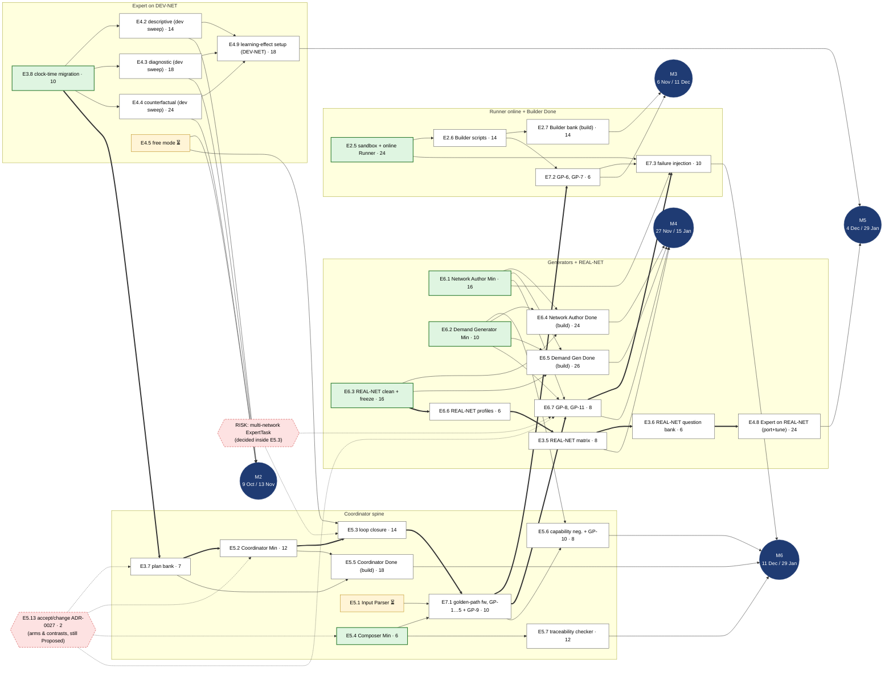
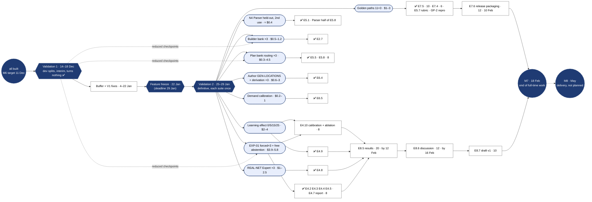

# Agentic Traffic Simulation Framework — Work Plan (v0.3)

Scope: reach **Done** on every module of the Architecture & DoD document (**v1.0**, frozen) as amended by
**ADR-0001 … ADR-0028**, plus the thesis document, between **Wed 9 Sep 2026** and **Thu 18 Feb 2027**
(end of full-time work, M7). The thesis is delivered in **May 2027** (M8, date TBC), which this plan
records but does not schedule. Stretch items are explicitly out of plan.

v0.3 (2026-09-24) re-baselines the plan after the project ran well ahead of v0.2's calendar. Every
change comes from a decision on the map
[Re-baseline the TFM work plan (v0.3)](https://github.com/ferranUPC/resto/issues/1):

- plan hours are read as **story points**; capacity is recomputed at 40 pts/week and the plan now has
  ≈ +170 points of slack (v0.2: −95) — [Re-sequence the remaining work](https://github.com/ferranUPC/resto/issues/6#issuecomment-5816072783);
- **development runs** go now, **measurement runs** wait for **Validation 1 / Validation 2**; new status
  ⏳; M2–M6 become **build milestones** — [What does ✅ mean…](https://github.com/ferranUPC/resto/issues/3#issuecomment-5815386485);
- new task **E3.8** (ADR-0028 clock-time migration, 10 pts), run first — [ADR-0028 clock-time migration](https://github.com/ferranUPC/resto/issues/4#issuecomment-5815606676);
- the task DAG with its critical paths (§4); E4.9 moves to DEV-NET, GP-9 goes to E7.1, feature freeze
  before Validation 2, E7.6 becomes packaging only — [Prototype: DAG of pending tasks](https://github.com/ferranUPC/resto/issues/5#issuecomment-5815749846);
- each milestone gets a **target** and a **deadline**, tasks get a **wave** and a **latest due**; new
  §3 calendar and §5 fallback order — [Re-sequence the remaining work](https://github.com/ferranUPC/resto/issues/6#issuecomment-5816072783);
- the costs behind the validation passes — [Inventory of pending paid runs](https://github.com/ferranUPC/resto/issues/2#issuecomment-5814898247).

Task ids are unchanged. The notes v0.2 accumulated in its §0 (ADR-0023/0025/0026 scope, E3.4 split,
estimates for E4.11 and E5.9–E5.12) are absorbed into the task rows; the old text is in
[`_old/tfm-work-plan-v0.2.md`](_old/tfm-work-plan-v0.2.md). Task status lives in
[`progress-tracker.md`](progress-tracker.md), kept in sync by the `progress-review` skill, never here.

---

## 0. Capacity and cross-cutting rules

### 0.1 Capacity check

| | |
|---|---|
| Unit | **1 point = 1 plan hour**, read as a story point, not wall-clock time (LLM-assisted work runs much faster than the estimate; the observed rate is not extrapolated) |
| Remaining span | Thu 24 Sep 2026 → Thu 18 Feb 2027 (M7) |
| Christmas break | **24 Dec → 2 Jan, zero work** (21–23 Dec are working days) |
| Planning rate | 40 pts/week nominal → **38.5 pts/week** after supervisor meetings (DLR + FIB, ~3 h every two weeks): ≈ 34.5 build + ≈ 4 writing |
| Capacity to 18 Feb | ≈ **745 pts** |
| Remaining work | ≈ **574 pts**: 385 build (incl. E3.8 and E5.13) + ≈ 50 measurement-only + ≈ 120 writing + 12 E7.6 + 7 (E3.9, E3.10) |
| Slack | ≈ **+170 pts** (v0.2: −95 h). Conservative: it still counts the writing that sits in the M8 window (second half of E8.7, E8.8, ≈ 18 pts) |
| Plan total (every row of §1) | 954 pts: v0.2's 935 + E3.8 (10) + E3.9 (5) + E3.10 (2) + E5.13 (2) |
| After 18 Feb | ~7 h/week from about March (the maintainer likely has a job), reserved for revisions, the thesis and the defense: M8 window, not planned here |

The slack is not a licence for Stretch work: it is the January buffer (§3) and the first step of the
fallback order (§5). Do not add Stretch work before M6.

### 0.2 Cross-cutting rules

**Status** (used by the tracker; defined here, applied by `progress-review`):

- ⬜ not started · 🔄 in progress · ✅ done: the DoD threshold, measured with the DoD protocol, in a
  validation pass (or met outright for tasks with no measurement).
- ⏳ **awaiting measurement**: the task is built and its development evidence is in; the only thing
  between it and ✅ is a named measurement suite. Counted separately from done, in tasks and in points.
  The tracker's Notes say whether the development evidence already meets the threshold.
- 🚧 **blocked**: reserved for reasons outside our control (a person, data or a service); the Notes say
  what unblocks it. A deferred paid run is never a reason for 🚧.

**Runs: purpose, not price** (CLAUDE.md cost policy; `evaluating-resto.md` §7):

- A **development run** lets work move forward (a smoke, a tuning iteration, a 1-repetition check). It
  runs now, with its cost stated up front; stop and ask only if a single development run is estimated
  above $1. No cumulative cap; each task's tuning log keeps a running total.
- A **measurement run** produces the figure a DoD threshold reads and is not needed to keep building. It
  runs only inside a validation pass, whatever its price. Held-out splits are used only inside a pass.
- The unit is the **measurement suite**; splitting a suite into cheaper runs to get under a limit is not
  allowed. Suites are listed in `evaluating-resto.md` §7.2 and, for the supervisors, in the evaluation
  budget document (E3.9); each suite's final shape is fixed when its benchmark is designed.
- **Cap: $30 for both passes together** unless funding arrives. Under the cap a suite shrinks in scale
  (inputs × repetitions × models, never below 2 repetitions); it is not dropped.

**Validation passes:**

- **Validation 1** (14 → 18 Dec): reduced checkpoints of **every** built module on dev splits, a dress
  rehearsal of V2. Its figures are interim and turn no task ✅. If funding is confirmed by then, frozen
  modules may be measured at definitive size here.
- **Feature freeze** (target 22 Jan, deadline 29 Jan): no behaviour change after it. V2 measures frozen
  code; E7.6 is packaging only.
- **Validation 2** (25 → 29 Jan): every definitive measurement, each suite once, held-out splits
  included. A threshold missed here is reported as a result, not re-tuned; V1 is the safety net.
- E5.1's held-out split may be used **a second time, once** (need N4): in V2, prompt frozen, labelled as
  a second use and reported next to the first result (`v6-heldout`, `intent` agreement 93.9 %).

**Dates:**

- A **milestone** has a *target* (internal, computed from the planning rate) and a *deadline* (the v0.2
  date). A target may move; a deadline never moves later. A moved date is struck through, never
  deleted.
- A **build milestone** (M2–M6) is met when every task it lists is ✅ or ⏳. Its measurement happens in
  V2; "do not cut M2, M3, M5" protects both the build and the V2 measurement.
- A **task** has no target date: it carries a **wave** (§3) and a **latest due**, the latest date that
  keeps its consumers on time.
- Every date is an internal commitment; nothing is promised to FIB/DLR by date.

---

## 1. Epics and tasks

Points are plan hours read as story points (§0.1). "DoD" points to the section of the Architecture & DoD
document the task satisfies.

**Wave** (§3): `1a`, `1b`, `2`, `3`, `4`, `5` build waves · `W` rolling writing track · `V2` only its
measurement suite is left (built; ⏳ once the tracker syncs) · `F` final stretch, after V2 ·
`M8` delivery window, not planned · `—` completed before this re-baseline (status in the tracker).
**Latest due** for a `—` row is its v0.2 due date.

### E0 — Foundations (70) · DoD §2

| ID | Task | Output | pts | Wave | Latest due |
|---|---|---|---|---|---|
| E0.1 | Repo skeleton: hexagonal layout (domain / application / adapters), packaging, ruff, pytest, CI | repo + green CI | 8 | — | 10 Sep |
| E0.2 | Pin SUMO 1.27.1 from PyPI as a `pyproject.toml` dependency (`eclipse-sumo`, `sumolib`, `traci`); reproducible environment (no extra service: the DatabaseMCP reference backend is SQLite, ADR-0012); record in README | env + README | 4 | — | 10 Sep |
| E0.3 | Domain dataclasses for every aggregate, value object, typed task and agent draft of §2.3 (incl. `NetworkDraft`, `DemandDraft`, `ScenarioDraft`); `application/schemas.py` (TypeAdapters), JSON-schema export to files, round-trip tests | `domain/` + `schemas.py` | 16 | — | 14 Sep |
| E0.4 | DatabaseMCP contract spec: tool names, I/O schemas, six capability groups (incl. `demands`, `results.query_edgedata`), error codes | `DATABASE_MCP_CONTRACT.md` | 8 | — | 15 Sep |
| E0.5 | DEV-NET: `netgenerate` grid + hand edits (2→1 merge bottleneck, signalised corridor), documented | `dev-net.net.xml` + doc | 10 | — | 16 Sep |
| E0.6 | Demand profiles `low` / `peak` / `incident` on DEV-NET, seeded, stored as trips + routes; synthetic counts at 3–5 control edges for calibration tests; verify congestion levels (≈10–20 % edges congested at peak). *(Moved to clock time by E3.8; not reopened.)* | 3 demand sets + counts + verification notebook | 10 | — | 17 Sep |
| E0.7 | Trace logging: run id, step, tool call, artifacts, tokens → JSONL | `tracing/` | 8 | — | 18 Sep |
| E0.8 | Architecture doc frozen as v1.0 + ADRs for the decisions in §7 | `docs/` | 6 | — | 18 Sep |

### E1 — MCP servers and `traci_api` (94) · DoD §4.9

| ID | Task | Output | pts | Wave | Latest due |
|---|---|---|---|---|---|
| E1.1 | NetworkMCP: `get_edge`, `get_lanes`, `get_neighbours`, `shortest_path`, `edges_in_bbox`, `capacity_estimate`, `get_tls`; ≥3 tests each incl. error case | server + tests | 20 | — | 24 Sep |
| E1.2 | `resto.traci_api`: primitives `close_lane`, `open_lane`, `set_speed`, `set_tls_program`, `get_edge_occupancy`, `get_edge_speed`, `get_vehicle_count`, `step`; declarative `at_time(...)` / `when(...)` / `run()`; `applied_actions` log with `origin`; TraciMCP server over the same primitives; tests with SUMO in the loop | module + server + tests | 20 | — | 28 Sep |
| E1.3 | DatabaseMCP reference implementation (SQLite + in-process cosine, ADR-0012; filesystem artifact store): `networks`, `demands`, `scenarios`, `results` (incl. `query_edgedata`), `notes` (in-process vector search), `historical_demand` capability groups; in-process repository adapters + `mcp_client` adapter | server + adapters | 24 | — | 30 Sep |
| E1.4 | `find_similar_scenario` (exact `scenario_id` match, else intervention + `context_tags` overlap), `search_notes` with `status`/`basis` filters, `query_edgedata` on windows/edge sets; 10 + 5 + 5 test cases | tests | 12 | — | 1 Oct |
| E1.5 | DatabaseMCP conformance suite runnable against any implementation through the `mcp_client` adapter | `conformance/` | 10 | — | 2 Oct |
| E1.6 | Capability-listing helper for the Coordinator; latency benchmark of every tool on DEV-NET | benchmark report | 8 | — | 2 Oct |

### E2 — Scenario Builder & Simulation Runner (110) · DoD §4.5, §4.6

| ID | Task | Output | pts | Wave | Latest due |
|---|---|---|---|---|---|
| E2.1 | Runner batch mode: run `sumocfg` with a seed, collect edgedata/tripinfo/summary, build `SimulationResult` (`result_id` = hash of scenario + seed), store; ephemeral mode for `probe_run` / `calibration_run` (not stored); byte-identical reproducibility test (20 runs) | runner + tests | 12 | — | 8 Oct |
| E2.2 | Builder Minimal (agent with writer tools): static `lane_closure` and `speed_limit` → rerouter / VSS `.add.xml` + `sumocfg`; `ScenarioDraft` → promotion (id validation against NetworkMCP, SUMO load check, `scenario_id` = request hash) | builder agent + writers | 20 | — | 13 Oct |
| E2.3 | Builder static: time-bounded `edge_closure`, `signal_program` (WAUT), `demand_scale` (derived `Demand` with `scale`, mechanism `RegenerateDemand`) | builder | 14 | — | 16 Oct |
| E2.4 | Effect-verification harness: per intervention type, read edgedata / `applied_actions` and assert the observable effect (§4.5) | `verify/` | 12 | — | 16 Oct |
| E2.5 | Runner online mode: `ScriptSandbox` (AST lint — only `resto.traci_api` imports; `dry_run`; subprocess execution with the run seed), `applied_actions` with `origin`; 10 script test cases verified by reading state back through TraCI; scripts failing lint rejected before SUMO starts; crashing scripts → failed run with traceback | sandbox + online runner + tests | 24 | 2 | 4 Dec |
| E2.6 | Builder scripts: `condition` → `when(...)` script; `custom` interventions (static mechanism if one fits, else free Python against `traci_api`); `rejected[]` with reason; mechanism-selection tests | builder | 14 | 2 | 8 Dec |
| E2.7 | Builder bank (25–30 specs covering every §2.5 cell incl. `custom`) built and checked on a development run; rejection of unsupported specs with reason. **Measured in V2:** ≥27/30 and the structural-determinism check over 3 runs (static files + `declared_rules`) | bank + report | 14 | 2 | 11 Dec |

### E3 — Evaluation assets & harness (94)

| ID | Task | Output | pts | Wave | Latest due |
|---|---|---|---|---|---|
| E3.1 | Scenario matrix DEV-NET / peak: 15–25 rows × 3 seeds, simulated and stored via DatabaseMCP. *(Rebuilt in clock time by E3.8; not reopened.)* | matrix in DB | 12 | — | 16 Oct |
| E3.2 | Question templates (descriptive / diagnostic / counterfactual) + generator + programmatic gold answers from the matrix; ≥60 questions on DEV-NET. *(Rebuilt in clock time by E3.8; not reopened.)* | question bank | 16 | — | 23 Oct |
| E3.3 | Metrics: exact match, Jaccard top-k, direction, magnitude band, Brier, abstention P/R; harness with repeated runs, mean ± std, report generation | `eval/` | 16 | — | 27 Oct |
| E3.4 | Request bank (text → `Question`, Input Parser): ~60 hand-written **concepts**, each an English base request + gold `Question` (single treatment per `intent`, 10+ multi-arm with gold `arms`/`contrasts` per ADR-0027, combined-treatment controls, ambiguous, unintelligible, out of scope, adversarial), expanded to ~250 requests by **variants** that share the concept's gold (translations, registers, *vaguised* variants, code-made typos); variants LLM-generated and field-verified by families not under evaluation, human-reviewed, frozen; 70/30 dev/held-out split by concept. Code and rules: `eval/request_bank/`, `evaluating-resto.md` §5. Consumer: E5.1 | request bank + variant pipeline | 12 | — | 18 Nov |
| E3.5 | Scenario matrix REAL-NET / peak | matrix in DB | 8 | 3 | 15 Jan |
| E3.6 | Question bank REAL-NET (40+) | question bank | 6 | 4 | 18 Jan |
| E3.7 | Plan bank (`Question` → `StudyPlan`, Coordinator): for a fixed DB state (the clock-time matrix of E3.8), the gold phase-0 `StudyPlan` of each E3.4 request, keyed by request id, with the gold `Question` as input; plans follow ADR-0025 (rules by `intent`, `network_id` + `reused` with role/purpose, zero-step plans valid, no `ask_expert`/`compose_report` steps) and ADR-0027 (exactly `required_arms`, reference side only for `counterfactual`, one `derive_network` per distinct topology); the 4 canonical DB states covered; request windows with no covering demand (e.g. 17:00–18:00) planned as a clarification request (ADR-0028 §3). Consumers: E5.2, E5.5 | plan bank | 7 | 1b | 20 Nov |
| E3.8 | *(new 2026-09-24)* ADR-0028 migration to clock time: the three DEV-NET demands move from `[0, 3600)` to `[28800, 32400)` (08:00–09:00; `low`/`peak`/`incident` are intensity labels, not times) — `eval/dev-net/demand/` (`generate_demand.sh`, trips/routes, `control_counts.json`, verification notebook re-run over 9 sim seeds, README); `eval/scenario_matrix/` windows `[0, 300)` → `[28800, 29100)`, `matrix.db`, report; `eval/question_bank/` (`DEFAULT_WINDOW`, question text in clock time, `question-bank.json`, report); `verify/` tests; the expert benchmark's bank loader; `evaluating-resto.md` citations. Not touched: synthetic unit tests, the request bank, old expert runs (history). DoD: rebuilt assets pass the checks they already passed (`peak` congestion 10–20 %, `incident` teleport-free over 9 seeds, every matrix row's §4.5 effect check, ≥ 60 questions, `verify/` green). No paid runs | demands + matrix + question bank | 10 | 1a | 23 Oct |
| E3.9 | *(new 2026-09-24)* Evaluation budget document for the supervisors (FIB/DLR): short, in English, one row per measurement suite (what it measures, which threshold, which pass, full vs minimum size, cost measured vs proxy), totals against the $30 cap; takes over `evaluating-resto.md` §7.2's table. First version with whatever is known, **before the funding request (~24 Oct)**; each suite's row is refined when its benchmark is designed | document | 5 | 1b | 23 Oct |
| E3.10 | *(new 2026-09-24)* Trim `evaluating-resto.md`'s Decisions log (§5) to one line per decision, linking the tuning logs | doc edit | 2 | 1b | 11 Dec |

### E4 — Network Expert (166) · DoD §4.7 · **research focus**

| ID | Task | Output | pts | Wave | Latest due |
|---|---|---|---|---|---|
| E4.1 | Refactor the existing v1 Expert onto the `ToolAgent` port (`ExpertTask` in, `ExpertAnswer` out); facts only through tools (`query_edgedata`, `get_result`, NetworkMCP), never from parsed files; `evidence[]` on every answer | expert v2 | 16 | — | 22 Oct |
| E4.2 | Descriptive questions on DEV-NET: tune until a development sweep on the E3.8 bank meets ≥90 % (→ ⏳). **Measured in V2** by EXP-01 | dev sweep + tuning log | 14 | 1a | 27 Oct |
| E4.3 | Diagnostic questions on DEV-NET: tune until a development sweep on the E3.8 bank meets Jaccard ≥0.6 and "why" rubric ≥70 % (→ ⏳). **Measured in V2** by EXP-01 | dev sweep + tuning log | 18 | 1a | 2 Nov |
| E4.4 | Counterfactual, forced mode: reasoning strategy over graph + facts, `confidence` and `basis` output; tune until a development sweep on the E3.8 bank meets direction ≥75 %, band ≥50 % (→ ⏳). **Measured in V2** by EXP-01 | dev sweep + tuning log | 24 | 1a | 6 Nov |
| E4.5 | Free mode: abstention policy, `proposed_experiment` (a `Question`) generation; harness built. **Measured in V2** by EXP-01's free-mode leg: abstention recall ≥70 %, false requests ≤30 % | benchmark run | 14 | V2 | 5 Feb |
| E4.6 | `ExpertNote` writing after each experiment, RAG over notes, `status` update on confirm/refute; knowledge-hygiene probes (20) | notes pipeline + tests | 16 | — | 12 Nov |
| E4.7 | DEV-NET benchmark report from EXP-01 (V2): all §4.7 metrics, 3 runs, mean ± std | report | 8 | F | 9 Feb |
| E4.8 | Port to REAL-NET and tune on development runs (build). **Measured in V2:** full benchmark, 3 reps (descriptive ≥85 %, Jaccard ≥0.5, direction ≥65 %) | report | 24 | 4 | 26 Jan |
| E4.9 | Learning-effect experiment **on DEV-NET**, after E4.2–E4.4: store size 0 / 5 / 15 / 25, held-out interventions; setup built in wave 4. **Measured in V2:** confidence intervals, plot | figure + data | 18 | 4 | 29 Jan |
| E4.10 | Calibration analysis (Brier, accuracy by `basis`) and ablation facts-only vs facts + notes, read from EXP-01 and E4.9's V2 runs (store size 0 is the facts-only arm) | figures | 8 | F | 9 Feb |
| E4.11 | Notes per ADR-0026: note writer returns 0–3 `ExpertNoteDraft`s, each with a `scenario_ref` from an allow-list (study scenarios + predicted `scenario_id`); `write_note` validates the ref and sets `provenance = simulation` only if that scenario has results in the study; tests with the fake agent | notes v2 + tests | 6 | — | 12 Nov |

### E5 — Input Parser, Coordinator, Executor, Output Composer (140) · DoD §4.1, §4.2, §4.8

| ID | Task | Output | pts | Wave | Latest due |
|---|---|---|---|---|---|
| E5.1 | Input Parser (own agent, ADR-0023): text → `Question`, no tools, retry-then-fail, `ambiguities[]` → `awaiting_user` before the Coordinator runs; `InputParserAgent` port implementation (ADR-0025); tuned on dev (§4.1 + arm structure ≥ 90 %). **Measured in V2:** held-out, second use (N4) | parser agent + report | 14 | V2 | 5 Feb |
| E5.2 | Coordinator Minimal (ADR-0023): one `ToolAgent.run` per `Question` with read-only tools (`find_network`, `find_demand`, `find_scenario`, `list_results`) → typed `StudyPlan` or a clarification request; planning rules by `intent` (ADR-0025), `network_id` + `reused` + role/purpose in the plan, planning per arm (ADR-0027); `CoordinatorAgent` port; the 4 canonical DB states | coordinator agent | 12 | 1b | 23 Nov |
| E5.3 | Loop closure (ADR-0023): `needs_simulation` → Coordinator plans the `proposed_experiment` as a new phase → Executor runs it → re-ask with the original question and all phases' results, `max_rounds` respected with the last round forced (`forced_by_limit`, ADR-0025); `ExpertTask` over base + derived networks (decided here, §4 risks); GP-3 / GP-4 / GP-5 passing | tests | 14 | 1b | 26 Nov |
| E5.4 | Output Composer Minimal (agent): completed `Study` → `Report` (claims with `evidence_refs`) → Markdown with evidence table; experiments table marks reused experiments; fixed limitation line added by code when the last round was `forced_by_limit` (ADR-0025) | composer | 6 | 1b | 27 Nov |
| E5.5 | Coordinator Done (build): routing harness on `StudyPlan` vs gold plan (plan bank, E3.7); `StepRecord` trace vs expected checked by tests with the fake agent; zero redundant simulations (counter); failure injection (incl. agent budget exhausted) yields named failing step with the right `StepError.kind` (ADR-0025). **Measured in V2:** routing ≥90 %, 3 reps (serves E5.8 too) | report | 18 | 5 | 29 Jan |
| E5.6 | Capability negotiation with DatabaseMCP; GP-10 | tests | 8 | 5 | 29 Jan |
| E5.7 | Output Composer Done: automatic traceability checker (numbers ↔ artifacts), built in wave 5; faithfulness rubric on 20 reports taken from E7.5's V2 studies (F) | checker + report | 12 | 5 | 29 Jan (checker) · 9 Feb (rubric) |
| E5.8 | Stability: 3 repeated runs of Input Parser and Coordinator benchmarks, read from V2 (Parser: N4; Coordinator: E5.5's 3-rep run) | report | 8 | F | 9 Feb |
| E5.9 | Domain change for ADR-0023/0025: `Phase`, `Study.phases`, typed `PlanStep` union with `FromStep`, `ExpertRound` without `triggered_experiments`, `StudyPlan.network_id` + `reused`, zero-step plans, `Experiment.reused`, `StepError`, `ExpertRound.forced_by_limit`; schemas and class diagram regenerated | domain + tests | 12 | — | 13 Nov |
| E5.10 | Executor (`run_study`, deterministic code, not an agent): resolves `FromStep`, calls specialists, promotes drafts, records `StepRecord`s per phase, guards in code, runs `ask_expert` and `compose_report` itself, mechanical closing status; agent ports + composition root, `StepError`, forced last round, `DEFAULT_SEEDS`, note writer after the final round (ADR-0025/0026) | run_study | 24 | — | 25 Nov |
| E5.11 | Deterministic rendering (ADR-0025) of `failed` and `awaiting_user` studies in `interface/render.py`; CLI error when no `Study` is created | render + tests | 4 | — | 27 Nov |
| E5.12 | Domain change for ADR-0027: `Arm`, `Contrast`, `Question.arms`/`contrasts`, `required_arms`/`reference_arms`, `AddEdge.edge_id`, `arm` on `BuildScenarioStep`/`ReusedExperiment`/`Experiment` | domain + tests | 6 | — | 13 Nov |
| E5.13 | *(new 2026-09-24)* ADR-0027 (arms and contrasts, still *Proposed*): Accept it, or change it and Accept, before E3.7 starts — it roots E3.7, E5.2, E5.4 and E6.7 | ADR status | 2 | 1a | 13 Nov |

### E6 — Network Author, Demand Generator, REAL-NET (106) · DoD §4.3, §4.4

| ID | Task | Output | pts | Wave | Latest due |
|---|---|---|---|---|---|
| E6.1 | Network Author Minimal (agent): place / bbox → OSM snapshot → `netconvert` → `Network` with recipe; v1 tool catalogue (`netconvert` options, `remove_edge` / `add_edge` / `set_lanes` / `set_speed` on plain XML, `inspect_network`, `sanity_check`, `probe_run`); `NetworkDraft` promotion with replay check; `NetworkAuthorAgent` port | agent + tools | 16 | 3 | 16 Dec |
| E6.2 | Demand Generator Minimal (agent): parameters → `randomTrips` + `duarouter` → trips + routes stored via `demands`; teleport ≤2 %; seeded; replay-deterministic; `reroute_demand` (deterministic); `DemandGeneratorAgent` port | agent + tools | 10 | 3 | 18 Dec |
| E6.3 | REAL-NET: choose district (300–800 edges), hand-clean on plain XML, **freeze**, log every fix as (type, plain file, attribute) → error taxonomy **and** Network Author tool backlog. No prerequisite: fills gaps in wave 1b; if not done by 23 Oct it moves into wave 3 before E6.4/E6.5 | `real-net.net.xml` + fix log | 16 | 1b | 6 Jan |
| E6.4 | Network Author Done (build): sanity report (SCC ≥95 %, no zero-length, fringe reachability) + `probe_run` threshold; replay determinism (`replay(recipe)` == `content_hash`, 100 %); derivation bank (incl. `AddEdge`); catalogue extended from the E6.3 fix log where cheap. **Measured in V2:** GEN-LOCATIONS 10/10 over 3 runs (the stability runs are the loadable check), derivation bank 10/10 | report | 24 | 3 | 11 Jan |
| E6.5 | Demand Generator Done (build): calibration loop (`routeSampler` + `calibration_run`), `Fidelity.evidence` resolvable; external datasets frozen as artifacts; synthetic `historical_demand` + history-driven generation; `reroute_demand` test on a derived network. **Measured in V2:** fidelity ±15 % DEV / ±25 % REAL at the control edges within 5 rounds | report | 26 | 3 | 14 Jan |
| E6.6 | Demand profiles `low` / `peak` / `incident` on REAL-NET (clock-time windows, ADR-0028) | route sets | 6 | 3 | 15 Jan |
| E6.7 | GP-8 (full pipeline from a new place name) and GP-11 (add an edge, a `run` request per ADR-0025: derive → reroute → baseline vs treatment) passing | tests | 8 | 3 | 15 Jan |

### E7 — Integration (54) · DoD §5

| ID | Task | Output | pts | Wave | Latest due |
|---|---|---|---|---|---|
| E7.1 | Golden-path test framework: expected-trace assertions over the trace log, per phase, starting at the Input Parser (`study-flows.md` §4); GP-1 … GP-5 and **GP-9** (ambiguous request → `awaiting_user`) | `golden/` | 10 | 1b | 27 Nov |
| E7.2 | GP-6 (dynamic path) and GP-7 (compare) | tests | 6 | 2 | 11 Dec |
| E7.3 | Failure-injection suite across all golden paths (netconvert, SUMO crash, invalid scenario, script lint/dry-run failure, tool timeout, agent budget exhausted); asserts `StepError.kind` and the rendered failure blocks (ADR-0025) | tests | 10 | 5 | 29 Jan |
| E7.4 | Cost / latency per golden path, read from E7.5's V2 traces; thresholds set from that first measurement | table | 6 | F | 9 Feb |
| E7.5 | Full run in V2: 11/11 golden paths × 3; GP-2 reproducibility (identical `result_id`s, hashes and conclusions) | report | 10 | F | 9 Feb |
| E7.6 | Release packaging only (no behaviour change after the feature freeze): tag, README, reproducibility package (one command per experiment in the thesis) | release | 12 | F | **Wed 10 Feb** |
| E7.7 | *(Stretch, only if M6 is on time)* usability session with 2–3 DLR engineers | — | — | — | — |

### E8 — Thesis document (120) · rolling from now, concentrated 1 → 18 Feb

Rule: a module's section is drafted at the close of the wave that builds it, while the details are
fresh (~4 pts/week of writing from now on).

| ID | Task | Output | pts | Wave | Latest due |
|---|---|---|---|---|---|
| E8.1 | Outline mapped to epics; state-of-the-art chapter from the existing SoA matrix work | outline + SoA chapter | 16 | W (Oct) | 30 Oct |
| E8.2 | Architecture & contracts chapter (from doc v1.0, ADRs), once ADR-0027 is settled and the Coordinator spine is closed | chapter | 12 | W (Nov) | 27 Nov |
| E8.3 | Evaluation methodology chapter (assets, banks, metrics, DoD approach, validation passes), **before V1** | chapter | 12 | W | 11 Dec |
| E8.4 | Module sections written at the close of each wave (Builder/Runner, Expert, generators, Coordinator) | sections | 20 | W | rolling |
| E8.5 | Results chapter: DEV-NET, REAL-NET, learning-effect curve, calibration, ablation (from V2) | chapter | 20 | F | 12 Feb |
| E8.6 | Discussion, limitations, threats to validity, conclusions | chapter | 12 | F | 16 Feb |
| E8.7 | Full draft v1 to supervisors (FIB + DLR) → **M7** (10) · revision round → v2 (10, M8 window, not planned) | draft v1 → v2 | 20 | F / M8 | **18 Feb** (v1) |
| E8.8 | Final delivery → **M8** | — | 8 | M8 | May 2027 (TBC) |

---

## 2. Milestones

M2–M6 are **build milestones** (§0.2): met when every task listed is ✅ or ⏳. Their measurements run in
V2 and are read by the tasks in wave F.

| ID | Target | Deadline | Milestone | Acceptance check |
|---|---|---|---|---|
| **M0** | Fri 18 Sep | Fri 18 Sep | Foundations frozen | Contracts v1 merged; DEV-NET runs the three demand profiles; CI green; architecture v1.0 |
| **M1** | Fri 16 Oct | Fri 16 Oct | Tooling complete | All MCPs Done (§4.9); Builder & Runner Minimal; DEV-NET scenario matrix stored |
| **M2** | **Fri 9 Oct** | Fri 13 Nov | **Expert built on DEV-NET** | E3.8 ✅ (clock-time bank); E4.2–E4.4 ⏳ with a development sweep on the E3.8 bank, per-family figures stated; E4.5 ⏳. EXP-01 is ready to run in V2 (command and cost cap written) |
| **M3** | **Fri 6 Nov** | Fri 11 Dec | **End-to-end loop built** | E3.7, E5.2, E5.3, E5.4 ✅; GP-1 … GP-7 and GP-9 pass (E7.1, E7.2); Builder & Runner built (E2.5, E2.6 ✅; E2.7 ✅ or ⏳) |
| **M4** | **Fri 27 Nov** | Fri 15 Jan | Real network ready (built) | REAL-NET frozen with fix log (E6.3); Network Author and Demand Generator built (E6.1, E6.2 ✅; E6.4, E6.5 ✅ or ⏳); REAL-NET matrix and profiles stored (E3.5, E6.6); GP-8, GP-11 (E6.7) |
| **M5** | **Fri 4 Dec** | Fri 29 Jan (v0.2 date, now a build deadline) | **Thesis result built** | E3.6 ✅; E4.8 ⏳ (ported and tuned on REAL-NET, development evidence stated); E4.9 ⏳ (learning-effect setup on DEV-NET ready to run). The figures come from V2 → E4.10 → E8.5 |
| **M6** | **Fri 11 Dec** | ~~Fri 5 Feb~~ Fri 29 Jan | All modules built | E5.5, E5.6, E7.3 ✅ or ⏳; E5.7's checker built; 11 golden paths pass as tests; failure injection green |
| **V1** | Mon 14 → Fri 18 Dec | Fri 18 Dec | Validation 1 | Reduced checkpoints of every built module on dev splits, figures recorded as interim. If M6 slips, V1 covers what is built on 14 Dec and does not move |
| **FF** | **Fri 22 Jan** | Fri 29 Jan | Feature freeze | No behaviour change after it; V1 fixes and slips absorbed by the January buffer |
| **V2** | Mon 25 → Fri 29 Jan | Fri 5 Feb | Validation 2 | Every measurement suite run once at its definitive size (under the $30 cap), held-out included; a missed threshold is a result |
| **M7** | **Thu 18 Feb** | Thu 18 Feb | **End of full-time work** | Code frozen and tagged (E7.6, 10 Feb); V2 done; E8.5 written; full draft v1 sent to supervisors (E8.7) |
| **M8** | May 2027 (TBC) | — | Delivery | Revision round (second half of E8.7), E8.8, defense preparation. Recorded only, **not planned in v0.3** |

---

## 3. Calendar

Two tracks run in parallel: a **build** track (≈ 34.5 pts/week) and a **writing** track (≈ 4 pts/week).
Targets come from the cumulative build points at 34.5 pts/week from 28 Sep; a wave's content is ordered
by the DAG (§4), not by the week.

### Build waves

| Wave | Weeks | Content (in order) | Cum. pts | Target | Deadline |
|---|---|---|---|---|---|
| 1a | 24 Sep → 9 Oct | E3.8 → E5.13 (accept/change ADR-0027) → E4.2–E4.4 development sweep and tuning | 68 | **M2: Fri 9 Oct** | 13 Nov |
| 1b | 12 → 23 Oct | E3.7 → E5.2 → E5.3 → E5.4 → E7.1; E6.3 (REAL-NET) in the gaps; E3.9 evaluation budget (before ~24 Oct); E3.10 Decisions-log trim | 133 | Fri 23 Oct | — |
| 2 | 26 Oct → 6 Nov | E2.5 → E2.6 → E7.2 → E2.7 | 191 | **M3: Fri 6 Nov** | 11 Dec |
| 3 | 9 → 27 Nov | E6.1, E6.2 → E6.4, E6.5, E6.6, E3.5, E6.7 (E6.3 here if it missed 1b) | 289 | **M4: Fri 27 Nov** | 15 Jan |
| 4 | 30 Nov → 4 Dec | E3.6 → E4.8; E4.9 (DEV-NET) | 337 | **M5: Fri 4 Dec** | 29 Jan |
| 5 | 7 → 11 Dec | E5.5, E5.6, E5.7 (checker), E7.3 | 385 | **M6 = all built: Fri 11 Dec** | 29 Jan |
| V1 | 14 → 18 Dec | Validation 1 | — | Fri 18 Dec | 18 Dec |
| — | 21 → 23 Dec | Margin (working days) | — | — | — |
| — | **24 Dec → 2 Jan** | **Break, zero work** | — | — | — |

### Writing track

| When | Content |
|---|---|
| Oct | E8.1 outline + state of the art |
| Nov | E8.2 architecture, once ADR-0027 is settled and the Coordinator spine is closed |
| before V1 (by 11 Dec) | E8.3 evaluation methodology |
| close of each wave | E8.4 module sections |

### Final stretch

| Block | Target | Deadline | Content |
|---|---|---|---|
| Buffer + V1 fixes | 4 → 22 Jan | — | What V1 surfaced, plus any slipped build work. If empty, everything below moves earlier |
| **Feature freeze** | **Fri 22 Jan** | Fri 29 Jan | No behaviour change after it |
| **Validation 2** | 25 → 29 Jan | Fri 5 Feb | Each suite once, held-out; a failure is a result |
| Measurement-only work | 25 Jan → 5 Feb | Tue 9 Feb | E4.7 report, E4.10, E5.8, E7.4, E7.5, E5.7 rubric half |
| E7.6 release packaging | Wed 10 Feb | Wed 10 Feb | Tag, README, reproducibility package |
| E8.5 results → E8.6 discussion | 1 → 16 Feb | — | |
| **M7: full draft v1 to supervisors** | **Thu 18 Feb** | Thu 18 Feb | End of full-time work |

---

## 4. Dependencies

The plan is **limited by capacity, not by dependencies**: the longest chain of pending build work is 71
of 385 points (≈ 19 %), so the order within a wave is mostly free. Two DAGs: what must be **built**
before V2, and which **measurement suites** turn ⏳ into ✅.

### 4.1 Build DAG

Thick arrows (`==>`) are the critical chains; dotted arrows come from risk nodes. Milestones show
target / deadline.

Off every chain, no prerequisite: E3.9 evaluation budget (5, before ~24 Oct), E3.10 Decisions-log
trim (2), E8.1–E8.4 (writing track).

### 4.2 Measurement DAG

Suites run only inside a validation pass (§0.2). Costs are the estimates of
[Inventory of pending paid runs](https://github.com/ferranUPC/resto/issues/2#issuecomment-5814898247)
at the default model; only EXP-01 is designed so far (`evaluating-resto.md` §7.2), the rest get their
final shape in E3.9 and in their benchmark's design.

### 4.3 Critical paths

| Target | Points | Chain |
|---|---|---|
| M2 (build) | 34 | E3.8 → E4.4 |
| M3 (build) | 59 | E3.8 → E3.7 → E5.2 → E5.3 → E7.1 → E7.2 |
| M4 (build) | 61 | E3.8 → E3.7 → E5.2 → E5.3 → E7.1 → E6.7 |
| M5 (build) | 60 | E6.3 → E6.6 → E3.5 → E3.6 → E4.8 (E4.9: E3.8 → E4.4 → E4.9 = 52) |
| M6 (build) = all built | **71** | E3.8 → E3.7 → E5.2 → E5.3 → E7.1 → E6.7 → E7.3 |
| Tail after V2 | 68 + V2 runs | E4.10 → E8.5 → E8.6 → E8.7 → (E8.8 in M8) |

### 4.4 What to watch

- **The Coordinator spine is the critical path of the whole plan.** E3.8 → E3.7 → E5.2 → E5.3 → E7.1
  feeds M3, M4 (GP-8/GP-11 need the Coordinator and the golden-path framework) and M6. Start it first.
- **ADR-0027 sits at the root of the spine** (E3.7, E5.2, E5.4, E6.7 build on arms): E5.13 settles it
  right after E3.8, before E3.7 starts.
- **Multi-network `ExpertTask`** (risk, decided inside E5.3): `ExpertTask` carries one `network_id`; the
  Expert's topology tools are built over one `NetworkQuery`, `ask_expert` rejects `values` naming an edge
  that network lacks, and `proposed_experiment.network_ref` must be that network. When an arm changes
  topology (GP-11: `treatment` on a derived network adding edge `J7J9`) a correct answer about the new
  edge is rejected. E5.10 passes the phase-0 network plus every result id (`TODO(E5.3)` in
  `application/use_cases/run_study.py`). E5.3 decides the fix (e.g. `network_ids` and one
  `NetworkQuery` per network); it also gates GP-11 (E6.7).
- **E3.8 before any Expert sweep.** A sweep on the pre-ADR-0028 bank is paid again after the rebuild:
  E4.2–E4.4's development sweep and EXP-01 both read the E3.8 bank.
- **E6.3 has no prerequisite.** The whole REAL-NET chain (M5) can start any week; keep it in the gaps of
  wave 1b so it is off the Christmas break.
- **E2.5 has no fallback**: without it GP-6 and the script half of §4.5 cannot pass.
- **E6.2 before E6.4 and E6.7**: the derivation bank and GP-11 use `reroute_demand`.
- **The measurement-only work (≈ 50 pts) sits between V2 and E8.5.** That window (25 Jan → 9 Feb) is
  the real crunch of the calendar; the January buffer exists to keep V2 on its target.
- **E8.5 needs E4.9 and E4.10's figures**, which is why the learning-effect setup is in wave 4, not
  after.

---

## 5. Fallback order if a milestone slips

Apply one step at a time, in order. Record every downgrade in the thesis as a stated limitation.

1. **Consume the January buffer**: targets slide towards their deadlines. A deadline never moves later.
2. **Cost axis**: under the $30 cap, measurement suites shrink in scale (inputs × repetitions × models,
   never below 2 repetitions); no suite is dropped.
3. **Move E8.6** (discussion, limitations, conclusions) to the March–May window. It is the only writing
   that may move; E8.5 may not.
4. **Downgrade *Done* criteria to *Minimal*** (the v0.2 list, unchanged):
   1. E7.7 (already Stretch) — never scheduled.
   2. E6.4 / E6.5 agent tuning → keep the v1 tool catalogue with a single prompt; drop the *agent
      stability over 3 runs* criterion (replay determinism and the derivation bank stay).
   3. E6.5 history-driven demand generation → keep parameter-driven and count-calibrated only
      (`historical_demand` becomes an unimplemented optional capability; GP-10 still demonstrates
      negotiation).
   4. E4.10 ablation → keep calibration analysis only.
   5. E5.7 automatic traceability checker → manual rubric only.
   6. E6.4 GEN-LOCATIONS 10/10 → 6/6 locations.
   7. E2.7 Builder bank → drop the `custom` and `signal_program` script variants.

What must **not** be cut: M2, M3, M5 — their build and their V2 measurement. Those three are the
thesis. Nothing that needs SUMO, API budget or sustained work moves past 18 Feb.

---

## 6. Weekly ritual (15 min, Friday)

1. Read the tracker (kept by the morning `progress-review`); do not tick tasks by hand in either file.
2. Check the current wave against the next milestone's **target** and **deadline**. A target may move
   (strike the old date through, never delete it); a deadline never moves later.
3. If a milestone's target is past and its deadline is at risk, apply the next step of §5 and note it.
4. Write the paragraph of the thesis corresponding to whatever closed this week (writing track).
