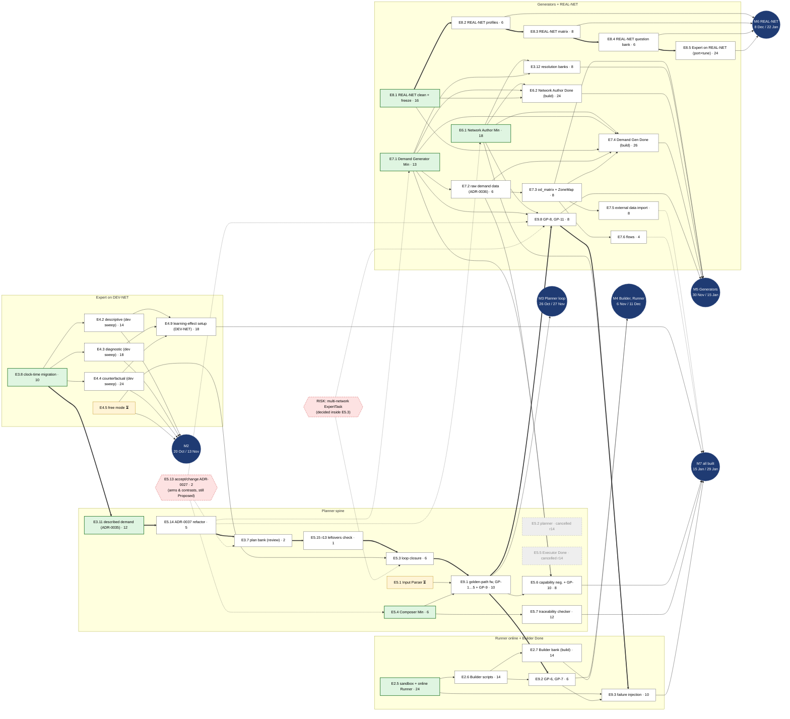
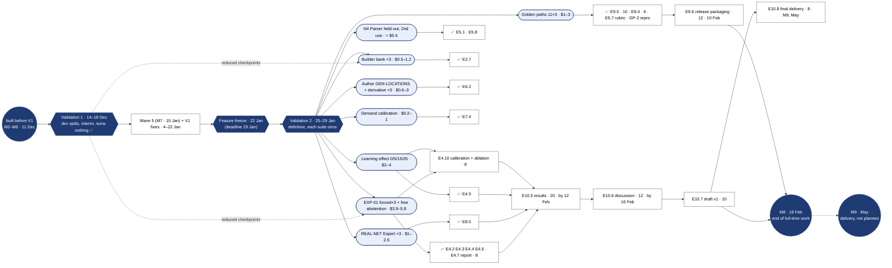

# Agentic Traffic Simulation Framework — Work Plan (v0.4)

Scope: reach **Done** on every module of the Architecture & DoD document (**v1.0**, frozen) as amended by
**ADR-0001 … ADR-0039**, plus the thesis document, between **Wed 9 Sep 2026** and **Thu 18 Feb 2027**
(end of full-time work, M8). The thesis is delivered in **May 2027** (M9, date TBC), which this plan
records but does not schedule. Stretch items are explicitly out of plan.

v0.3 (2026-09-24) re-baselines the plan after the project ran well ahead of v0.2's calendar. Every
change comes from a decision on the map
[Re-baseline the TFM work plan (v0.3)](https://github.com/ferranUPC/resto/issues/1):

- plan hours are read as **story points**; capacity is recomputed at 40 pts/week and the plan now has
  ≈ +170 points of slack (v0.2: −95) — [Re-sequence the remaining work](https://github.com/ferranUPC/resto/issues/6#issuecomment-5816072783);
- **development runs** go now, **measurement runs** wait for **Validation 1 / Validation 2**; new status
  ⏳; M2–M7 become **build milestones** — [What does ✅ mean…](https://github.com/ferranUPC/resto/issues/3#issuecomment-5815386485);
- new task **E3.8** (ADR-0028 clock-time migration, 10 pts), run first — [ADR-0028 clock-time migration](https://github.com/ferranUPC/resto/issues/4#issuecomment-5815606676);
- the task DAG with its critical paths (§4); E4.9 moves to DEV-NET, GP-9 goes to E9.1, feature freeze
  before Validation 2, E9.6 becomes packaging only — [Prototype: DAG of pending tasks](https://github.com/ferranUPC/resto/issues/5#issuecomment-5815749846);
- each milestone gets a **target** and a **deadline**, tasks get a **wave** and a **latest due**; new
  §3 calendar and §5 fallback order — [Re-sequence the remaining work](https://github.com/ferranUPC/resto/issues/6#issuecomment-5816072783);
- the costs behind the validation passes — [Inventory of pending paid runs](https://github.com/ferranUPC/resto/issues/2#issuecomment-5814898247).

v0.4 (2026-10-02) restructures the epics and the calendar; no scope is added or dropped (1003 pts before
and after):

- **Epics.** E6 held two agents and the REAL-NET work. It is now three epics: **E6 Network Author**,
  **E7 Demand Generator**, **E8 REAL-NET** (E6.3, E6.6, E3.5, E3.6, E4.8). Integration moves to **E9**
  and gains GP-8 / GP-11 (E9.8); the thesis moves to **E10**. Every old id maps to a new one in §8; ids in
  ADRs, the diary and past reviews keep their v0.3 spelling and are read through that table.
- **Milestones.** M3–M7 are one per block of work, in build order (M3 Planner loop, M4 Builder and
  Runner, M5 Generators, M6 REAL-NET, M7 all built). End of full-time work is now M8 and delivery M9.
- **Calendar.** Waves 3–5 asked for 55 pts more than the planning rate gives by 11 Dec. The six tasks
  that Validation 1 does not measure (E4.9, E5.6, E5.7, E7.5, E7.6, E9.3, 60 pts) move to a wave 5 after
  V1, 4 → 15 Jan. Every latest due is now on or before the feature freeze (22 Jan).

r13 (2026-10-06, [ADR-0039](adr/0039-deterministic-planner-replaces-the-coordinator.md)) removes the
Coordinator agent: planning becomes a deterministic function, the planner. The plan goes from 1003 to
**991 pts** (E5.2 8 → 3, E5.5 18 → 11, E5.8 8 → 5, new E5.15 +3), the E3.7 → E5.2 → E5.3 spine gains the
E5.15 wiring step and is 2 pts shorter, and the plan bank routing suite leaves the $30 budget (E3.9). No
other scope moves.

r14 (2026-10-06) records that r13 delivered that work (PR #20: `planner.py`, the Executor calls it, the
Coordinator is deleted, phase 1 case set with 57 cases). A new task status, **cancelled** (a cancelled task
leaves the plan: no points, no pending work, and its dependents inherit its blockers unless a substitute is
declared), applies to **E5.2** (3 pts) and **E5.5** (11 pts); **E5.15** goes 3 → 1 and **E3.7** 4 → 2. The
plan goes from 991 to **973 pts**; the spine becomes E3.7 → E5.15 → E5.3 and is 7 pts shorter (§4.3).
No scope is dropped: the pieces of E5.5 have owners (E5.3, E9.1, E9.3). No ADR.

r15 (2026-10-06) re-estimates **E5.3** from 14 to **6 pts** after triaging it against the code: the loop,
`max_rounds` with the forced last round and the multi-network `ExpertTask` (ADR-0032) were already built and
tested, so what remains is the zero-redundant-simulations counter across phases, GP-4 and GP-5 at use-case
level, and a closing note. The plan goes from 973 to **965 pts**; the spine becomes 8 pts shorter (§4.3).
No scope is dropped and no date moves. No ADR.

The notes v0.2 accumulated in its §0 (ADR-0023/0025/0026 scope, E3.4 split,
estimates for E4.11 and E5.9–E5.12) are absorbed into the task rows; the old text is in
[`_old/tfm-work-plan-v0.2.md`](_old/tfm-work-plan-v0.2.md). Task status lives in
[`progress-tracker.md`](progress-tracker.md), kept in sync by the `daily-review` and `weekly-review` skills, never here.

---

## 0. Capacity and cross-cutting rules

### 0.1 Capacity check

| | |
|---|---|
| Unit | **1 point = 1 plan hour**, read as a story point, not wall-clock time (LLM-assisted work runs much faster than the estimate; the observed rate is not extrapolated) |
| Remaining span | Thu 24 Sep 2026 → Thu 18 Feb 2027 (M8) |
| Christmas break | **24 Dec → 2 Jan, zero work** (21–23 Dec are working days) |
| Planning rate | 40 pts/week nominal → **38.5 pts/week** after supervisor meetings (DLR + FIB, ~3 h every two weeks): ≈ 34.5 build + ≈ 4 writing |
| Capacity to 18 Feb | ≈ **745 pts** |
| Remaining work | ≈ **585 pts**: 399 build (incl. E3.8, E3.11, E3.12, E5.13, E5.14, E5.15 and E7.2, E7.3, E7.5, E7.6) + ≈ 47 measurement-only + ≈ 120 writing + 12 E9.6 + 7 (E3.9, E3.10) |
| Slack | ≈ **+159 pts** (v0.2: −95 h; +170 before E3.11; −26 for E7.2, E7.3, E7.5, E7.6; −11 net for ADR-0037, tentative; +12 net for ADR-0039; +18 for r14; +8 for r15). Conservative: it still counts the writing that sits in the M9 window (second half of E10.7, E10.8, ≈ 18 pts) |
| Plan total (every row of §1) | **965 pts**: 973 before r15, 991 before r14 and 1003 before r13 (v0.2's 935 + E3.8 (10) + E3.9 (5) + E3.10 (2) + E3.11 (12) + E5.13 (2) + E7.2, E7.3, E7.5, E7.6 (26) + ADR-0037 net (+11: E5.14 +5, E3.12 +8, E6.1 +2, E7.1 +3, E3.7 −3, E5.2 −4) − 12 for ADR-0039 (E5.2 −5, E5.5 −7, E5.8 −3, E5.15 +3)); r14 takes 18 more (E5.2 −3 cancelled, E5.5 −11 cancelled, E5.15 −2, E3.7 −2); r15 takes 8 more (E5.3 14 → 6) |
| After 18 Feb | ~7 h/week from about March (the maintainer likely has a job), reserved for revisions, the thesis and the defense: M9 window, not planned here |

The slack is not a licence for Stretch work: it is the January buffer (§3) and the first step of the
fallback order (§5). Do not add Stretch work before M7.

### 0.2 Cross-cutting rules

**Status** (used by the tracker; defined here, applied by `daily-review` and `weekly-review`):

- ⬜ not started · 🔄 in progress · ✅ done: the DoD threshold, measured with the DoD protocol, in a
  validation pass (or met outright for tasks with no measurement).
- ⏳ **awaiting measurement**: the task is built and its development evidence is in; the only thing
  between it and ✅ is a named measurement suite. Counted separately from done, in tasks and in points.
  The tracker's Notes say whether the development evidence already meets the threshold.
- 🚧 **blocked**: reserved for reasons outside our control (a person, data or a service); the Notes say
  what unblocks it. A deferred paid run is never a reason for 🚧.

**Runs: purpose, not price** (CLAUDE.md cost policy; `eval/measurement-plans.md`):

- A **development run** lets work move forward (a smoke, a tuning iteration, a 1-repetition check). It
  runs now, with its cost stated up front; stop and ask only if a single development run is estimated
  above $1. No cumulative cap; each task's tuning log keeps a running total.
- A **measurement run** produces the figure a DoD threshold reads and is not needed to keep building. It
  runs only inside a validation pass, whatever its price. Held-out splits are used only inside a pass.
- The unit is the **measurement suite**; splitting a suite into cheaper runs to get under a limit is not
  allowed. Suites are listed in `eval/measurement-plans.md` and, for the supervisors, in the evaluation
  budget document (E3.9); each suite's final shape is fixed when its benchmark is designed.
- **Cap: $30 for both passes together** unless funding arrives. Under the cap a suite shrinks in scale
  (inputs × repetitions × models, never below 2 repetitions); it is not dropped.

**Validation passes:**

- **Validation 1** (14 → 18 Dec): reduced checkpoints of **every** built module on dev splits, a dress
  rehearsal of V2. Its figures are interim and turn no task ✅. If funding is confirmed by then, frozen
  modules may be measured at definitive size here.
- **Feature freeze** (target 22 Jan, deadline 29 Jan): no behaviour change after it. V2 measures frozen
  code; E9.6 is packaging only.
- **Validation 2** (25 → 29 Jan): every definitive measurement, each suite once, held-out splits
  included. A threshold missed here is reported as a result, not re-tuned; V1 is the safety net.
- E5.1's held-out split may be used **a second time, once** (need N4): in V2, prompt frozen, labelled as
  a second use and reported next to the first result (`v6-heldout`, `intent` agreement 93.9 %).

**Dates:**

- A **milestone** has a *target* (internal, computed from the planning rate) and a *deadline* (the v0.2
  date). A target may move; a deadline never moves later. A moved date is struck through, never
  deleted.
- A **build milestone** (M2–M7) is met when every task it lists is ✅ or ⏳. Its measurement happens in
  V2; "do not cut M2, M3, M6" protects both the build and the V2 measurement.
- A **task** has no target date: it carries a **wave** (§3) and a **latest due**, the latest date that
  keeps its consumers on time.
- Every date is an internal commitment; nothing is promised to FIB/DLR by date.

---

## 1. Epics and tasks

Points are plan hours read as story points (§0.1). "DoD" points to the section of the Architecture & DoD
document the task satisfies.

**Wave** (§3): `1a`, `1b`, `2`, `3`, `4`, `5` build waves · `W` rolling writing track · `V2` only its
measurement suite is left (built; ⏳ once the tracker syncs) · `F` final stretch, after V2 ·
`M9` delivery window, not planned · `—` completed before this re-baseline (status in the tracker), or a
**cancelled** row (r14: 0 pts, no wave, no date).
**Latest due** for a `—` row is its v0.2 due date (a cancelled row has none).

### E0 — Foundations (70) · DoD §2

| ID | Task | Output | pts | Wave | Latest due |
|---|---|---|---|---|---|
| E0.1 | Repo skeleton: hexagonal layout (domain / application / adapters), packaging, ruff, pytest, CI | repo + green CI | 8 | — | 10 Sep |
| E0.2 | Pin SUMO 1.27.1 from PyPI as a `pyproject.toml` dependency (`eclipse-sumo`, `sumolib`, `traci`); reproducible environment (no extra service: the DatabaseMCP reference backend is SQLite, ADR-0012); record in README | env + README | 4 | — | 10 Sep |
| E0.3 | Domain dataclasses for every aggregate, value object, typed task and agent draft of §2.3 (incl. `NetworkDraft`, `DemandDraft`, `ScenarioDraft`); `application/schemas.py` (TypeAdapters), JSON-schema export to files, round-trip tests | `domain/` + `schemas.py` | 16 | — | 14 Sep |
| E0.4 | DatabaseMCP contract spec: tool names, I/O schemas, six capability groups (incl. `demands`, `results.query_edgedata`), error codes | `DATABASE_MCP_CONTRACT.md` | 8 | — | 15 Sep |
| E0.5 | DEV-NET: `netgenerate` grid + hand edits (2→1 merge bottleneck, signalised corridor), documented | `dev-net.net.xml` + doc | 10 | — | 16 Sep |
| E0.6 | Demand profiles `low` / `peak` / `incident` on DEV-NET, seeded, stored as trips + routes; synthetic counts at 3–5 control edges for calibration tests; verify congestion levels (≈10–20 % edges congested at peak). *(Moved to clock time by E3.8; not reopened.)* | 3 demand sets + counts + verification notebook | 10 | — | 17 Sep |
| E0.7 | Trace logging: run id, step, tool call, artifacts, tokens → JSONL | `tracing/` | 8 | — | 18 Sep |
| E0.8 | Architecture doc frozen as v1.0 + ADRs for the decisions in §7 | `docs/` | 6 | — | 18 Sep |

### E1 — MCP servers and `traci_api` (94) · DoD §4.9

| ID | Task | Output | pts | Wave | Latest due |
|---|---|---|---|---|---|
| E1.1 | NetworkMCP: `get_edge`, `get_lanes`, `get_neighbours`, `shortest_path`, `edges_in_bbox`, `capacity_estimate`, `get_tls`; ≥3 tests each incl. error case | server + tests | 20 | — | 24 Sep |
| E1.2 | `resto.traci_api`: primitives `close_lane`, `open_lane`, `set_speed`, `set_tls_program`, `get_edge_occupancy`, `get_edge_speed`, `get_vehicle_count`, `step`; declarative `at_time(...)` / `when(...)` / `run()`; `applied_actions` log with `origin`; TraciMCP server over the same primitives; tests with SUMO in the loop | module + server + tests | 20 | — | 28 Sep |
| E1.3 | DatabaseMCP reference implementation (SQLite + in-process cosine, ADR-0012; filesystem artifact store): `networks`, `demands`, `scenarios`, `results` (incl. `query_edgedata`), `notes` (in-process vector search), `historical_demand` capability groups; in-process repository adapters + `mcp_client` adapter | server + adapters | 24 | — | 30 Sep |
| E1.4 | `find_similar_scenario` (exact `scenario_id` match, else intervention + `context_tags` overlap), `search_notes` with `status`/`basis` filters, `query_edgedata` on windows/edge sets; 10 + 5 + 5 test cases | tests | 12 | — | 1 Oct |
| E1.5 | DatabaseMCP conformance suite runnable against any implementation through the `mcp_client` adapter | `conformance/` | 10 | — | 2 Oct |
| E1.6 | Capability-listing helper for the specialists; latency benchmark of every tool on DEV-NET | benchmark report | 8 | — | 2 Oct |

### E2 — Scenario Builder & Simulation Runner (110) · DoD §4.5, §4.6

| ID | Task | Output | pts | Wave | Latest due |
|---|---|---|---|---|---|
| E2.1 | Runner batch mode: run `sumocfg` with a seed, collect edgedata/tripinfo/summary, build `SimulationResult` (`result_id` = hash of scenario + seed), store; ephemeral mode for `probe_run` / `calibration_run` (not stored); byte-identical reproducibility test (20 runs) | runner + tests | 12 | — | 8 Oct |
| E2.2 | Builder Minimal (agent with writer tools): static `lane_closure` and `speed_limit` → rerouter / VSS `.add.xml` + `sumocfg`; `ScenarioDraft` → promotion (id validation against NetworkMCP, SUMO load check, `scenario_id` = request hash) | builder agent + writers | 20 | — | 13 Oct |
| E2.3 | Builder static: time-bounded `edge_closure`, `signal_program` (WAUT), `demand_scale` (derived `Demand` with `scale`, mechanism `RegenerateDemand`) | builder | 14 | — | 16 Oct |
| E2.4 | Effect-verification harness: per intervention type, read edgedata / `applied_actions` and assert the observable effect (§4.5) | `verify/` | 12 | — | 16 Oct |
| E2.5 | Runner online mode: `ScriptSandbox` (AST lint — only `resto.traci_api` imports; `dry_run`; subprocess execution with the run seed), `applied_actions` with `origin`; 10 script test cases verified by reading state back through TraCI; scripts failing lint rejected before SUMO starts; crashing scripts → failed run with traceback | sandbox + online runner + tests | 24 | 2 | 4 Dec |
| E2.6 | Builder scripts: `condition` → `when(...)` script; `custom` interventions (static mechanism if one fits, else free Python against `traci_api`); `rejected[]` with reason; mechanism-selection tests | builder | 14 | 2 | 8 Dec |
| E2.7 | Builder bank (25–30 specs covering every §2.5 cell incl. `custom`) built and checked on a development run; rejection of unsupported specs with reason. **Measured in V2:** ≥27/30 and the structural-determinism check over 3 runs (static files + `declared_rules`) | bank + report | 14 | 2 | 11 Dec |

### E3 — Evaluation assets & harness (95)

| ID | Task | Output | pts | Wave | Latest due |
|---|---|---|---|---|---|
| E3.1 | Scenario matrix DEV-NET / peak: 15–25 rows × 3 seeds, simulated and stored via DatabaseMCP. *(Rebuilt in clock time by E3.8; not reopened.)* | matrix in DB | 12 | — | 16 Oct |
| E3.2 | Question templates (descriptive / diagnostic / counterfactual) + generator + programmatic gold answers from the matrix; ≥60 questions on DEV-NET. *(Rebuilt in clock time by E3.8; not reopened.)* | question bank | 16 | — | 23 Oct |
| E3.3 | Metrics: exact match, Jaccard top-k, direction, magnitude band, Brier, abstention P/R; harness with repeated runs, mean ± std, report generation | `eval/` | 16 | — | 27 Oct |
| E3.4 | Request bank (text → `Question`, Input Parser): ~60 hand-written **concepts**, each an English base request + gold `Question` (single treatment per `intent`, 10+ multi-arm with gold `arms`/`contrasts` per ADR-0027, combined-treatment controls, ambiguous, unintelligible, out of scope, adversarial), expanded to ~250 requests by **variants** that share the concept's gold (translations, registers, *vaguised* variants, code-made typos); variants LLM-generated and field-verified by families not under evaluation, human-reviewed, frozen; 70/30 dev/held-out split by concept. Code and rules: `eval/request_bank/`, `eval/decisions-log.md`. Consumer: E5.1 | request bank + variant pipeline | 12 | — | 18 Nov |
| E3.7 | Plan bank (`Question` → `StudyPlan`), reshaped by ADR-0037 and, from ADR-0039 and r14, the **regression snapshot reviewed by the maintainer**: one gold plan per E3.4 concept that has a gold `Question` (54 of 80), which its variants share (a request id resolves through its concept, split inherited), independent of the database. The gold is produced by `plan_study`, so it is not independent of the planner and a difference is a diff to review, not evidence; the real independence is the 14 + 1 plans frozen by hand in r13-03. Plans follow ADR-0025 §2, ADR-0027 (exactly `required_arms`, one `derive_network` per distinct topology) and ADR-0037 (`obtain_network` and `obtain_demand` with the references as the Parser wrote them, study window derived by code; a network-only question is one `obtain_network` step). Gold fields: step kinds and dependencies, arm and role per scenario, study window; free text (`purpose`, `rationale`, the wording of the references) is not gold. What remains: the human review of the 54 plans on the HTML page, with every plan that changed since the previous review marked, and a test that protects the corrected concepts (a concept fixed in review fails if the planner regresses). The phase 1 case set is not E3.7's (r13 delivered it, 57 cases); the DB states, distractors and resolution cases are E3.12's. DoD: 54 plans reviewed, changes since the last review marked, regression test and corrected-concepts test green. No consumer task: the planner's regression test reads it | plan bank | 2 | 1b | 20 Nov |
| E3.8 | *(new 2026-09-24)* ADR-0028 migration to clock time: the three DEV-NET demands move from `[0, 3600)` to `[28800, 32400)` (08:00–09:00; `low`/`peak`/`incident` are intensity labels, not times) — `eval/dev-net/demand/` (`generate_demand.sh`, trips/routes, `control_counts.json`, verification notebook re-run over 9 sim seeds, README); `eval/scenario_matrix/` windows `[0, 300)` → `[28800, 29100)`, `matrix.db`, report; `eval/question_bank/` (`DEFAULT_WINDOW`, question text in clock time, `question-bank.json`, report); `verify/` tests; the expert benchmark's bank loader; the evaluation document's citations (now `eval/README.md`). Not touched: synthetic unit tests, the request bank, old expert runs (history). DoD: rebuilt assets pass the checks they already passed (`peak` congestion 10–20 %, `incident` teleport-free over 9 seeds, every matrix row's §4.5 effect check, ≥ 60 questions, `verify/` green). No paid runs | demands + matrix + question bank | 10 | 1a | 23 Oct |
| E3.9 | *(new 2026-09-24)* Evaluation budget document for the supervisors (FIB/DLR): short, in English, one row per measurement suite (what it measures, which threshold, which pass, full vs minimum size, cost measured vs proxy), totals against the $30 cap, **without the plan bank routing suite** (ADR-0039: planning is checked by deterministic tests, so $0.3–4.5 leaves the budget and the estimated total of §4.2 falls from $9.9–25.4 to $9.6–20.9); takes over the suites table of `eval/measurement-plans.md`. First version with whatever is known, **before the funding request (~24 Oct)**; each suite's row is refined when its benchmark is designed | document | 5 | 1b | 23 Oct |
| E3.10 | *(new 2026-09-24)* Trim `eval/decisions-log.md` to one line per decision, linking the tuning logs | doc edit | 2 | 1b | 11 Dec |
| E3.11 | *(new 2026-09-30, widened by its grilling the same day)* ADR-0035 described demand, found while triaging E3.7: `Demand.description` (required) + free `labels` (domain, `DemandDraft`, schemas, both `Database` backends, DatabaseMCP demand record; `matrix.db` rebuilt); DEV-NET's three demands described; `Question.network_only` marked by the Parser; `time_window` is the period the user asks about for every `intent`; `demand_ref` becomes a short English phrase, scored by presence; DatabaseMCP contract and GP-10 ask instead of falling back to random demand; request bank (E3.4): concepts that need a demand name it (some with the demand spread across the text), a few stay without one on purpose, + 3 network-only `describe` concepts and one traffic counterexample, + 3 concepts on networks not in the DB (Berlin-Mitte, the Eixample, a 4x4 grid), variants regenerated and reviewed, new concepts placed by the frozen split rule (`concepts.py`); module docstring's "peak hour" rule updated; Parser (E5.1) development pass on dev, logged as one contract change (bank + the `demand_ref`/`time_window`/`network_only` prompt rules). DoD: bank rebuilt and verified, Parser dev thresholds still met, tests green. Development runs only (≈ $0.30) | domain + DEV-NET demands + request bank | 12 | 1b | 13 Nov |
| E3.12 | *(new 2026-10-01, from the E3.7 grilling)* Resolution banks for the specialists (ADR-0037): the DB states built by functions in `eval/` from `matrix.db` (nothing, network, network + demands, results exist), all four for a stratified subset of ~15 concepts and "results exist" with synthetic marked results for the rest; distractors (`DEV-NET-2`, `Eixample-1347` and `Eixample-1211`, demands described by day); the 32-row demand resolution table (reuse only when the stored window contains the study window, generate otherwise, ask for typical-day phrases without raw data, ask for the period when none is derivable, `random traffic` always generates); gold per case as `Found`, draft or `NeedsUser` with candidates, reviewed on an annotation page. Single gold in V1. Detail in `.scratch/unplanned/issues/04`. Used by E6.1 and E7.1 (their resolution is tuned against it, so it follows them) | resolution banks | 8 | 3 | 11 Dec |

### E4 — Network Expert (142) · DoD §4.7 · **research focus**

| ID | Task | Output | pts | Wave | Latest due |
|---|---|---|---|---|---|
| E4.1 | Refactor the existing v1 Expert onto the `ToolAgent` port (`ExpertTask` in, `ExpertAnswer` out); facts only through tools (`query_edgedata`, `get_result`, NetworkMCP), never from parsed files; `evidence[]` on every answer | expert v2 | 16 | — | 22 Oct |
| E4.2 | Descriptive questions on DEV-NET: tune until a development sweep on the E3.8 bank meets ≥90 % (→ ⏳). **Measured in V2** by EXP-01 | dev sweep + tuning log | 14 | 1a | 27 Oct |
| E4.3 | Diagnostic questions on DEV-NET: tune until a development sweep on the E3.8 bank meets Jaccard ≥0.6 and "why" rubric ≥70 % (→ ⏳). **Measured in V2** by EXP-01 | dev sweep + tuning log | 18 | 1a | 2 Nov |
| E4.4 | Counterfactual, forced mode: reasoning strategy over graph + facts, `confidence` and `basis` output; tune until a development sweep on the E3.8 bank meets direction ≥75 %, band ≥50 % (→ ⏳). **Measured in V2** by EXP-01 | dev sweep + tuning log | 24 | 1a | 6 Nov |
| E4.5 | Free mode: abstention policy, `proposed_experiment` (a `Question`) generation; harness built. **Measured in V2** by EXP-01's free-mode leg: abstention recall ≥70 %, false requests ≤30 % | benchmark run | 14 | V2 | 5 Feb |
| E4.6 | `ExpertNote` writing after each experiment, RAG over notes, `status` update on confirm/refute; knowledge-hygiene probes (20) | notes pipeline + tests | 16 | — | 12 Nov |
| E4.7 | DEV-NET benchmark report from EXP-01 (V2): all §4.7 metrics, 3 runs, mean ± std | report | 8 | F | 9 Feb |
| E4.9 | Learning-effect experiment **on DEV-NET**, after E4.2–E4.4: store size 0 / 5 / 15 / 25, held-out interventions; setup built in wave 5 (4 → 15 Jan, before V2). **Measured in V2:** confidence intervals, plot | figure + data | 18 | 5 | 22 Jan |
| E4.10 | Calibration analysis (Brier, accuracy by `basis`) and ablation facts-only vs facts + notes, read from EXP-01 and E4.9's V2 runs (store size 0 is the facts-only arm) | figures | 8 | F | 9 Feb |
| E4.11 | Notes per ADR-0026: note writer returns 0–3 `ExpertNoteDraft`s, each with a `scenario_ref` from an allow-list (study scenarios + predicted `scenario_id`); `write_note` validates the ref and sets `provenance = simulation` only if that scenario has results in the study; tests with the fake agent | notes v2 + tests | 6 | — | 12 Nov |

### E5 — Input Parser, Planner, Executor, Output Composer (105) · DoD §4.1, §4.2, §4.8

| ID | Task | Output | pts | Wave | Latest due |
|---|---|---|---|---|---|
| E5.1 | Input Parser (own agent, ADR-0023): text → `Question`, no tools, retry-then-fail, `ambiguities[]` → `awaiting_user` before the planner runs; `InputParserAgent` port implementation (ADR-0025); tuned on dev (§4.1 + arm structure ≥ 90 %). **Measured in V2:** held-out, second use (N4) | parser agent + report | 14 | V2 | 5 Feb |
| E5.2 | *(cancelled 2026-10-06, r14: delivered by r13, ADR-0039)* ~~Planner: the pure function `plan(question, context) -> StudyPlan` in the domain layer, validated by a hand-frozen oracle, properties, metamorphic tests and the plan bank as a regression snapshot; no agent, prompt or port.~~ Delivered by r13 (PR #20): `src/resto/domain/services/planner.py`, called by the Executor; the oracle is r13-03. Its 3 pts leave the plan | ~~planner + tests~~ | 0 | — | — |
| E5.3 | Loop closure (ADR-0023): `needs_simulation` → the planner plans the `proposed_experiment` as a new phase → Executor runs it → re-ask with the original question and all phases' results, `max_rounds` respected with the last round forced (`forced_by_limit`, ADR-0025); multi-network `ExpertTask` already resolved by ADR-0032 (r4), closed here with a note; GP-3 / GP-4 / GP-5 passing at use-case level (E9.1 re-expresses them on `golden/`); **zero redundant simulations** across the rounds, checked by a counter of `run_simulation` calls on the fake world (a scenario that already has results is never simulated again; moved here from E5.5, r14); the `StepRecord` trace of the loop is asserted by E9.1 (14 → 6 pts, r15: the loop, `max_rounds` and the network scope were already built) | tests | 6 | 1b | 26 Nov |
| E5.4 | Output Composer Minimal (agent): completed `Study` → `Report` (claims with `evidence_refs`) → Markdown with evidence table; experiments table marks reused experiments; fixed limitation line added by code when the last round was `forced_by_limit` (ADR-0025) | composer | 6 | 1b | 27 Nov |
| E5.5 | *(cancelled 2026-10-06, r14: its pieces have an owner, ADR-0039)* ~~Executor Done (build): `StepRecord` trace vs expected with the fake world; zero redundant simulations (counter); failure injection with the right `StepError.kind`, including the planning error; no routing harness.~~ The `StepRecord` traces go to E9.1 and E5.3; failure injection with `StepError.kind` (the planning error is already covered by r13-07) goes to E9.3; the zero-redundant-simulations counter moves to E5.3. Its 11 pts leave the plan | ~~tests + report~~ | 0 | — | — |
| E5.6 | Capability negotiation with DatabaseMCP (`raw_demand_data` group and `list_demand_data`, ADR-0036); GP-10 | tests | 8 | 5 | 12 Jan |
| E5.7 | Output Composer Done: automatic traceability checker (numbers ↔ artifacts), built in wave 5; faithfulness rubric on 20 reports taken from E9.5's V2 studies (F) | checker + report | 12 | 5 | 22 Jan (checker) · 9 Feb (rubric) |
| E5.8 | Stability: 3 repeated runs of the Input Parser benchmark, read from V2 (N4). The Coordinator half is gone with the agent (ADR-0039) | report | 5 | F | 9 Feb |
| E5.9 | Domain change for ADR-0023/0025: `Phase`, `Study.phases`, typed `PlanStep` union with `FromStep`, `ExpertRound` without `triggered_experiments`, `StudyPlan.network_id` + `reused`, zero-step plans, `Experiment.reused`, `StepError`, `ExpertRound.forced_by_limit`; schemas and class diagram regenerated | domain + tests | 12 | — | 13 Nov |
| E5.10 | Executor (`run_study`, deterministic code, not an agent): resolves `FromStep`, calls specialists, promotes drafts, records `StepRecord`s per phase, guards in code, runs `ask_expert` and `compose_report` itself, mechanical closing status; agent ports + composition root, `StepError`, forced last round, `DEFAULT_SEEDS`, note writer after the final round (ADR-0025/0026) | run_study | 24 | — | 25 Nov |
| E5.11 | Deterministic rendering (ADR-0025) of `failed` and `awaiting_user` studies in `interface/render.py`; CLI error when no `Study` is created | render + tests | 4 | — | 27 Nov |
| E5.12 | Domain change for ADR-0027: `Arm`, `Contrast`, `Question.arms`/`contrasts`, `required_arms`/`reference_arms`, `AddEdge.edge_id`, `arm` on `BuildScenarioStep`/`ReusedExperiment`/`Experiment` | domain + tests | 6 | — | 13 Nov |
| E5.13 | *(new 2026-09-24)* ADR-0027 (arms and contrasts, still *Proposed*): Accept it, or change it and Accept, before E3.7 starts — it roots E3.7, E5.4 and E9.8 (and rooted the planner, now delivered by r13) | ADR status | 2 | 1a | 13 Nov |
| E5.14 | *(new 2026-10-01, from the E3.7 grilling)* ADR-0037 refactor of what E5.9 and E5.10 built: `GenerateNetworkStep` and `GenerateDemandStep` become `obtain_network` and `obtain_demand` (reference + study window; ids flow by `FromStep`); `StudyPlan` loses `reused` and zero-step plans; the `NeedsUser` outcome of a specialist puts the `Study` in `awaiting_user` with the candidates and what was found (rendered by E5.11); the Executor looks a scenario up by the hash of the typed request before calling the Scenario Builder and marks it `reused` (verify that the hash before the call equals the one after); study window derived by code from the `Question`; DatabaseMCP contract and GP-10 point at the specialist. DoD: unit tests on both outcomes and on the lookup, schemas regenerated | domain + Executor change | 5 | 1b | 13 Nov |
| E5.15 | *(new 2026-10-06, refactor r13, ADR-0039; 3 → 1 pts by r14)* Verification after r13 (PR #20), which delivered the wiring and the deletions (the Executor calls the planner, the planning error is a failed step with its own `StepError` kind, the `CoordinatorAgent` port, `allow_script` and the clarification request are gone, phase 1 case set rebuilt with 57 cases): search the code, published schemas, `GLOSSARY.md` and the indexes for leftovers of the Coordinator (`CoordinatorAgent`, `StudyPlan \| Clarification`, the clarification `Phase` field, adapter and tool placeholders, the composition-root slot, `allow_script`); regenerate the schemas; thesis architecture text if it is still missing. DoD: the search finds nothing outside the ADRs and history, the schemas regenerate without a diff, the eleven golden paths keep their trace shape | verification + schemas | 1 | 1b | 24 Nov |

### E6 — Network Author (42) · DoD §4.3

| ID | Task | Output | pts | Wave | Latest due |
|---|---|---|---|---|---|
| E6.1 | Network Author Minimal (agent): place / bbox → OSM snapshot → `netconvert` → `Network` with recipe; v1 tool catalogue (`netconvert` options, `remove_edge` / `add_edge` / `set_lanes` / `set_speed` on plain XML, `inspect_network`, `sanity_check`, `probe_run`); `NetworkDraft` promotion with replay check; `NetworkAuthorAgent` port; resolution of `network_ref` (ADR-0037: `find_network`, `Found`, draft or `NeedsUser` with candidates; ADR-0035 point 6) | agent + tools | 18 | 3 | 9 Dec |
| E6.2 | Network Author Done (build): sanity report (SCC ≥95 %, no zero-length, fringe reachability) + `probe_run` threshold; replay determinism (`replay(recipe)` == `content_hash`, 100 %); derivation bank (incl. `AddEdge`); catalogue extended from the E8.1 fix log where cheap. **Measured in V2:** GEN-LOCATIONS 10/10 over 3 runs (the stability runs are the loadable check), derivation bank 10/10 | report | 24 | 3 | 11 Jan |

### E7 — Demand Generator (65) · DoD §4.4

| ID | Task | Output | pts | Wave | Latest due |
|---|---|---|---|---|---|
| E7.1 | Demand Generator Minimal (agent): parameters → `randomTrips` + `duarouter` → trips + routes stored via `demands`; teleport ≤2 %; seeded; replay-deterministic; `reroute_demand` (deterministic); `DemandGeneratorAgent` port; resolution of `demand_ref` on the network id already resolved (ADR-0037: `find_demand`, reuse a stored demand whose window contains the study window, generate what can be obtained, `NeedsUser` otherwise; ADR-0035 points 3 and 4) | agent + tools | 13 | 3 | 10 Dec |
| E7.2 | *(new 2026-10-01)* Raw demand data (ADR-0036): `RawDemandData` aggregate with `counts` content and `ObservationInterval`; DatabaseMCP group `raw_demand_data` (`list_demand_data`, `get_demand_data`, optional `store_demand_data`) replacing `historical_demand`; `RawDataSource` replacing `HistoricalDbSource`; SQLite backend and conformance; `plan_validation` reads the list | code + contract | 6 | 3 | 7 Jan |
| E7.3 | *(new 2026-10-01)* `od_matrix` content with `ZoneMap` (edge roles `source` / `sink` / `both`) and the Demand Generator's path from an OD matrix to a `Demand` through a `kind → fitter` registry | code | 8 | 3 | 14 Jan |
| E7.4 | Demand Generator Done (build): calibration loop (`routeSampler` + `calibration_run`), `Fidelity.evidence` resolvable; external datasets frozen as artifacts; history-driven generation from `RawDemandData` (the data model, the contract group and the OD path are E7.2, E7.3, ADR-0036); `reroute_demand` test on a derived network. **Measured in V2:** fidelity ±15 % DEV / ±25 % REAL at the control edges within 5 rounds | report | 26 | 3 | 14 Jan |
| E7.5 | *(new 2026-10-01)* Import of external demand data: `resto import` for counts (CSV) and OD (CSV + SUMO TAZ file), checks against the network, same content with another description is a conflict | CLI | 8 | 5 | 15 Jan |
| E7.6 | *(new 2026-10-01)* `flows` content (a measurement over a whole edge) and its fitting path in the generator. Lowest priority of the four | code | 4 | 5 | 20 Jan |

### E8 — REAL-NET (60) · DoD §4.7 (REAL-NET), assets

| ID | Task | Output | pts | Wave | Latest due |
|---|---|---|---|---|---|
| E8.1 | REAL-NET: choose district (300–800 edges), hand-clean on plain XML, **freeze**, log every fix as (type, plain file, attribute) → error taxonomy **and** Network Author tool backlog. No prerequisite: fills gaps in wave 1b; if not done by 23 Oct it moves into wave 3 before E6.2/E7.4 | `real-net.net.xml` + fix log | 16 | 1b | 6 Jan |
| E8.2 | Demand profiles `low` / `peak` / `incident` on REAL-NET (clock-time windows, ADR-0028) | route sets | 6 | 4 | 15 Jan |
| E8.3 | Scenario matrix REAL-NET / peak | matrix in DB | 8 | 4 | 15 Jan |
| E8.4 | Question bank REAL-NET (40+) | question bank | 6 | 4 | 18 Jan |
| E8.5 | Port to REAL-NET and tune on development runs (build). **Measured in V2:** full benchmark, 3 reps (descriptive ≥85 %, Jaccard ≥0.5, direction ≥65 %) | report | 24 | 4 | 22 Jan |

### E9 — Integration (62) · DoD §5

| ID | Task | Output | pts | Wave | Latest due |
|---|---|---|---|---|---|
| E9.1 | Golden-path test framework: expected-trace assertions over the trace log, per phase, starting at the Input Parser (`study-flows.md` §4; the file is pending regeneration, out of scope for now); GP-1 … GP-5 and **GP-9** (ambiguous request → `awaiting_user`) | `golden/` | 10 | 1b | 27 Nov |
| E9.2 | GP-6 (dynamic path) and GP-7 (compare) | tests | 6 | 2 | 11 Dec |
| E9.3 | Failure-injection suite across all golden paths (netconvert, SUMO crash, invalid scenario, script lint/dry-run failure, tool timeout, agent budget exhausted); asserts `StepError.kind` and the rendered failure blocks (ADR-0025) | tests | 10 | 5 | 15 Jan |
| E9.4 | Cost / latency per golden path, read from E9.5's V2 traces; thresholds set from that first measurement | table | 6 | F | 9 Feb |
| E9.5 | Full run in V2: 11/11 golden paths × 3; GP-2 reproducibility (identical `result_id`s, hashes and conclusions) | report | 10 | F | 9 Feb |
| E9.6 | Release packaging only (no behaviour change after the feature freeze): tag, README, reproducibility package (one command per experiment in the thesis) | release | 12 | F | **Wed 10 Feb** |
| E9.7 | *(Stretch, only if M7 is on time)* usability session with 2–3 DLR engineers | — | — | — | — |
| E9.8 | GP-8 (full pipeline from a new place name) and GP-11 (add an edge, a `run` request per ADR-0025: derive → reroute → baseline vs treatment) passing | tests | 8 | 3 | 15 Jan |

### E10 — Thesis document (120) · rolling from now, concentrated 1 → 18 Feb

Rule: a module's section is drafted at the close of the wave that builds it, while the details are
fresh (~4 pts/week of writing from now on).

| ID | Task | Output | pts | Wave | Latest due |
|---|---|---|---|---|---|
| E10.1 | Outline mapped to epics; state-of-the-art chapter from the existing SoA matrix work | outline + SoA chapter | 16 | W (Oct) | 30 Oct |
| E10.2 | Architecture & contracts chapter (from doc v1.0, ADRs), once ADR-0027 is settled and the planner spine is closed; records the r13 finding (agents stay where the uncertainty is linguistic or about the domain, not where rules suffice) | chapter | 12 | W (Nov) | 27 Nov |
| E10.3 | Evaluation methodology chapter (assets, banks, metrics, DoD approach, validation passes), **before V1** | chapter | 12 | W | 11 Dec |
| E10.4 | Module sections written at the close of each wave (Builder/Runner, Expert, generators, planner and Executor) | sections | 20 | W | rolling |
| E10.5 | Results chapter: DEV-NET, REAL-NET, learning-effect curve, calibration, ablation (from V2) | chapter | 20 | F | 12 Feb |
| E10.6 | Discussion, limitations, threats to validity, conclusions | chapter | 12 | F | 16 Feb |
| E10.7 | Full draft v1 to supervisors (FIB + DLR) → **M8** (10) · revision round → v2 (10, M9 window, not planned) | draft v1 → v2 | 20 | F / M9 | **18 Feb** (v1) |
| E10.8 | Final delivery → **M9** | — | 8 | M9 | May 2027 (TBC) |

---

## 2. Milestones

M2–M7 are **build milestones** (§0.2): met when every task listed is ✅ or ⏳. Their measurements run in
V2 and are read by the tasks in wave F. v0.4 renumbered M3–M9 (§8); the dates below are recomputed from the
planning rate, not carried over.

| ID | Target | Deadline | Milestone | Acceptance check |
|---|---|---|---|---|
| **M0** | Fri 18 Sep | Fri 18 Sep | Foundations frozen | Contracts v1 merged; DEV-NET runs the three demand profiles; CI green; architecture v1.0 |
| **M1** | Fri 16 Oct | Fri 16 Oct | Tooling complete | All MCPs Done (§4.9); Builder & Runner Minimal; DEV-NET scenario matrix stored |
| **M2** | **Tue 20 Oct** (~~Fri 9 Oct~~) | Fri 13 Nov | **Expert built on DEV-NET** | E3.8 ✅ (clock-time bank); E4.2–E4.4 ⏳ with a development sweep on the E3.8 bank, per-family figures stated; E4.5 ⏳. EXP-01 is ready to run in V2 (command and cost cap written); E3.9 ✅ (evaluation budget for the supervisors) |
| **M3** | **Mon 26 Oct** | Fri 27 Nov | **Planner loop built** | E5.13, E3.11, E3.7, E5.14, E5.15, E5.3, E5.4 ✅ (E5.2 cancelled, r14: the planner is r13's); GP-1 … GP-5 and GP-9 pass (E9.1) |
| **M4** | **Fri 6 Nov** | Fri 11 Dec | **Builder and Runner built** | E3.10 ✅ (Decisions log trimmed); E2.5, E2.6 ✅; E2.7 ✅ or ⏳; GP-6 and GP-7 pass (E9.2) |
| **M5** | **Mon 30 Nov** | Fri 15 Jan | **Generators built** | E6.1, E7.1, E3.12, E7.2, E7.3 ✅; E6.2, E7.4 ✅ or ⏳ (both need E8.1, the frozen REAL-NET); GP-8 and GP-11 pass (E9.8) |
| **M6** | **Tue 8 Dec** | Fri 22 Jan | **REAL-NET ready (built)** | REAL-NET frozen with fix log (E8.1); profiles, matrix and question bank stored (E8.2, E8.3, E8.4 ✅); E8.5 ⏳ (ported and tuned on REAL-NET, development evidence stated). The figures come from V2 → E4.10 → E10.5 |
| **M7** | **Fri 15 Jan** (~~Fri 11 Dec~~) | ~~Fri 5 Feb~~ Fri 29 Jan | **All modules built** | E5.6, E5.7 (checker), E9.3 ✅ or ⏳ (E5.5 cancelled, r14: the Executor's failure behaviour is E9.3's and its zero-redundant-simulations counter is E5.3's); E7.5, E7.6 ✅ or ⏳; E4.9 ⏳ (learning-effect setup on DEV-NET ready to run); 11 golden paths pass as tests; failure injection green |
| **V1** | Mon 14 → Fri 18 Dec | Fri 18 Dec | Validation 1 | Reduced checkpoints of every module built by 11 Dec (M2–M6) on dev splits, figures recorded as interim. Wave 5 is not in V1. If a milestone slips, V1 covers what is built on 14 Dec and does not move |
| **FF** | **Fri 22 Jan** | Fri 29 Jan | Feature freeze | No behaviour change after it; V1 fixes and slips absorbed by the buffer of 18 → 22 Jan and the margin days |
| **V2** | Mon 25 → Fri 29 Jan | Fri 5 Feb | Validation 2 | Every measurement suite run once at its definitive size (under the $30 cap), held-out included; a missed threshold is a result |
| **M8** | **Thu 18 Feb** | Thu 18 Feb | **End of full-time work** | Code frozen and tagged (E9.6, 10 Feb); V2 done; thesis chapters E10.1–E10.4 written and E10.5 written (E10.6 may move to the M9 window, §5); E4.7, E4.10, E5.8, E9.4 and E9.5 done; full draft v1 sent to supervisors (E10.7) |
| **M9** | May 2027 (TBC) | — | Delivery | Revision round (second half of E10.7), E10.8, defense preparation. Recorded only, **not planned in v0.4** |

---

## 3. Calendar

Two tracks run in parallel: a **build** track (≈ 34.5 pts/week) and a **writing** track (≈ 4 pts/week).
Targets come from the cumulative build points at 34.5 pts/week from 28 Sep; a wave's content is ordered
by the DAG (§4), not by the week.

### Build waves

| Wave | Weeks | Content (in order) | Cum. pts | Target | Deadline |
|---|---|---|---|---|---|
| 1a | 24 Sep → 9 Oct | E3.8 → E5.13 (accept/change ADR-0027) → E4.2–E4.4 development sweep and tuning | 68 | **M2: Tue 20 Oct** | 13 Nov |
| 1b | 12 → 26 Oct | E3.11 → E5.14 → E3.7 → E5.15 → E5.3 → E5.4 → E9.1; E8.1 (REAL-NET) in the gaps; E3.9 evaluation budget (before ~24 Oct); E3.10 Decisions-log trim | 126 | **M3: Mon 26 Oct** | 27 Nov |
| 2 | 27 Oct → 6 Nov | E2.5 → E2.6 → E9.2 → E2.7 | 184 | **M4: Fri 6 Nov** | 11 Dec |
| 3 | 9 → 30 Nov | E6.1, E7.1 → E3.12, E7.2 → E7.3, E6.2, E7.4, E9.8 (E8.1 here if it missed 1b) | 295 | **M5: Mon 30 Nov** | 15 Jan |
| 4 | 1 → 11 Dec | E8.2 → E8.3 → E8.4 → E8.5 (339 pts, M6); E5.2 and E5.5 are cancelled (r14), so V1 sees the Executor and planner built by r13 and E5.3 | 339 | **M6: Tue 8 Dec** | 22 Jan |
| V1 | 14 → 18 Dec | Validation 1 (modules built by 11 Dec) | — | Fri 18 Dec | 18 Dec |
| — | 21 → 23 Dec | Margin (working days), not planned | — | — | — |
| — | **24 Dec → 2 Jan** | **Break, zero work** | — | — | — |
| 5 | 4 → 15 Jan | E5.6, E9.3, E7.5 → E4.9, E5.7 (checker), E7.6 | 399 | **M7 = all built: Fri 15 Jan** | 29 Jan |

Cumulative points leave out E3.9 and E3.10 (7 pts, counted apart in §0.1). Wave 5 holds only work that V1 does not measure (no suite of §4.2's V1 checkpoints reads it), so it can sit
after the break. Cumulative points before the break are 339, within the 379 the planning rate gives by
11 Dec (40 pts of room since r14 and r15 took 26 out of waves 1b and 4; no date moves); v0.3 asked for 434 by that date.

### Writing track

| When | Content |
|---|---|
| Oct | E10.1 outline + state of the art |
| Nov | E10.2 architecture, once ADR-0027 is settled and the planner spine is closed |
| before V1 (by 11 Dec) | E10.3 evaluation methodology |
| close of each wave | E10.4 module sections |

### Final stretch

| Block | Target | Deadline | Content |
|---|---|---|---|
| Buffer + V1 fixes | 18 → 22 Jan, plus 21 → 23 Dec | — | What V1 surfaced, plus any slipped build work (≈ 35 + 21 pts, and any gap in wave 5). A latest due after 15 Jan (E4.9, E5.7, E7.6, E8.4, E8.5) is a slip into this buffer, not a separate slot. If empty, everything below moves earlier |
| **Feature freeze** | **Fri 22 Jan** | Fri 29 Jan | No behaviour change after it |
| **Validation 2** | 25 → 29 Jan | Fri 5 Feb | Each suite once, held-out; a failure is a result |
| Measurement-only work | 25 Jan → 5 Feb | Tue 9 Feb | E4.7 report, E4.10, E5.8, E9.4, E9.5, E5.7 rubric half |
| E9.6 release packaging | Wed 10 Feb | Wed 10 Feb | Tag, README, reproducibility package |
| E10.5 results → E10.6 discussion | 1 → 16 Feb | — | |
| **M8: full draft v1 to supervisors** | **Thu 18 Feb** | Thu 18 Feb | End of full-time work |

---

## 4. Dependencies

The plan is **limited by capacity, not by dependencies**: the longest chain of pending build work is 64
of 399 points (≈ 16 %), so the order within a wave is mostly free. Two DAGs: what must be **built**
before V2, and which **measurement suites** turn ⏳ into ✅.

### 4.1 Build DAG

Thick arrows (`==>`) are the critical chains; dotted arrows come from risk nodes. Milestones show
target / deadline.

```mermaid
flowchart LR
  classDef frontier fill:#dff5e1,stroke:#2e7d32,stroke-width:2px,color:#000
  classDef pending fill:#fff,stroke:#555,color:#000
  classDef await fill:#fff4d6,stroke:#b8860b,color:#000
  classDef risk fill:#fde2e2,stroke:#c62828,stroke-dasharray:5 3,color:#000
  classDef ms fill:#1f3b73,stroke:#1f3b73,color:#fff
  classDef cancelled fill:#eee,stroke:#999,stroke-dasharray:4 4,color:#888

  E513{{"E5.13 accept/change ADR-0027 · 2<br/>(arms & contrasts, still Proposed)"}}:::risk
  XNET{{"RISK: multi-network ExpertTask<br/>(decided inside E5.3)"}}:::risk

  subgraph EXPERT["Expert on DEV-NET"]
    E38["E3.8 clock-time migration · 10"]:::frontier
    E42["E4.2 descriptive (dev sweep) · 14"]:::pending
    E43["E4.3 diagnostic (dev sweep) · 18"]:::pending
    E44["E4.4 counterfactual (dev sweep) · 24"]:::pending
    E45["E4.5 free mode ⏳"]:::await
    E49["E4.9 learning-effect setup (DEV-NET) · 18"]:::pending
  end

  subgraph SPINE["Planner spine"]
    E311["E3.11 described demand (ADR-0035) · 12"]:::frontier
    E514["E5.14 ADR-0037 refactor · 5"]:::pending
    E37["E3.7 plan bank (review) · 2"]:::pending
    E52["E5.2 planner · cancelled r14"]:::cancelled
    E515["E5.15 r13 leftovers check · 1"]:::pending
    E53["E5.3 loop closure · 6"]:::pending
    E54["E5.4 Composer Min · 6"]:::frontier
    E51["E5.1 Input Parser ⏳"]:::await
    E91["E9.1 golden-path fw, GP-1…5 + GP-9 · 10"]:::pending
    E55["E5.5 Executor Done · cancelled r14"]:::cancelled
    E57["E5.7 traceability checker · 12"]:::pending
    E56["E5.6 capability neg. + GP-10 · 8"]:::pending
  end

  subgraph RUNNER["Runner online + Builder Done"]
    E25["E2.5 sandbox + online Runner · 24"]:::frontier
    E26["E2.6 Builder scripts · 14"]:::pending
    E27["E2.7 Builder bank (build) · 14"]:::pending
    E92["E9.2 GP-6, GP-7 · 6"]:::pending
    E93["E9.3 failure injection · 10"]:::pending
  end

  subgraph GEN["Generators + REAL-NET"]
    E61["E6.1 Network Author Min · 18"]:::frontier
    E71["E7.1 Demand Generator Min · 13"]:::frontier
    E312["E3.12 resolution banks · 8"]:::pending
    E81["E8.1 REAL-NET clean + freeze · 16"]:::frontier
    E62["E6.2 Network Author Done (build) · 24"]:::pending
    E74["E7.4 Demand Gen Done (build) · 26"]:::pending
    E82["E8.2 REAL-NET profiles · 6"]:::pending
    E83["E8.3 REAL-NET matrix · 8"]:::pending
    E84["E8.4 REAL-NET question bank · 6"]:::pending
    E85["E8.5 Expert on REAL-NET (port+tune) · 24"]:::pending
    E98["E9.8 GP-8, GP-11 · 8"]:::pending
    E72["E7.2 raw demand data (ADR-0036) · 6"]:::pending
    E73["E7.3 od_matrix + ZoneMap · 8"]:::pending
    E75["E7.5 external data import · 8"]:::pending
    E76["E7.6 flows · 4"]:::pending
  end

  M2(("M2<br/>20 Oct / 13 Nov")):::ms
  M3(("M3 Planner loop<br/>26 Oct / 27 Nov")):::ms
  M4(("M4 Builder, Runner<br/>6 Nov / 11 Dec")):::ms
  M5(("M5 Generators<br/>30 Nov / 15 Jan")):::ms
  M6(("M6 REAL-NET<br/>8 Dec / 22 Jan")):::ms
  M7(("M7 all built<br/>15 Jan / 29 Jan")):::ms

  %% Expert
  E38 --> E42 & E43 & E44
  E42 & E43 & E44 --> E49
  E42 & E43 & E44 & E45 --> M2

  %% Planner spine (critical for M3, M4, M5, M7)
  E38 ==> E311 ==> E514 ==> E37 ==> E515 ==> E53 ==> E91 ==> E92
  E91 ==> E98 ==> E93
  %% E5.2 and E5.5 are cancelled (r14): no edges, their dependents inherited their blockers
  E45 --> E53
  E51 --> E91
  E54 --> E91
  E54 --> E57
  E91 --> E56
  E71 --> E56
  E72 --> E56

  %% Runner / Builder
  E25 --> E26 --> E27
  E26 --> E92
  E25 --> E93
  E92 --> E93
  E91 --> M3
  E92 & E27 --> M4

  %% Generators + REAL-NET (critical for M6)
  E61 & E71 & E81 --> E62
  E61 & E71 & E81 --> E74
  E61 & E71 --> E98
  E61 & E71 --> E312
  E71 --> E72 --> E74
  E73 --> E74
  E72 --> E73
  E73 --> E75
  E73 --> E76
  E73 --> M5
  E312 --> M5
  E75 & E76 -.-> M7
  E61 --> E93
  E81 ==> E82 ==> E83 ==> E84 ==> E85
  E62 & E74 & E98 --> M5
  E82 & E83 & E84 & E85 --> M6
  E49 & E56 & E57 & E93 --> M7

  %% risks
  E513 -.-> E37 & E54 & E98
  E514 -.-> E61 & E71
  XNET -.-> E53 & E98
```

Off every chain, no prerequisite: E3.9 evaluation budget (5, before ~24 Oct), E3.10 Decisions-log
trim (2), E10.1–E10.4 (writing track).

### 4.2 Measurement DAG

Suites run only inside a validation pass (§0.2). Costs are the estimates of
[Inventory of pending paid runs](https://github.com/ferranUPC/resto/issues/2#issuecomment-5814898247)
at the default model; only EXP-01 is designed so far (`eval/measurement-plans.md`), the rest get their
final shape in E3.9 and in their benchmark's design. The plan bank routing suite is gone (ADR-0039):
planning is checked by deterministic tests that must pass at 100 %, not measured, and the suites below
sum to $9.6–20.9 against the $30 cap.

```mermaid
flowchart LR
  classDef pass fill:#1f3b73,stroke:#1f3b73,color:#fff
  classDef suite fill:#e8eefc,stroke:#1f3b73,color:#000
  classDef task fill:#fff,stroke:#555,color:#000

  BUILT(("built before V1<br/>M2–M6 · 11 Dec")):::pass
  V1{{"Validation 1 · 14–18 Dec<br/>dev splits, interim, turns nothing ✅"}}:::pass
  BUF["Wave 5 (M7 · 15 Jan) + V1 fixes · 4–22 Jan"]:::task
  FRZ{{"Feature freeze · 22 Jan<br/>(deadline 29 Jan)"}}:::pass
  V2{{"Validation 2 · 25–29 Jan<br/>definitive, each suite once"}}:::pass

  S1(["EXP-01 forced×3 + free abstention · $3.9–5.8"]):::suite
  S2(["N4 Parser held-out, 2nd use · ≈ $0.4"]):::suite
  S3(["Builder bank ×3 · $0.5–1.2"]):::suite
  S5(["Author GEN-LOCATIONS + derivation ×3 · $0.6–3"]):::suite
  S6(["Demand calibration · $0.2–1"]):::suite
  S7(["REAL-NET Expert ×3 · $1–2.5"]):::suite
  S8(["Learning effect 0/5/15/25 · $2–4"]):::suite
  S9(["Golden paths 11×3 · $1–3"]):::suite

  BUILT --> V1 --> BUF --> FRZ --> V2
  V1 -.->|"reduced checkpoints"| S1 & S3
  V2 --> S1 & S2 & S3 & S5 & S6 & S7 & S8 & S9

  S1 --> T1["✅ E4.2 E4.3 E4.4 E4.5 · E4.7 report · 8"]:::task
  S2 --> T2["✅ E5.1 · E5.8"]:::task
  S3 --> T3["✅ E2.7"]:::task
  S5 --> T5["✅ E6.2"]:::task
  S6 --> T6["✅ E7.4"]:::task
  S7 --> T7["✅ E8.5"]:::task
  S8 --> T8["✅ E4.9"]:::task
  S9 --> T9["✅ E9.5 · 10 · E9.4 · 6 · E5.7 rubric · GP-2 repro"]:::task

  S1 & S8 --> E410["E4.10 calibration + ablation · 8"]:::task
  T1 & T7 & T8 & E410 --> E105["E10.5 results · 20 · by 12 Feb"]:::task
  E105 --> E106["E10.6 discussion · 12 · by 16 Feb"]:::task --> E107["E10.7 draft v1 · 10"]:::task
  E107 --> E108["E10.8 final delivery · 8 · M9, May"]:::task
  T9 --> E96["E9.6 release packaging · 12 · 10 Feb"]:::task
  E107 & E96 --> M8(("M8 · 18 Feb<br/>end of full-time work")):::pass
  M8 -.-> M9(("M9 · May<br/>delivery, not planned")):::pass
```

### 4.3 Critical paths

| Target | Points | Chain |
|---|---|---|
| M2 (build) | 34 | E3.8 → E4.4 |
| M3 (build) | 46 | E3.8 → E3.11 → E5.14 → E3.7 → E5.15 → E5.3 → E9.1 |
| M4 (build) | 52 | E3.8 → E3.11 → E5.14 → E3.7 → E5.15 → E5.3 → E9.1 → E9.2 (the Builder chain E2.5 → E2.6 → E2.7 is also 52) |
| M5 (build) | 54 | E3.8 → E3.11 → E5.14 → E3.7 → E5.15 → E5.3 → E9.1 → E9.8 |
| M6 (build) | 60 | E8.1 → E8.2 → E8.3 → E8.4 → E8.5 |
| M7 (build) = all built | **64** | E3.8 → E3.11 → E5.14 → E3.7 → E5.15 → E5.3 → E9.1 → E9.8 → E9.3 (E4.9: E3.8 → E4.4 → E4.9 = 52) |
| Tail after V2 | 68 + V2 runs | E4.10 → E10.5 → E10.6 → E10.7 → (E10.8 in M9) |

### 4.4 What to watch

- **The planner spine is the critical path of the whole plan.** E3.8 → E3.11 → E5.14 → E3.7 → E5.15 → E5.3 → E9.1
  feeds M3, M4, M5 (GP-8/GP-11 need the planner and the golden-path framework) and M7. Start it first.
- **ADR-0027 sits at the root of the spine** (E3.7, E5.4, E9.8 build on arms; the planner already does): E5.13 settles it
  right after E3.8, before E3.7 starts.
- **Multi-network `ExpertTask`** (risk, resolved by ADR-0032 / r4, 2026-09-30): `ExpertTask` carries `network_ids`,
  one `NetworkQuery` per network comes from the `NetworkQueryLoader` port, and an answer naming an edge names its
  network. E5.3 closes it with a note that lists the tests; GP-11 (E9.8) still depends on it.
- **E3.8 before any Expert sweep.** A sweep on the pre-ADR-0028 bank is paid again after the rebuild:
  E4.2–E4.4's development sweep and EXP-01 both read the E3.8 bank.
- **E8.1 has no prerequisite.** The whole REAL-NET chain (M6) can start any week; keep it in the gaps of
  wave 1b so it is off the Christmas break.
- **E2.5 has no fallback**: without it GP-6 and the script half of §4.5 cannot pass.
- **E7.1 before E6.2 and E9.8**: the derivation bank and GP-11 use `reroute_demand`.
- **Wave 5 sits after V1 on purpose.** E4.9, E5.6, E5.7, E7.5, E7.6 and E9.3 feed no V1 checkpoint, so they
  are built 4 → 15 Jan. A defect in them first shows in V2; the 18 → 22 Jan buffer is the margin for it.
- **The measurement-only work (≈ 47 pts) sits between V2 and E10.5.** That window (25 Jan → 9 Feb) is
  the real crunch of the calendar; the January buffer exists to keep V2 on its target.
- **E10.5 needs E4.9 and E4.10's figures**, which is why the learning-effect setup is in wave 5, not
  after.

---

## 5. Fallback order if a milestone slips

Apply one step at a time, in order. Record every downgrade in the thesis as a stated limitation.

1. **Consume the January buffer**: targets slide towards their deadlines. A deadline never moves later.
2. **Cost axis**: under the $30 cap, measurement suites shrink in scale (inputs × repetitions × models,
   never below 2 repetitions); no suite is dropped.
3. **Move E10.6** (discussion, limitations, conclusions) to the March–May window. It is the only writing
   that may move; E10.5 may not.
4. **Downgrade *Done* criteria to *Minimal*** (the v0.2 list, unchanged):
   1. E9.7 (already Stretch) — never scheduled.
   2. E6.2 / E7.4 agent tuning → keep the v1 tool catalogue with a single prompt; drop the *agent
      stability over 3 runs* criterion (replay determinism and the derivation bank stay).
   3. E7.4 history-driven demand generation → keep parameter-driven and count-calibrated only
      (E7.2 and E7.3 stay; the generator uses counts from one source and no longer mixes sources or
      selects dates to compute a typical day; GP-10 still demonstrates negotiation).
   4. E4.10 ablation → keep calibration analysis only.
   5. E5.7 automatic traceability checker → manual rubric only.
   6. E6.2 GEN-LOCATIONS 10/10 → 6/6 locations.
   7. E2.7 Builder bank → drop the `custom` and `signal_program` script variants.

What must **not** be cut: M2, M3, M6 and E4.9 — their build and their V2 measurement. Those are the
thesis. Nothing that needs SUMO, API budget or sustained work moves past 18 Feb.

---

## 6. Weekly ritual (15 min, Friday)

1. Read the tracker (kept by the morning `daily-review`); do not tick tasks by hand in either file.
2. Check the current wave against the next milestone's **target** and **deadline**. A target may move
   (strike the old date through, never delete it); a deadline never moves later.
3. If a milestone's target is past and its deadline is at risk, apply the next step of §5 and note it.
4. Write the paragraph of the thesis corresponding to whatever closed this week (writing track).

---

## 7. Deviations from the plan

Work the plan did not list: refactors and one bug fix, each found while building a listed task. This is
the only place to cite them. An ADR or another doc that needs to point at one links here, never to
`.scratch/`. Each row gives the reason and the ADR that holds the decision, if there is one. Status stays in
the tracker. Ids `r1`–`r6` follow the order of the 2026-09-29 architecture review; the first two predate
the numbering.

| Id | Refactor | Why | ADR | Prepares |
|---|---|---|---|---|
| — | Executor out of `run_study.py` | The private `_Executor` held about 700 lines and too many responsibilities inside the use case, which made it hard to maintain. | [0030](adr/0030-executor-package-and-module-split.md) | E5.2, E5.3, E5.5 |
| — | One module for paid evaluation runs | Three eval runners copied the same loop, and their cost caps had drifted apart (optional cap, no $1 gate, cap applied per mode). | — | E4.2–E4.4 sweeps, the validation passes |
| r1 | Each responsibility of `run_simulation` gets its own home | The use case also owned the reproducibility rule, result building and directory promotion, which are not orchestration. Behavior does not change. | — | E2.5 |
| r2 | One `Database` protocol for the in-memory and SQLite repositories | The two backends answered the same query differently (filters ignored, ordering, error types), so a test could pass on behavior production does not have. | [0034](adr/0034-database-protocol-and-backends.md) | E5.2, E5.6, E4.9 |
| r3 | Declare each tool once | Changing an Expert tool parameter meant editing five places, and about twenty more tools are coming. A forgotten edit failed only when a model called the tool. | [0033](adr/0033-tools-declared-once.md) | E5.2, E5.3, E2.6, E6.1, E7.1 |
| r4 | One network scope for the Expert round | `ExpertTask` carried one network id, so the Expert could not see a derived network's new edge and rejected correct answers about it. | [0032](adr/0032-expert-network-scope.md) | E5.3, E9.8, M5 |
| r5 | Typed study trace, one emitter, one shared test world | Trace events were free strings emitted from five modules, the plan and the Expert round were missing, and CLI runs lost the cost events. | — | E9.1, E5.5, E9.3, E9.4 |
| r6 | One module launches SUMO tools | Two call sites treated seed and errors differently, six or seven more were coming, and nobody checked the binary's version. | — | E2.5, E6.1, E7.1, E7.4, E9.3 |
| u2 | Failed `SimulationResult` retry conflicts in SQLite | Re-running a failed result raised `ConflictError`, which broke the real path. | [0031](adr/0031-only-ok-results-are-persisted.md) | — |
| e5.14 | `obtain_demand` does not carry the study window | The row says the step carries the reference and the window. The window is a pure function of the `Question`, so the Executor computes it when it builds the `ObtainDemandTask` and the plan stays free of a derived value. The specialist still receives it. | [0037](adr/0037-specialists-resolve-network-and-demand.md) | E3.7, E5.2 |
| r9 | Planning has no `counterfactual` rule; `run` has no default contrast | Phase 0 held back the treatment of a counterfactual for the Expert to ask for, which it always does, and `run` planned a base nobody asked for. | [0038](adr/0038-no-counterfactual-intent-contrast-decides-the-arms.md) | E3.7, E5.2, E5.5 |
| r10 | Request bank gold `intent` without `counterfactual` | 32 gold concepts carry an intent that ADR-0038 removes; the Parser and the plan bank score against them. | [0038](adr/0038-no-counterfactual-intent-contrast-decides-the-arms.md) | E3.7, E5.1 |
| r11 | The Input Parser reads four intents | The prompt teaches five; the `compare`/`run` boundary replaces the unstable `counterfactual` one. | [0038](adr/0038-no-counterfactual-intent-contrast-decides-the-arms.md) | E5.1, E5.8 |
| r13 | Planning is a deterministic function; the Coordinator agent is removed | After ADR-0037 and ADR-0038 the agent decided nothing that code did not already decide (no database tools, arms fixed by the contrast, plans validated by the Executor), and its routing metric would have measured imitation of the gold script. Adds E5.15 (3 pts); E5.2 8 → 3, E5.5 18 → 11, E5.8 8 → 5; the plan bank routing suite leaves the $30 budget (E3.9). Net 12 pts fewer. | [0039](adr/0039-deterministic-planner-replaces-the-coordinator.md) | E3.7, E5.2, E5.3, E5.5, E5.8, E3.9 |
| r14 | Tasks cancelled and absorbed: E5.2 and E5.5; E5.15 and E3.7 reduced | ADR-0039 replaced the Coordinator with the planner and r13 (PR #20) delivered it: `planner.py`, the Executor calls it, the agent is deleted, phase 1 case set with 57 cases. That left E5.2 without an object and E5.5 with pieces that already have an owner (`StepRecord` traces in E9.1 and E5.3, failure injection with `StepError.kind`, planning error included, in E9.3 with r13-07, the zero-redundant-simulations counter in E5.3), and cut E5.15 to a verification and E3.7 to a maintainer review of a snapshot that `plan_study` produces (its independence is the 14 + 1 plans frozen in r13-03). New task status **cancelled**: the task leaves the plan, counts no points or pending work, and its dependents inherit its blockers (absorption) unless a substitute is declared; the spine becomes E3.7 → E5.15 → E5.3. E5.2 −3, E5.5 −11, E5.15 3 → 1, E3.7 4 → 2: 18 pts fewer, 991 → 973; no date moves. No ADR: it applies ADR-0039. | — | E3.7, E5.3, E5.15, E9.1, E9.3 |
| r15 | E5.3 re-estimated 14 → 6 pts | Triage against the code found the loop closure, `max_rounds` with the forced last round and the multi-network `ExpertTask` (ADR-0032) already built and tested. What is left: a counter of simulations over a multi-phase study (no pair (scenario, seed) run twice, stored and earlier-phase results reused), GP-4 and GP-5 at use-case level, a closing note on the network scope. 14 → 6 pts: 973 → 965; no date moves. No ADR: it applies ADR-0023, ADR-0025, ADR-0032 and ADR-0038. | — | E5.3, E9.1 |

A cancelled task keeps its id in the "Prepares" column of the rows above as history (E5.2, E5.5): read what it prepared through r14.

A new refactor adds a row here in the same change that opens it.

---

## 8. Equivalence v0.3 → v0.4

ADRs, the diary, tuning logs, past reviews (`docs/progress-reviews/`) and the frozen architecture
document keep v0.3 ids. Read them through this table. Ids absent from it did not change (E0–E2, E3 except
E3.5 and E3.6, E4 except E4.8, E5).

| v0.3 | v0.4 | Task |
|---|---|---|
| E6.1 | E6.1 | Network Author Minimal |
| E6.4 | E6.2 | Network Author Done |
| E6.2 | E7.1 | Demand Generator Minimal |
| E6.8 | E7.2 | Raw demand data (ADR-0036) |
| E6.9 | E7.3 | `od_matrix` and `ZoneMap` |
| E6.5 | E7.4 | Demand Generator Done |
| E6.10 | E7.5 | Import of external demand data |
| E6.11 | E7.6 | `flows` content |
| E6.3 | E8.1 | REAL-NET district, clean and freeze |
| E6.6 | E8.2 | REAL-NET demand profiles |
| E3.5 | E8.3 | REAL-NET scenario matrix |
| E3.6 | E8.4 | REAL-NET question bank |
| E4.8 | E8.5 | Expert on REAL-NET |
| E7.1 – E7.7 | E9.1 – E9.7 | Integration (same order) |
| E6.7 | E9.8 | GP-8 and GP-11 |
| E8.1 – E8.8 | E10.1 – E10.8 | Thesis (same order) |

| v0.3 milestone | v0.4 |
|---|---|
| M0, M1, M2 | M0, M1, M2 |
| M3 End-to-end loop built | M3 Planner loop built and M4 Builder and Runner built |
| M4 Real network ready | M5 Generators built (E6.1, E7.x, E3.12, E9.8) and M6 REAL-NET ready (E8.x) |
| M5 Thesis result built | M6 (E8.5) and M7 (E4.9) |
| M6 All modules built | M7 |
| M7 End of full-time work | M8 |
| M8 Delivery | M9 |
